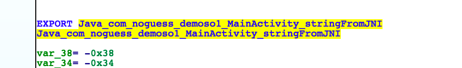
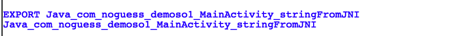
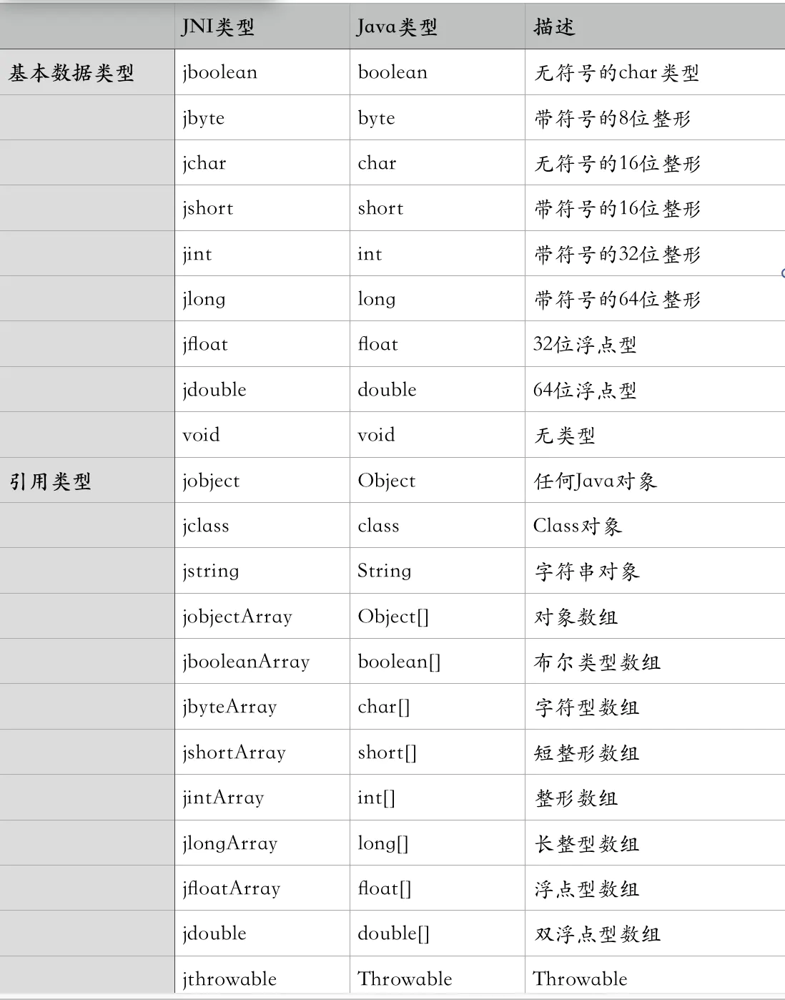
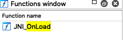

## 1.1 **JNI介绍**

  [以下提到的`源码`的地址](https://github.com/heyhu/demoso1)

  [NDK与JNI基础](https://www.jianshu.com/p/87ce6f565d37)  

  [ndk-samples ](https://github.com/android/ndk-samples)

定义:  JNI，全称为Java Native Interface, 即Java本地接口, JNI是Java调用Native 语言的一种特性。`通过JNI可以使得Java与C/C++机型交互`。即可以在Java代码中调用C/C++等语言的代码或者在C/C++代码中调用Java代码, `由于JNI是JVM规范的一部分，因此可以将我们写的JNI的程序在任何实现了JNI规范的Java虚拟机中运行`, 同时这个特性使我们可以复用以前用C/C++写的大量代码JNI是一种在Java虚拟机机制下的执行代码的标准机制，`相当于java和c、c++中间的桥梁，JNI 大于NDK`，


## 1.2 **NDK介绍**

定义:  `Native Development Kit`, 是 `Android`的一个工具开发包, NDK是属于 `Android` 的, 与`Java`并无直接关系,没有NDK就无法编译C++的代码, native层也是可以抓包的, 比如视频电话, NDK原生代码不需要在java虚拟机运行, 而是直接在`cpu`上运行。

作用: 快速开发`C`、 `C++`的动态库, 并自动将`so`和应用一起打包成 `APK`, 即可通过 `NDK`在 `Android`中 使用 `JNI`与本地代码（如C、C++）交互。

应用场景:  在Android的场景下 使用JNI。

```
优点: 
	1、重复使用现在库，或者提供其自己的库重复使用

	2、在某些情况下提性能，特别是像游戏这种计算密集型应用

	3、使用第三方库，现在许多第三方库都是由C/C++库编写的，比如Ffmpeg这样库。

	4、不依赖于Dalvik Java虚拟机的设计

	5、代码的保护。由于APK的Java层代码很容易被反编译，而C/C++库反编译难度大。

缺点：

  1、由于和java交互比较繁琐，开发难度较大。

  2、容易造成内存泄漏，c++和java是两种不同的语言。
```

  

## 1.3 静态注册

打开Android studio文件，创建项目，选c、c++，build编译，打开`build/outputs/apk/debug`下，会有编译好的apk文件，解压进入lib，就会看到so文件。

##### java source code view：

```java
目录：src/main/java/com/noguess/demoso1/MainActivity.java
public class MainActivity extends AppCompatActivity {
    // Used to load the 'native-lib' library on application startup.
    // libnative-lib.so
    static {
        System.loadLibrary("native-lib");
    }
    @Override
    protected void onCreate(Bundle savedInstanceState) {
        super.onCreate(savedInstanceState);
        setContentView(R.layout.activity_main);
        // Example of a call to a native method
        TextView tv = findViewById(R.id.sample_text);
        tv.setText(stringFromJNI());
        // 调用动态方法
        Log.i("r0add", String.valueOf(this.myfirstjni()));
        // 调用静态方法
        Log.i("r0add", MainActivity.myfirstjniJNI("from JAVA"));
    }
    /**
     * A native method that is implemented by the 'native-lib' native library,
     * which is packaged with this application.
     * native 关键字，函数返回类型为String
     */
    public native String stringFromJNI();
    // public static native String stringFromJNI();
    public native int myfirstjni();
}
```


##### native source code view：

```c++
目录：src/main/cpp/native-lib.cpp
点击java层stringFromJNI也可以跳进去。
#include <jni.h>
#include <string>
int r0add(int x, int y){
    return x + y;
}
extern "C" JNIEXPORT jstring JNICALL
Java_com_noguess_demoso1_MainActivity_stringFromJNI( 
        # 两个必要参数，最少不会少于两个。
        JNIEnv* env,
        jobject /* this */) {
    std::string hello = "Hello from C++";
    # NewStringUTF：JNI API
    // NewStringUTF有两个参数，第一个默认为env
    return env->NewStringUTF(hello.c_str());
}
extern "C" JNIEXPORT jint JNICALL
Java_com_noguess_demoso1_MainActivity_myfirstjni(
        JNIEnv* env,
        jobject /* this */) {
    return r0add(10 ,20);
}
```

  `stringFromJNI` 加了一个**native**描述符，表示是一个原生函数，`MainActivity`是类名，`com_noguess_demoso1`是包名，`Java_com_noguess_demoso1_MainActivity_stringFromJNI`是对应的C函数名，那么这个规则就很显而易见了，将包名的.替换成_(因为.不能用于函数命名)，然后`Java_PackName_CLassName_MethodName`。**运行时，JNI就会依赖此规则来对函数进行绑定**。

注释：

1. jstring JNICALL 指返回的类型为string。

2. JNIEXPORT：表明此函数为导出函数，如果不加，则java调用不了。

   

   

   

3. Java_com_noguess_demoso1_MainActivity_stringFromJNI：`包名_类名_函数名`，静态固定格式。

4. JNIEnv* env：一个接口指针

5.  `jobject /* this */ `：在本地方法中声明的对象引用，定义为当前MainActivity的一个实例。如果java层代码加一个static变成静态方法，此处就要改成jclass,   个人理解 jobject为对象调用动态方法，jclass：为类调用静态方法。

6. extern "c"：如果前面声明了，表示使用c的形式编译。ida反编译后查看此函数，就不会使用`name mangling`。

   > 名字不一样，**c++函数要支持函数名重载**，就会用name mangling来进行混淆，可以使用c++filt -n 来进行还原原函数名。
   >
   > name mangling 还原相关文档：https://github.com/nico/demumble   

   

   1. myfirstjni 加了extern “c”， 函数名就不会变。

      

   2. r0add没有加， 函数名变化。

      

​         

7. jint 指的是此函数返回的数据类型为int类型， native函数返回的是什么数据类型，java层也要写对应的数据类型。

   JNI数据类型和java数据类型关系如下：

   

8. 开发一个简单的JNI -> HELLO WORD

   ##### java source code view：

   ```java
   package com.noguess.demoso1;
   import androidx.appcompat.app.AppCompatActivity;
   import android.os.Bundle;
   import android.util.Log;
   import android.widget.TextView;
   
   import java.lang.reflect.Field;
   
   public class MainActivity extends AppCompatActivity {
       // Used to load the 'native-lib' library on application startup.
       static {
           System.loadLibrary("native-lib");
       }
   
       @Override
       protected void onCreate(Bundle savedInstanceState) {
           super.onCreate(savedInstanceState);
           setContentView(R.layout.activity_main);
   
           // Example of a call to a native method
           TextView tv = findViewById(R.id.sample_text);
           tv.setText(stringFromJNI());
           // 调用动态方法
           Log.i("r0add", String.valueOf(this.myfirstjni()));
           // 调用静态方法
           Log.i("r0add", MainActivity.myfirstjniJNI("from JAVA"));
       }
   
       /**
        * A native method that is implemented by the 'native-lib' native library,
        * which is packaged with this application.
        */
       public native String stringFromJNI();
       // 静态方法
       public static native String myfirstjniJNI(String context);
       public native int myfirstjni();
   }
   ```

   ##### Native source code view：

   ```c++
   extern "C" JNIEXPORT jstring JNICALL
   // 固定格式
   Java_com_noguess_demoso1_MainActivity_myfirstjniJNI(
       	// 固定参数
           JNIEnv *env,
       	// 静态 -> jclass, 动态 -> jobject
           jclass clazz,
       	// 参数
           jstring context) {
       // c++的写法
       const char* a = env->GetStringUTFChars(context, nullptr);
       
       int a_size = env->GetStringUTFLength(context);
       if(a!=0){
   //        LOGI('now a is %s', a);
   //        LOGI('new context is %s', context);
       }
       // 不用的对象释放掉
       env->ReleaseStringUTFChars(context, a);
       // 创建一个utf-8字符串
       jstring result = env->NewStringUTF("Hello I`am from myfirstjniJNI");
       return result;
   ```


## 1.4 动态注册

如今许多开发者都出于**安全性考虑**或其他需求，不愿使用函数名规则绑定，而是自己动态注册来绑定native函数。方法也很简单，只需调用`RegisterNatives`函数即可。其申明如下：

```c++
jint RegisterNatives(jclass clazz, const JNINativeMethod* methods,jint nMethods)
```

`clazz` 就是native函数所在的类，可通过`FindClass`获取(将.换成/);`methods`是一个数组，其中包含注册信息。

##### java source code view：

```java
public static native String stringFromJNI2();
```

##### Native source code view：

```c++
// 动态注册: so
JNIEXPORT jstring JNICALL stringFromJNI2(JNIEnv* env, jclass clazz) {
    std::string hello = "Hello from C++ stringFromJNI2";
    return env->NewStringUTF(hello.c_str());
}

JNIEXPORT jint JNI_OnLoad(JavaVM* vm, void* reserved)
{
    JNIEnv * env;
    // 从java虚拟机中获取java env
    vm->GetEnv((void**)&env,JNI_VERSION_1_6);
    // 注册信息
    JNINativeMethod methods[] = {
            // 签名()Ljava/lang/String; 括号里是参数, 返回值是一个jstring
            // name:stringFromJNI2 是与java层 public static native String stringFromJNI2();对应的
            {"stringFromJNI2","()Ljava/lang/String;",(void*)stringFromJNI2},
    };
    // FindClass寻找类
    // RegisterNatives为env的函数，代表此函数可以hook。
    // RegisterNatives参数详解：FindClass寻找类 methods：方法数组 1：方法个数
    env->RegisterNatives(env->FindClass("com/example/demoso1/MainActivity"),methods,1);
    return JNI_VERSION_1_6;
}
```

#####  JNI ONLOAD

如果代码中已经实现了，那么ida中就可以搜索到。JNI ONLOAD是一个回调，加载一个so时会自动执行。



ida中代码：

```c++
{
  unsigned __int64 v1; // x8
  unsigned __int64 v2; // ST20_8
  void *v3; // ST10_8
  __int64 v4; // x0
  __int64 result; // x0
  void *v6; // [xsp+38h] [xbp-28h]
  __int128 v7; // [xsp+40h] [xbp-20h]
  __int64 (__fastcall *v8)(int, int, int, int, int, int, int, int, int, int, __int64); // [xsp+50h] [xbp-10h]
  __int64 v9; // [xsp+58h] [xbp-8h]

  v1 = _ReadStatusReg(ARM64_SYSREG(3, 3, 13, 0, 2));
  v9 = *(_QWORD *)(v1 + 40);
  v2 = v1;
  // 源码：vm->GetEnv((void**)&env,JNI_VERSION_1_6),所以v6就是env,可以按y键重命名方便观看。
  _JavaVM::GetEnv(a1, &v6, 65542);
  // v8就是动态注册的函数名
  v8 = stringFromJNI2;
  v7 = off_32CB8;
  v3 = v6;
  v4 = _JNIEnv::FindClass((_JNIEnv *)v6, "com/example/demoso1/MainActivity");
  result = _JNIEnv::RegisterNatives(v3, v4, &v7, 1LL);
  if ( *(_QWORD *)(v2 + 40) == v9 )
    result = 65542LL;
  return result;
}
```

