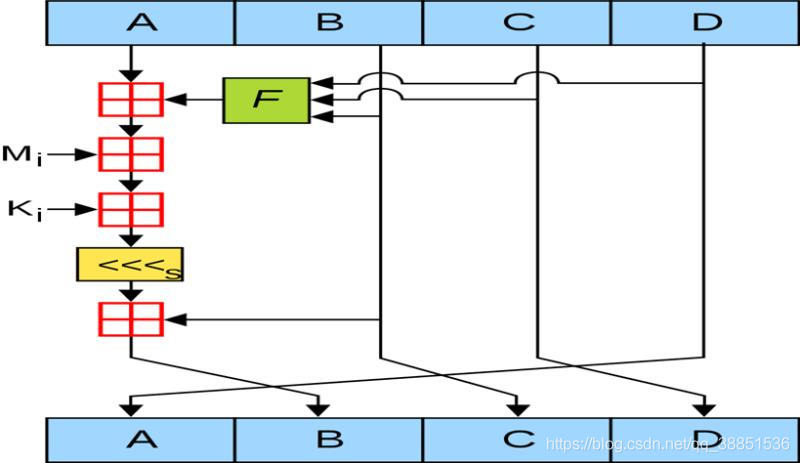
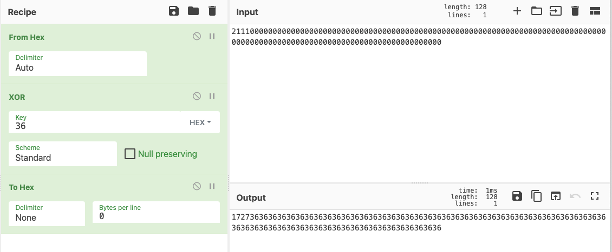
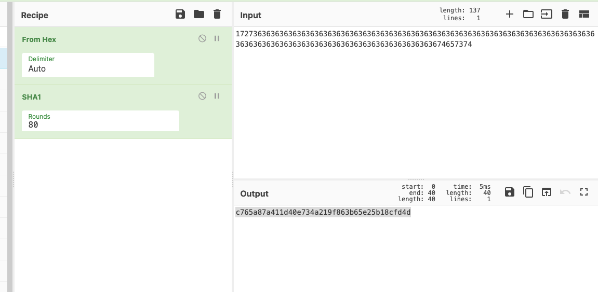

## 1.1 MD5

输出长度16个字节，或者说32个十六进制数(一个字节两个16进制数)，有时候输出16个十六进制数。

> MD5_Init 初始化
>
> MD5_Update 添加参数，也就是要加密的值
>
> MD5_Final 获取结果

### 1.1.1 初始化魔数

初始化魔数也叫初始化链接变量或者iv：

```c
A = 0x67452301;
B = 0xEFCDAB89;
C = 0x98BADCFE;
D = 0x10325476;
```

ida中样本：

```c
_DWORD *__fastcall MD5Init(_DWORD *result)
{
  result[5] = 0;
  result[4] = 0;
  *result = 0x67452301;
  result[1] = 0xEFCDAB89;
  result[2] = -1732584194;
  result[3] = 271733878;
  return result;
}
// 按h键还原16进制和源码初始化链接变量比较
```

### 1.1.2 K表

```c
K1 = 0xd76aa478
K2 = 0xe8c7b756
K3 = 0x242070db
```

k表中共`64`个常数，来自sin函数，共64轮运算，每一轮运算使用一个k值，在ida中看前三轮是不是和源码一样就能确定是否魔改了，运算部分查看和源码k表对应一下。

因为md5共64轮运算，所以运算过程很长，运算的时候经常会运行一些函数，c源码如下，重复使用FF函数：

```c
FF (a, b, c, d, x[ 0], S11, 0xd76aa478); /* 1 */
FF (d, a, b, c, x[ 1], S12, 0xe8c7b756); /* 2 */
FF (c, d, a, b, x[ 2], S13, 0x242070db); /* 3 */
FF (b, c, d, a, x[ 3], S14, 0xc1bdceee); /* 4 */
FF (a, b, c, d, x[ 4], S11, 0xf57c0faf); /* 5 */
FF (d, a, b, c, x[ 5], S12, 0x4787c62a); /* 6 */
FF (c, d, a, b, x[ 6], S13, 0xa8304613); /* 7 */
FF (b, c, d, a, x[ 7], S14, 0xfd469501); /* 8 */
FF (a, b, c, d, x[ 8], S11, 0x698098d8); /* 9 */
FF (d, a, b, c, x[ 9], S12, 0x8b44f7af); /* 10 */
FF (c, d, a, b, x[10], S13, 0xffff5bb1); /* 11 */
FF (b, c, d, a, x[11], S14, 0x895cd7be); /* 12 */
FF (a, b, c, d, x[12], S11, 0x6b901122); /* 13 */
FF (d, a, b, c, x[13], S12, 0xfd987193); /* 14 */
FF (c, d, a, b, x[14], S13, 0xa679438e); /* 15 */
FF (b, c, d, a, x[15], S14, 0x49b40821); /* 16 */
```

ida中 md5运算部分，重复执行`__ROR4__`函数：

```c
v6 = v3 + __ROR4__((v5 & ~v3 | v4 & v3) + v71 + v2 - 0x28955B88, 25);
v7 = v6 + __ROR4__((v4 & ~v6 | v3 & v6) + v72 + v5 - 0x173848AA, 20);
v8 = v7 + __ROR4__((v3 & ~v7 | v6 & v7) + v73 + v4 + 0x242070DB, 15);
v9 = v8 + __ROR4__((v6 & ~v8 | v7 & v8) + v74 + v3 - 1044525330, 10);
v10 = v9 + __ROR4__((v7 & ~v9 | v8 & v9) + v75 + v6 - 176418897, 25);
v11 = v10 + __ROR4__((v8 & ~v10 | v9 & v10) + v76 + v7 + 1200080426, 20);
```

发现和源码中不同，假如左边是减号，还需要右键inver sign变成正常的k值，加号的话就不用动。

### 1.1.3 拓展

1. md5_HALF

   > 正常的md5 截取中间的一部分

2. 加盐 md5

   > 传入一个空值，看他的输出，输出与在线md5网站上，比如cmd5碰下运气（彩虹表碰撞）
   >
   > salt：9位以内往往可以测试出来

### 1.1.4 手算md5



```c
明文:123456
对内容进行编码:ASCII, 123456 的hex为 31 32 33 34 35 36
第一步:附加比特位，使得其比特长度除以512余448
  1. 31 32 33 34 35 36 现在为12个16进制数也就是48比特，需要填充到448比特长
  2. 31的二进制为 0011 0001 那么31 32 33 34 35 36对应的二进制就是 0011 0001 0011 0010 0011 0011 0011 0100 0011 0101 0011 0110
  3. 此时为48比特长，剩余的400用1000000000..0来表示，因为二进制看来很复杂 用16进制来表示，10000000也就是80, 400 / 4 = 100 - 12 = 88, 313234353680......0

第二步:附加长度信息
  1. 512-448=64,特意留存的64比特长，用于附加长度信息。3132343536明文信息48比特长，给了64比特长（16个16进制数）大小去记录,所以就是4800000000000000(16个16进制数,前面48为长度，后面14个用0补齐)
  2. 所以最后的明文信息就是128位长 3132333435368000000000000003000000000000000（48转换为16进制也就是30）
  3. 如果明文就是448，也必须填充
  
第三步: 计算
  1.初始化链接变量/IV/初始化魔数
     A = 0x67452301;
     B = 0xEFCDAB89;
     C = 0x98BADCFE;
     D = 0x10325476;
  2. 明文分成16块，128 / 16 = 8，因为一共64轮，共4组，每组16次。明文分组然后进行大小端序转化。
     m1 = 31323334  34333231
     m2 = 35368000  00086353
     m3 = 0...      0
     m15 = 30000000 30
     m16 = 0....    0 
  3. 第一轮的时候由图可得知A的结果是上一轮的D，B的结果是有上一轮的A的值的计算，C的结果是上一轮的B，D的结果是上一轮的C。
     那么此时 A1 = 0x10325476;B1 = 未知。C1 = 0xEFCDAB89; D1 = 0x98BADCFE;
     B的计算：
       第一步: A + F(B,C,D)
          F为非线性函数 由4个组成 
          f1 1-16轮用   (x&y)| ((~x) &z) if x then y else z
          f2 17-32轮用  if Z then x else y
          f3 32-48轮用
          f4 49-64轮用  Y ^ (x|(~z))
       所以f1(b,c,d )
       b = 1101111110011011010101110001001
       c = 10011000101110101101110011111110
       d = 10000001100100101010001110110
           10011000101110101101110011111110 = 0x98BADCFE 单纯的巧合
      第二步：0x98BADCFE + A = 0x67452301 + 0x98BADCFE = ffffffff
      第三步：ffffffff + m1 = ffffffff + 34333231 = 134333230
      第四步：134333230 + k1 = 134333230 + 0xd76aa478 = 20B9DD6A8 （k表64个32比特 ki = 2的32次方 ✖️ /sin i/ 取整数的16进制）
      第五步：循环左移 
        先处理消高位只要后8位 0B9DD6A8
        在循环左移 <<< 第一轮循环左移7位 规定好的
        先转换2进制  0000101 1100111 0111010 1101010 1000（32个比特长）
        1100111 0111010 1101010 1000 0000101 转换为16进制  CEEB5405
      第六步：b1 = CEEB5405 + B = CEEB5405 + 0xEFCDAB89 = 1BEB8FF8E 最后B1的结果为：1BEB8FF8E    
  4. 最后一轮: 
      A63 = B7E871AF
      B63 = BF2579C0
      C63 = 2E55BB7C
      D63 = D296E7E0
      f4 = Y ^ (x|(~z))
      A + F(B,C,D) = B7E871AF + 9138C2A3 = 149213452 + m64 = 149213452 + 0
      149213452 + k64 = 149213452 + eb86d391 = 234a807e3
      34a807e3 先转换2进制  
      00110100101010000000011111100011
      循环左移21位
      11111100011001101001010100000000 = FC669400 + b = FC669400 + BF2579C0 = 1BB8C0dc0
      舍弃高位 BB8C0dc0

      A64 = D296E7E0
      B64 = BB8C0dc0
      C64 = BF2579C0
      D64 = 2E55BB7C

第四步: 得出结果(与原始相加做级联)
   1. 与原始相加舍最高位 
       a = D296E7E0 + 0x67452301 = 39dc0ae1
       b = BB8C0dc0 + 0xEFCDAB89 = ab59b949
       c = BF2579C0 + 0x98BADCFE = 57e056be
       d = 2E55BB7C + 0x10325476 = 3e880ff2
   2. 做级联,先端序转换
      e10adc39 + 49b959ab + be56e057 + f20f883e
  
```


## 1.2 SHA1

输出长度20个字节，或者说40个十六进制数

### 1.2.1 初始化魔数

和MD5相比，有五个初始化链接变量，而且前四个链接变量完全相同。

```c
A = 0x67452301
B = 0xEFCDAB89
C = 0x98BADCFE
D = 0x10325476
E = 0xC3D2E1F0
```

### 1.2.2 K表

只有四个K值，共80轮运算每20轮左右用同一个K作变换，一般魔改只会魔改常数，不会对k进行修改

```c
K1 = 0x5a827999
K2 = 0x6ed9eba1
K3 = 0x8f1bbcdc
K4 = 0xca62c1d6
```

### 1.2.3 拓展

sha0是有缺陷的算法，iv以及k都一样，如果测试的结果和sha1不一样，那么就可以用sha0测试下。


## 1.3 SHA256

输出长度为32个字节，或者说64个十六进制数，结果来自iv计算的拼接， 8 * 8 = 64

### 1.3.1 初始化魔数

IV：八个初始化链接变量

```c
A = 0x6A09E667;
B = 0xBB67AE85;
C = 0x3C6EF372;
D = 0xA54FF53A;
E = 0x510E527F;
F = 0x9B05688C;
G = 0x1F83D9AB;
H = 0x5BE0CD19;
```

### 1.3.2 K表

有64个K值，每轮1个K值，K值来自素数，使用前4个与ida中伪代码对照即可。

```c
K1 = 0x428a2f98
K2 = 0x71374491
K3 = 0xb5c0fbcf
K4 = 0xe9b5dba5
```


## 1.4 SHA512

输出长度为64字节，或者说128个十六进制数

### 1.4.1 初始化魔数

八个初始化链接变量，IDA反编译也时常显示为16个，给拆开了

```c
A = 0x6a09e667f3bcc908; // 到67和sha256一样
B = 0xbb67ae8584caa73b;
C = 0x3c6ef372fe94f82b;
D = 0xa54ff53a5f1d36f1;
E = 0x510e527fade682d1;
F = 0x9b05688c2b3e6c1f;
G = 0x1f83d9abfb41bd6b;
H = 0x5be0cd19137e2179;
```

## 1.4.2 K表

有80个K，每一轮一个K，K值来自素数。

前半部分与sha256一致，看最后是否有16个k，对照最后一个k值来区分是256还是512。

```c
K1 = 0x428a2f98d728ae22
K2 = 0x7137449123ef65cd
K3 = 0xb5c0fbcfec4d3b2f
K4 = 0xe9b5dba58189dbbc
```


## 1.5 HMAC-xxx系列

HMAC-MD5、HMAC-SHA1

防止彩虹表碰撞，加盐 + 双重哈希方案

### 1.5.1 特征

两次加盐，两次MD5、两次异或(主要是看异或的值)

16进制：

> k_ipad[i] ^= 0x36;
> k_opad[i] ^= 0x5c;

10进制：

> v14[i] ^= 54u;
> v13[i] ^= 92u;

ida中

```c
if ( a4 >= 65 )
{
  j_MD5Init(&v11);
  j_MD5Update((int)&v11, (int)v8, v7);
  ((void (*)(void))j_MD5Final)();
  v8 = &v12;
  v7 = 16;
}
_aeabi_memclr(v14, 65);
_aeabi_memclr(v13, 65);
_aeabi_memmove(v14, v8, v7);
_aeabi_memmove(v13, v8, v7);
for ( i = 0; i <= 63; ++i )
{
  v14[i] ^= 0x36u; //异或值
  v13[i] ^= 0x5Cu; //异或值
}
j_MD5Init(&v15);
j_MD5Update((int)&v15, (int)v14, 64);
j_MD5Update((int)&v15, v10, v9);
j_MD5Final(a5, &v15);
j_MD5Init(&v15);
j_MD5Update((int)&v15, (int)v13, 64);
j_MD5Update((int)&v15, a5, 16);
j_MD5Final(a5, &v15);
return _stack_chk_guard;
```

### 1.5.2 手算HMAC-SHA1

明文: test   (utf8)

密钥: 2111 (hex)

结果：6e3a2a24b997b7138fcc48a56427d196a056bf8b

第0步：密钥扩展

> 对密钥扩展到sha1的分组大小64字节(128位16进制数)
>
> 怎么查看分组大小： [https://zh.wikipedia.org/wiki/SHA%E5%AE%B6%E6%97%8F](https://zh.wikipedia.org/wiki/SHA家族)，资料区块长度列：sha1 512位=64字节=128位16进制数。

> 密钥填充到128位：21110000000000000000000000000000000000000000000000000000000000000000000000000000000000000000000000000000000000000000000000000000

第一步：密钥扩展后的结果与ipad(0x36)异或 



> 结果为：17273636363636363636363636363636363636363636363636363636363636363636363636363636363636363636363636363636363636363636363636363636

第二步：append拼接 

> 明文的16进制追加到上一步的结果中
>
> test的hex为74657374，追加到上一步结果后1727363636363636363636363636363636363636363636363636363636363636363636363636363636363636363636363636363636363636363636363636363674657374 

第三步：对第二步结果进行sha1

输入是hex，添加 from hex



> 结果为：c765a87a411d40e734a219f863b65e25b18cfd4d

第四步：密钥扩展后的结果与opad(0x5c)异或 

7d4d5c5c5c5c5c5c5c5c5c5c5c5c5c5c5c5c5c5c5c5c5c5c5c5c5c5c5c5c5c5c5c5c5c5c5c5c5c5c5c5c5c5c5c5c5c5c5c5c5c5c5c5c5c5c5c5c5c5c5c5c5c5c

第五步 ：把第四步异或的值与第三步sha1的值拼接在一起

7d4d5c5c5c5c5c5c5c5c5c5c5c5c5c5c5c5c5c5c5c5c5c5c5c5c5c5c5c5c5c5c5c5c5c5c5c5c5c5c5c5c5c5c5c5c5c5c5c5c5c5c5c5c5c5c5c5c5c5c5c5c5c5cc765a87a411d40e734a219f863b65e25b18cfd4d

第六步：第5步的值做一个sha1

6e3a2a24b997b7138fcc48a56427d196a056bf8b

