#### 简介

```
AES 高级加密标准
Rijndael 分组加密荣耀

工作模式：ECB、CBC、CFB、OFB
KEY：密钥
IV： 初始化链接变量, 十六个字节长度
PADDING：填充

明文：
     DES：分组长度64比特，明文会被切成64比特做运算，16个16进制数、8个字节
     hex：0123456789abcdef 1111111111111111 2222222222222222 3333333333333333
     明文会被切成4块，64比特为1块

     AES：分组长度128比特，32个16进制数、16个字节
     hex：0123456789abcdef1111111111111111 22222222222222223333333333333333
     明文会被切成2块，128比特为1块

     DES中明文都是比特流，最小单位是比特
     AES中基于字节的，最小单位是字节

密钥：
     AES密钥 密钥长度分三种
       - 128比特长，16个字节 ----10轮运算
       - 192比特长，24个字节 ----12轮运算
       - 256比特长，32个字节 ----14轮运算 
       不管是aes-128/192/256比特 aes分组大小以及密文输出大小都是不变的。
       假如密钥是255比特长依然会出结果？
	   比如：1111111(比特)？不可能是3.5字节，他会在最后一个前面补个0变成: 11 11 11 01
	   比如：111111111111111111111111111111111111111111111111111111111111111(252bit),少了4bit 半个字节
	   等于：1111111111111111111111111111111111111111111111111111111111111101
 
特征：
    AES-128接收16字节的明文输入，16字节的密钥，输出16字节的密文结果。
    当明文恰好是一个分组长度，结果变成了两个分组大小。可能就是aes。
```
#### AES算法原理

```
- 密钥的编排
- 明文的运算

一切基于字节做操作。

举例：
明文：0123456789abcef to hexdump 30 31 32 33 34 35 36 37 38 39 61 62 63 64 65 66（16个字节）
aes把明文放在一个4*4的矩阵当中，表中每个元素是一个字节大小
30 34 38 63
31 35 39 64
32 36 61 65
33 37 62 66
密钥也同明文如此。表中每个元素都是一个字节大小
```

1. ##### 明文加密流程

```
AES-128 ----10轮运算

if not ECB: 明文 xor iv

首先是一个初始变换 --addRoundKey
  - 明文 xor 密钥k （这个key就是我们输入的种子密钥）
然后是9轮相同的运算
  - S盒替换  subBytes
  - 循环左移 shiftRows
  - 列混淆   mixcolumn
  - state xor 密钥 （密钥编排得到的子密钥，不是我们输入的密钥, k1-k9）addRoudKey
末运算(第10轮)
  - S盒替换
  - 循环左移
  - state xor 密钥 （密钥编排得到的子密钥，不是我们输入的密钥, k10）addRoudKey
```

**1.1 subBytes**

大小: 16 * 16 = 256

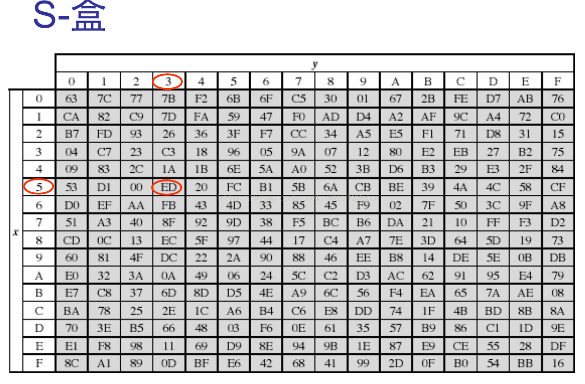

```
S盒行和列使用规则:

S盒替换前明文数据:
30 34 38 63
31 35 39 64
32 36 61 65
33 37 62 66

从0开始数
30 就代表第3行第0个 -> 04
34 就代表第3行第4个 -> 18

替换后就变为

04 18 07 FB
C7 .. .. ..
23 .. .. ..
C3 .. .. ..
```

ida如何找s盒？
ida view-> open subviews-> segments  data数据断以及rodata只读数据断。

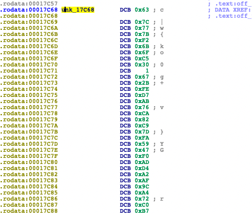

  ida中找到s盒，选中0x63右键点击`Byte 0x63`，就识别成了byte数组了，选中右键，点击array，设置size：256。

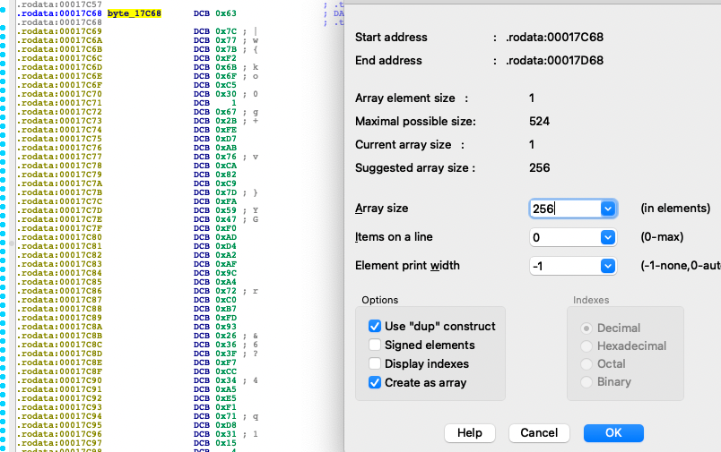

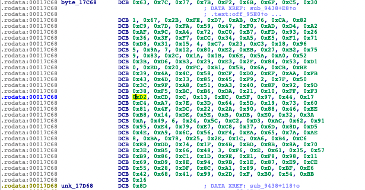

通过对AES算法原理了解，学会通过查找`S盒`，来确定SO中是否有AES算法。

**1.2 循环左移**

```
最小单位字节

举例：
d4 e0 b8 1e
27 bf b4 41
11 98 5d 52
ae f1 e5 30

把上面的循环左移一字节:
d4 e0 b8 1e   第一行左移0个字节
bf b4 41 27   第二行左移一个字节
5d 52 11 98   第三行左移两个字节
30 ae f1 e5   第四行左移三个字节
```

ida中循环左移的特征：

实现方式1:

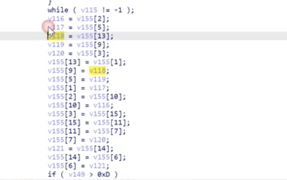

上图中:

v155[13]  = v155[1]  就是1去13

v155[9]  = v155[13] 就是13去9

然后就是 9去5、5去1、10去2、2去10

```
如果明文用a表示的话，可以得到以下结论:
a0 a4 a8  a12
a1 a5 a9  a13
a2 a6 a10 a14
a3 a7 a11 a15
循环左移后:
a0  a3   a7  a11
a5  a9   a13 a1
a10 a14  a2  a6
a15 a3   a7 a11

左移后 a1的位置就是原来的a13，a13的位置就是原来的a9
```

实现方式2:

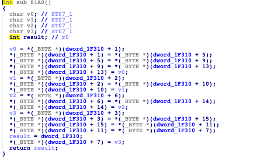

```
5去1、9去5
```

实现方式3:

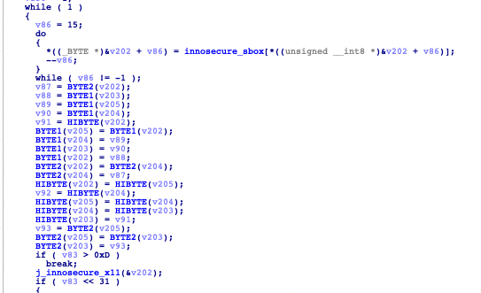

ida中应用，识别出so中循环左移步骤的代码，然后以此为基点，把上面下面全部打通，可以被当作锚点

```c++
sub_81A0的函数引用

int sub_7F8C()
{
  int v0; // r0
  unsigned __int8 i; // [sp+7h] [bp-9h]

  sub_80A0(0);
  for ( i = 1; (signed int)i <= 9; ++i )
  {
    sub_8120();					// 循环左移上一步就是S盒替换
    v0 = sub_81A0();                            // 循环左移
    sub_8220(v0);				// 循环左移下一步就是列混淆
    sub_80A0(i);
  }
  sub_8120();
  sub_81A0();
  return sub_80A0(10);
}
```

**1.3 列混淆**

ida中特征：

会有两个数很关键：0x1B、0x80 这两个数很关键、很明显特征

```c++
int __fastcall sub_8380(unsigned __int8 a1)
{
  return (unsigned __int8)(0x1B * (a1 >> 7) ^ 2 * a1);
} 
```

尤其与这个0x1B做异或 ^


**1.4 通过上述知识做还原**

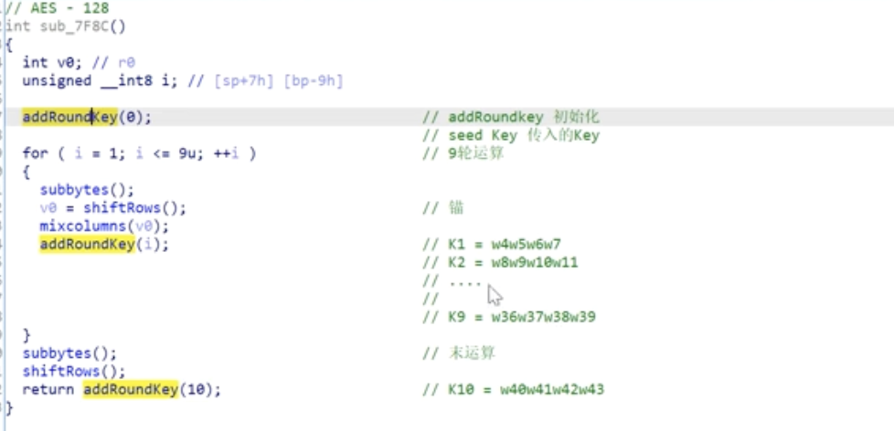

初始化的addRoundKey，明文 xor 密钥k （这个key就是我们输入的种子密钥）。

2. ##### 密钥的编排(aes-128)

```
假设我们的密钥为：
d42711aee0bf98f1b8b45de51e415230

d4   e0   b8   1e
27   bf   b4   41
11   98   5d   52
ae   f1   e5   30

w0   w1   w2   w3  w4  w5  w6 .....w43


为什么到w43？
   因为是aes-128, 所以每一轮密钥是16个字节，4个w是一轮的密钥，共10轮运算。

初始化的addRoundKey用到的key：
    key0 = w0w1w2w3 = d42711aee0bf98f1b8b45de51e415230我们的种子密钥，用来做初始变换，根据我们传入的种子密钥获得10个新的子密钥。
    hook初始变化addroundKey的异或后面的key,就是我们输入的种子key。

9轮运算用到的key分别是：
   k1:w4w5w6w7
   k2:w8w9w10w11
   ......
   k9:w36w37w38w39

最后一轮：
   k10: w40w41w42w43

密钥编排：
   就是根据我们w0-w3传入的密钥，通过密钥编排，生成w4-w43，也叫密钥扩展算法
   密钥扩展：w0-w43，44个w，或者44 *4 = 176个字节
	
文章:
   https://blog.csdn.net/qq_28205153/article/details/55798628
```

**2.1 w4-w17的生成**

```
w4 = T(w3) ^ w0, Wn = T(Wn-1) xor Wn-4 每当Windex index为4的倍数时都需要wi-1走一遍T函数
w5、w6、w7时 w5 = w4 ^ w1, wi = wi-1 ^ wi-4（如果i不是4的倍数）

T函数步骤：
1. 循环左移1位
2. S表替换
3. rcon表异或

假如：
 w4的计算：
   w0 = 2b7e1516，w3 = 0x09cf4f3c，T(w3) = sbox(shiftrow(w3)) ^ rcon[i]
   循环左移1位 -> cf4f3c09
   S表替换  -> 8a84eb01
   rcon表异或 -> 8b84eb01(rcon表固定的，rcon = [0x01, 0x02, 0x04, 0x08, 0x10, 0x20, 0x40, 0x80, 0x1B, 0x36])
   最后 w4 = 8b84eb01 ^ w0 = a0fafe17
w5的计算：
   w5 = w4 ^ w1 = a0fafe17 ^ w1
```

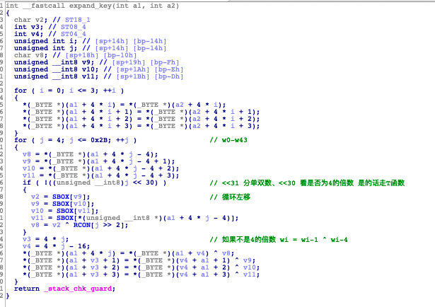\

ida中特征：
> w43也是密钥扩展的特征，比如 <=43
> <<31 分单双数
> <<30 看是否为4的倍数

#### so 实现AES算法：

```
一个AES算法我们要关注哪些内容?
   是AES-128 还是 AES-192 还是 AES-256
   明文是什么
   密钥是什么 
   什么模式 ECB还是CBC还是其他 
   如果是非ECB模式，那么IV是什么 
   明文填充模式呢，是PCKS#7吗?
```

1. 调用open_ssl封装的EVP。传入结构体，百度搜索，查看参数信息。
	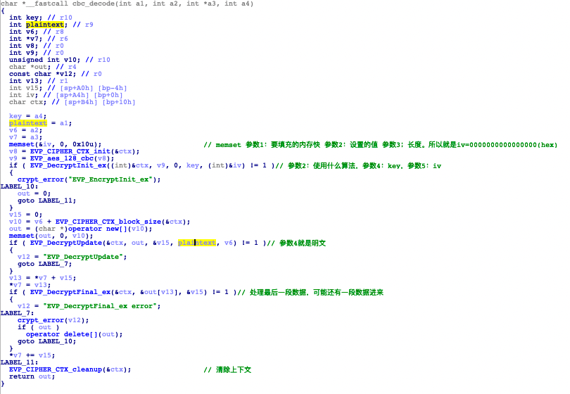

2. 直接使用底层的代码，通过hook各个函数，得到信息。
	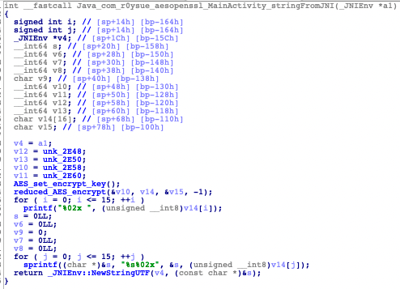

#### 拓展

```
哈希算法：签名校验
对称加密：DES、AES, 主要应用于对明文的处理
非对称加密：RSA, 主要功能：提供AES/DES 密钥

非对称加密算法：RSA、ECC
  特点：安全性好、
  缺点：运算复杂慢、性能不好

RSA + AES：混合加密

findcrypt 可以找到特征

逆S盒：https://bbs.pediy.com/thread-266410.htm
   S盒 用来加密
   00 0x90
   逆S盒 用来解密
   第9行 第0列 为 00
   new_contrary_sbox = [0]*256

  for i in range(256):
      line = (new_s_box[i]&0xf0)>>4
      rol = new_s_box[i]&0xf
      new_contrary_sbox[(line*16)+rol] = i

  print (new_contrary_sbox)
```

```
CBC模式分析：
key: 0123456789abcdef str
IV : 1111111111111111 str
input: 0123456789abcdef 0123456789abcdef 两个分组长度
result: 
e5b72c539aae45dea57686570b0b5156
67529ac954d9dee130a26b116dc601c4

第一步:
首先 iv xor 第一个分组的明文块0123456789abcdef 得到 hex:
01 00 03 02 05 04 07 06 09 08 50 53 52 55 54 57
结果进行ECB模式加密得到: e5b72c539aae45dea57686570b0b5156
第二步: 
第二个分组的明文块和第一个秘文块做异或然后进行AES ECB模式加密
e5b72c539aae45dea57686570b0b5156(hex) xor 0123456789abcdef 得到 hex:
d5 86 1e 60 ae 9b 73 e9 9d 4f e7 35 68 6f 34 30
结果进行ECB模式加密得到: 67529ac954d9dee130a26b116dc601c4 
```

```
填充pkcs#7
padding是必须存在的，如果明文已经是16个字节了, 那么也要填充10101010101010101010101010101010

输入：pcks#7 000102030405060708090a0b0c0d0e0f
输出：a07999f0e2bfbe16f99593e984a449b7 377222e061a924c591cd9c27ea163ed4

aes一个分组会填充10101010101010101010101010101010
输出：377222e061a924c591cd9c27ea163ed4  377222e061a924c591cd9c27ea163ed4

验证：
hex
01  15个0f的字节 (差15个字节，此时明文是hex，补充hex，hex(15) = 0xf，就是15个0f)
01 02 14个0e
01 02 03 13个0d
01 02 03 04 12个0c
01 02 03 04 05 11个0b
01 02 03 04 05 06 10个0a 
注意：类似0f这种padding点 pkcs#7，在hook的时候可以看出他是明文。
```

```
在初始化的addRoundKey时是可以通过异或获得密钥的，但是因为工作模式的不同，是获取不到明文的，例如CBC模式，开始会和iv做异或。
```

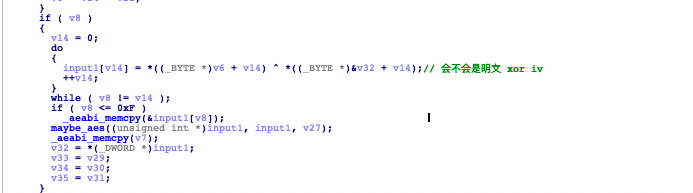

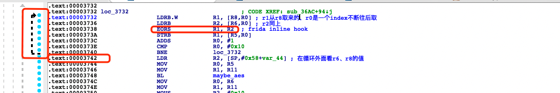

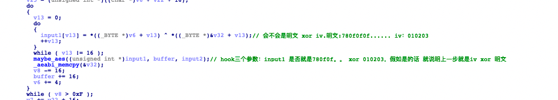

手动验证发现：两个值异或就等于input1，说明r8和r6寄存器的值就是iv和明文。(m 0x3742)

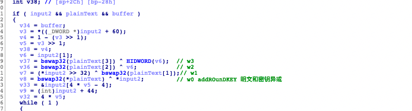

发现明文和input2做异或，那么他就是第一轮的addRoundKey的 明文 oxr 密钥。

**SBOX不同表现形式**


初始置换addRoundKey之后就应该是 S盒替换 为什么这个循环里面都不是S盒，反而是循环外面出现了S盒呢？被魔改了吗？

在github或者谷歌搜索: 代码`RijnDael_AES_3629C`里第一个元素`0xC66363A5`，看看有没有线索，发现是有的。[链接](https://github.com/Spittie/advancedtomato-ac/blob/f8d44eac51c1c7c45daf3e5ec324a59549aca6fc/release/src/router/libsodium/src/libsodium/crypto_stream/aes256estream/hongjun/aes-table-be.h)。

根据网址里面的命名进行改名，T0就是代码里RignDeal_AES_3629Czaai第一个元素`0xC66363A5`根据网址里查到的,然后进行命名修改。

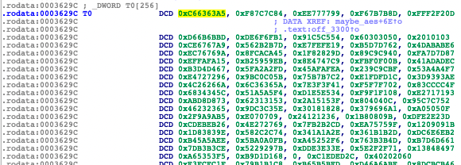

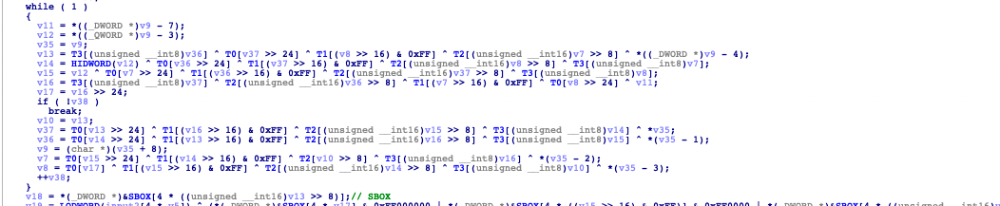

变成了 T0、T1、T2、T3进行操作。从4个表中取值进行操作。其实是实现方式不同而已。

正常用SBOX实现的叫 按照算法描述去实现，样本中这种叫查表法。

查表法的好处：以空间换时间加快AES运算，把subBytes、shiftRows、mixcolumn前三个步骤混在一起去了，得到了4个T表。

```
加解密过程中，加密用Tbox1-4，解密用Tbox5-8，前9轮用T，为什么最后一轮用Sbox不用查表法呢？
   1-9轮 把subBytes、shiftRows、mixcolumn前三个步骤混在一起去了所以用T。
   最面一轮没有mixcolumn，不能用上面混合后的表了，这时候两种方式：可以新增一个新的混合表或者分开来算 s-box、循环左移、state xor 密钥。
为什么查表法不把addroudkey 和前三步放在一起呢?
  因为addroudkey 密钥是我们生成的，可能会变化, 混合表已经是固定的，所以放不进去。
  怎么把key也放进去? 就是aes白盒--加重混淆，即使有源码都无法简简单单还原出key。
https://bbs.pediy.com/thread-267330.htm
```

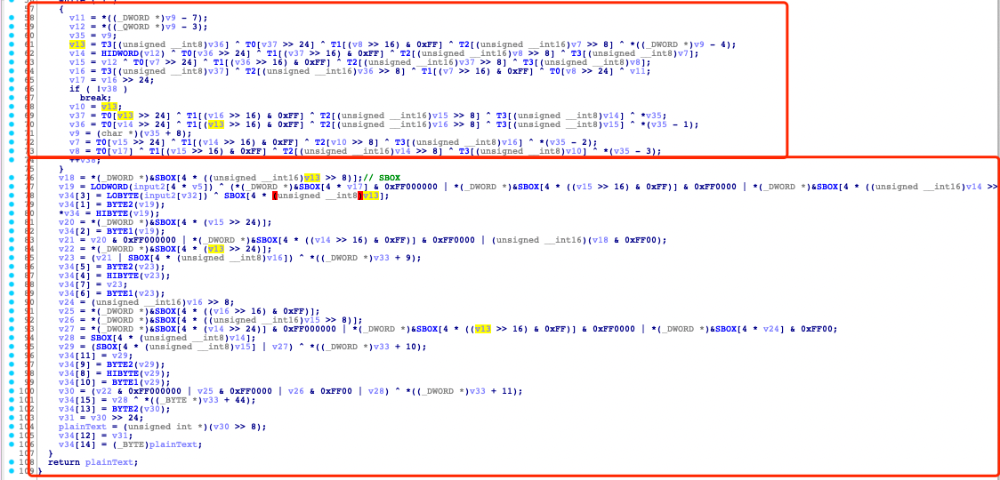

上面是查表法下面是分开计算的。

但是样本中和S盒还是不一样，有可能是S盒和循环左移搞在一起了。

