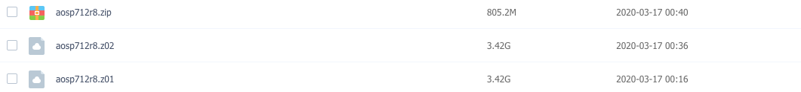
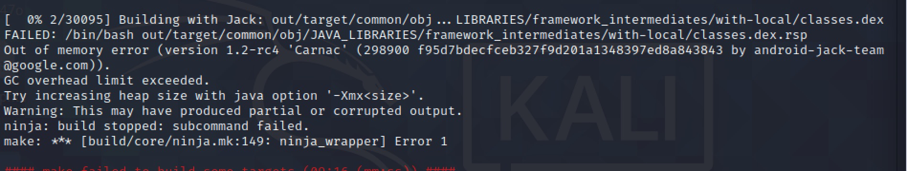
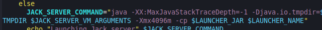
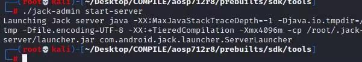

## 编译目标Android 7.1.2

- [源码下载链接: r0ysue编译好的源码](https://github.com/heyhu/AndroidSecurityStudy) 

  > 注: 内含多个解压文件，只要解压aosp712r8.zip就行
  >
  > 

- [手机代号查询](https://source.android.com/setup/start/build-numbers)

  > Android7.1.2搜索android-7.1.2_r8，此版本支持机型最多, 选择前面的Build名称N2G47O

- Factory Images下载

  > 搜索上面提前的Build号搜索，会有好多版本
  >
  > 选择"sailfish" for Pixel
  >
  > | Version                  | Download                                                     | SHA-256 Checksum                                             |
  > | ------------------------ | ------------------------------------------------------------ | ------------------------------------------------------------ |
  > | 7.1.2 (N2G47O, May 2017) | [Link](https://dl.google.com/dl/android/aosp/sailfish-n2g47o-factory-f2bc8024.zip) | f2bc8024b015fdf1e79d0ae3da187cb0c371c7fd5a24e384abe75a0c7c1bdb41 |

- Driver Binaries

  > Pixel binaries for Android 7.1.2 (N2G47O) 两个链接都下载下来

  

## 选择kali虚拟机编译

- 默认账号密码

  > kali / kali

-  添加超级管理员权限

  > sudo passwd root

- 设置用户名密码

  > root/toor 自行决定

- Logout系统，使`root`进行登录即可，再进入就是root系统

- 修改时区

  > Asia / Shanghai

- zsh系统修改为bash

  > chsh -s /bin/bash 修改完重启系统生效

- 设置网络桥接

- 设置科学上网

  >主机的`vpn`允许局域网连接打开
  >
  >vim /etc/proxychains 最下面改为socks5设置为主机的sockes 5 ip port，`socks5 192.168.10.8 7891`
  >
  >proxy_dns 注释掉
  >
  >proxychains curl ip.sb 查看代理是否挂载成功

- 安装工具

  > proxychains apt update
  >
  > apt install jnettop `流量查看工具`  htop `进程查看` 


## 磁盘分区

```
因为该虚拟机默认的八十几G的磁盘空间肯定是不够的，我们给他扩展到450G，要不然报io错误
进入系统后启动Gparted软件，在unallocated部分右击，选择新建，按照默认即可，即可新建这个370G的ext4分区，点击选择Apply，应用到磁盘。然后将这个新建的磁盘给mount到某个文件夹。
# cd Desktop
# mkdir COMPILE
# 把代码发送到COMPILE文件夹下
# mount /dev/sda3 /root/COMPILE
```


## 拓展Swap

```
dd if=/dev/zero of=swapfile bs=1M count=10240
mkswap swapfile  `mkswap创建交换文件`
swapon swapfile  `swapon激活` 
```


## 下载驱动

- 把zip包传入kali虚拟机后，使用7z x解压
- 解压完成后，把下好的两个驱动文件拷贝到aosp文件夹下，解压，执行sh文件，会生成vendor目录，之后编译好的镜像就会存在vender.image，否则真机启动不起来。


## 准备编译环境

```
$ apt update
$ git config --global user.email "you@example.com"
$ git config --global user.name "Your Name"
$ apt install bison tree
$ apt-get install gnupg flex bison build-essential curl zlib1g-dev gcc-multilib g++-multilib libc6-dev-i386 lib32ncurses-dev x11proto-core-dev libx11-dev lib32z1-dev libgl1-mesa-dev libxml2-utils xsltproc fontconfig
$ apt update
$ apt install libxml2-utils
```

安装openjdk-8

```
下载java8
wget https://download.java.net/openjdk/jdk8u41/ri/openjdk-8u41-b04-linux-x64-14_jan_2020.tar.gz

编写~/.bashrc
export JAVA_HOME=/root/Desktop/openjdk8/java-se-8u41-ri
export PATH=$JAVA_HOME/bin:$PATH
export CLASSPATH=.:$JAVA_HOME/lib/dt.jar:$JAVA_HOME/lib/tools.jar

使java环境生效
source /etc/profile && source /root/.bashrc

可以通过-version来确认
java -version
```

调整python优先级, 使用python2

```
update-alternatives --install /usr/bin/python python /usr/bin/python2 150
update-alternatives --install /usr/bin/python python /usr/bin/python3 100
```

编译时的报错处理



> 当出现heap不足时有两种解决办法：打开prebuilts/sdk/tools/jack-admin对JACK_SERVER_COMMAND增加-Xmx4096m选项，-cp 前面加
>
> 修改完成后重启jack-admin服务：./jack-admin kill-server、./jack-admin start-server
>
>  Android8貌似不用






## 开始编译

```
# cd /root/Desktop/COMPILE/aosp/
# export LC_ALL=C
# source build/envsetup.sh
# 选择设备 lunch选择对应的设备，我这里是sailfish，前面驱动也是
# m 程序会自动选择最合适的并行任务数量

```

**如果要重新编译记得先清理之前的一些东西**，用`m clobber`命令，注意命令`m`是在`. build/envsetup.sh`后才有效的

如果重启后要编译，记得先把那个分区挂载上

```
mount /dev/sda3 /root/COMPILE
source /etc/profile && source /root/.bashrc && export LC_ALL=C
. build/envsetup.sh
m clobber
lunch
m
```


## 刷机

记住编译完的终端不要退出，用里面自带的fast-boot 是和系统一起编译出来的，百分之百成功。

下载后的镜像解压zip，并将解压结果中image开头的zip再次解压，进入后只保留`android-info.txt`

最后将编译产生的img复制过来，并打包为zip，然后复制zip替换原有zip

```bash
7z x image-sailfish-n2g470.zip
cd image-sailfish-n2g470
rm *.img
cp ~/Desktop/COMPILE/aosp/out/target/product/sailfish/*.img .
zip -r image-sailfish-n2g470.zip * 
```

注意刷机要用到fastboot（adb也可能用到）

所以临时把它们添加到环境变量

```bash
export PATH=~/myaosp/out/host/linux-x86/bin:$PATH
```

可以用adb查看下手机刷机前的系统编译日期，对比下刷机之后的日期

```bash
adb shell getprop ro.build.date
```

刷机

```bash
./falsh-all.sh
```

如果刷机碰到`error: Cannot generate image for userdata`报错
编辑flash-all.sh，把`-w`去掉，重新刷机


## 参考链接  

> https://www.anquanke.com/post/id/199898
>
> https://blog.seeflower.dev/archives/12/
>
> https://blog.csdn.net/click_idc/article/details/80591686
