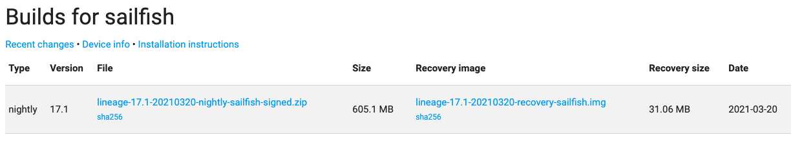
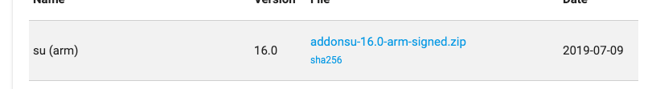
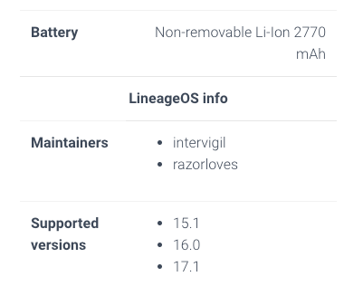
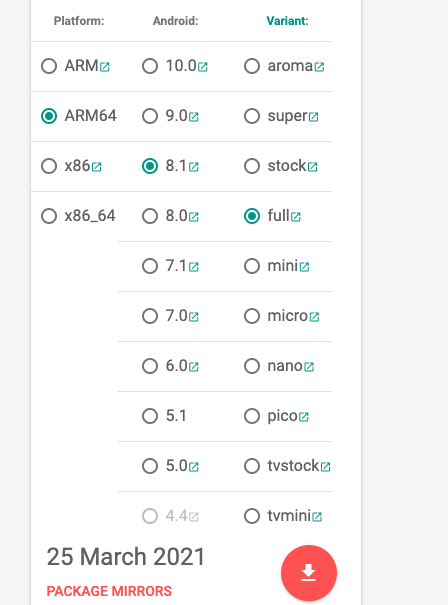

## 1.1 刷机

谷歌搜 APKMirror、APKPure 可以下载谷歌apk

经常用的两个版本：android-8.1.0_r1、android-7.1.2_r8。

先去源码库里选择对应型号，找到最前面的aosp代码，去其他两个网址搜索。

### 1.1.1  Twrp安装（刷机修复备份工具）

```
$ 进入网址 点击devices 搜索手机型号。

$ 点击primary，下载 twrp-pixel-installer-sailfish-3.3.0-0.zip以及twrp-3.3.0-0-sailfish.img。

$ adb reboot bootloader 进入bootloader 模式，fastboot devices 查看是否有设备

$ fastboot boot twrp-3.3.0-0-sailfish.img  临时进入

$ adb push ./twrp-pixel-installer-sailfish-3.3.0-0.zip /sdcard/ 手机必须解锁

$ 手机进去右滑点击install，选择zip包，往右滑就开始刷了。安装完成后rebot system，do not install 就行了。

$ 版本对应：
    安卓8.1.0 -> twrp-3.3.0-0-sailfish.img -> magisk 最新版
    安卓7.1   -> twrp-3.2.1-0-sailfish.img -> SR3-SuperSU-v2.82-20170813133244.zip + XposedInstaller_3.1.5.apk
```


### 1.1.2  Magisk同上

```
$ fastboot boot twrp-3.3.0-0-sailfish.img  临时进入

$ 下载Magisk-v20.4.zip  push到sdcard中。

$ 手机进去点击install，选择zip包，往右滑就开始刷了。

$ 获取root, adb shell su 就可以了。
```


### 1.1.3  Super su 

 最高只适用android 7

下载：

a） -> SuperSU-v2.82-201705271822.zip

b）同上twrp安装。


### 1.1.4  lineage

lineage 自带网络adb调试。

刷机包信息：



 su(arm64) 16.0版本






### 1.1.5 谷歌全家桶



### 1.1.6 nethunter

  https://www.offensive-security.com/kali-linux-nethunter-download/


## 1.2参考链接

- [系统版本：Codenames, Tags, and Build Numbers](https://source.android.com/setup/start/build-numbers )
- [系统镜像：Factory Images for Nexus and Pixel Devices](https://developers.google.com/android/images#sailfish )
- [设备驱动：Driver Binaries for Nexus and Pixel Devices](https://developers.google.com/android/drivers)
- [TWRP](https://twrp.me/google/googlepixel.html )
- [Magisk](https://github.com/topjohnwu/Magisk/releases )
- [SuperSU](https://supersuroot.org/download/ )
- [xposed](https://forum.xda-developers.com/showthread.php?t=3034811 )
- [nethunter](https://www.offensive-security.com/kali-linux-nethunter-download/)
- [谷歌全家桶](https://opengapps.org/)