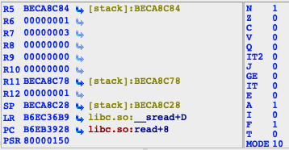

## 1.1 寄存器

ida调试模式下怎么看是arm还是thumb? 寄存器窗口PSR寄存器，看T是0还是1。

```
ida: Debugger -> Attach -> Remote ARMLinux/Android debugger
```



Thumb模式是1，ARM模式是0。

```
Linux的虚拟地址空间范围为0～4G（intel x86架构32位），Linux内核将这4G字节的空间分为两部分，将最高的1G字节（从虚拟地址0xC0000000到0xFFFFFFFF）供内核使用，称为“内核空间”。而将较低的3G字节（从虚拟地址0x00000000到0xBFFFFFFF）供各个进程使用，称为“用户空间”，
一般碰到B开头是用户进程地址。elf文件入口是arm
```

```
用户模式下寄存器：
	LR: linker指针，调用函数的返回地址
	PC：当前地址
	PSR：状态寄存器
		(MODE：处理器模式,10:用户模式，
		F：FIQ 中断禁止位,1:禁止 0允许，
		I：中断禁止位,1:禁止 0允许，
		A：异常屏蔽位
		E：大小端序 0:小端序 1:大端序 linux就是小端序
		T：arm还是thumb
		***NZCV整型运算用的***
		N：符号位，负数或小于
		Z：0标志位   Z标志位赋值为1就是一定执行
		C：进位标志位
		V：溢出标志位
		)
```

**arm条件和标志位响应**


```
N  当用两个补码表示的带符号数进行运算时，N=1表示运算的结果为负数；N=0表示运算的结果为正数或零.
Z  Z=1表示运算的结果为零，Z=0表示运算的结果非零。Z标志位赋值为1就是一定执行
C  可以有4种方法设置C的值：
   加法运算（包括CMN）：当运算结果产生了进位时（无符号数溢出），C=1，否则C=0。
   减法运算（包括CMP）：当运算时产生了借位时（无符号数溢出），C=0，否则C=1。
   对于包含移位操作的非加/减运算指令，C为移出值的最后一位。
   对于其它的非加/减运算指令，C的值通常不会改变。
V  可以有2种方法设置V的值：
   对于加减法运算指令，当操作数和运算结果为二进制的补码表示的带符号数时，V=1表示符号位溢出
   对于其它的非加/减运算指令，V的值通常不会改变。
https://blog.csdn.net/nanfangqiulin/article/details/51122718

-------------
一般机器码最高位E是最常见的，代表着AL，无条件执行，通常会忽略此后缀

CMPCS R2, R3 本来有个CMP指令，加了一个条件后缀CS
-------------
ADD R0, R0, R1 arm一般的第一个寄存器就是写入的目标值，r0 = R0 + R1

ADDS R0, R0, R1 
 
ADDS和ADD的区别就是操作完后会影响标志位，ADD不会影响标志位。
-------------

ADDS R0, R0, R1  r0,0x00000000 r1,0xffffffff，结果r0=0x00000000 带s会影响标志位，因为r0=0所以Z=1, 结果产生了进位时（无符号数溢出了）所以 C=1

subs r0, r0, r1  r0,0x00000000 r1,0xffffffff，结果r0=0x00000001, 当运算时产生了借位时,C=1,但是此时C没有变成1
subs r0, r0, r1   r0,0x00000002 r1,0x00000001，结果r0=0x00000001, 此时没有借位，但是c=1了 为什么？
  执行加法时对C位的影响是正常的。但是减法时对C位的影响和x86是反的。
  减法的时候，只要看到SUBS指令先把C位置1，C位放在被减位的的第一位，变成了0x10000002,0x10000002-1，此时如果产生了借位C=0，否则  	C=1，这时因为我们没借位，所以C被留下来了=1。
-------------
1A 00 00 9A BLS loc_EA2C，怎么理解BLS？
  B + LS标志位后缀还是BL指令 + S后缀，怎么理解？
  bl 指令就是跳转一个地方，同时把返回地址写入他的lr寄存器里。此机器码最高位是9，他的二进制为1001,1001对应条件码就是LS，所以是B + LS条件

-------------
01 00 50 E1 CMP r0, r1 第三列(20位)为奇数一定更新Z标志位，偶数就是不需要更新标志位

SUBS 既要结果，又要标志寄存器
SUB  只要结果，忽略标志寄存器
CMP  忽略结果，只要标志寄存器

ADDS  既要结果，又要标志寄存器
add   只要结果，忽略标志寄存器
cmn   忽略结果，只要标志寄存器
```

[arm 标志寄存器 ](http://t.zoukankan.com/hjbf-p-13292589.html)

## 1.2 指令基本格式

```
arm中没有隐式操作指令，LDR R3, [R5] 带中括号的就是显示操作指令

每条指令0-3个操作数，内存操作数和立即操作数不能同时存在，内存操作数至多出现一次，寄存器操作数总在最前

操作数3类 ：寄存器、内存([R5] 中括号就是内存操作数)、立即数

LDR R3, [R5]，这条指令有寄存器和内存两个操作数，寄存操作数总在最前。

MOVEQ R2，#0x1F 这条指令有寄存器和立即数两个操作数，寄存操作数总在最前。

LDR r0，[r1, #4] 第一个操作数r0 寄存器，第二个操作数[r1, #4]内存，#4不是立即数，只是内存的一个索引模式

MOV R6，R6,LSL R2  第一个操作数R6 寄存器, 第二个操作数(R6,LSL，R2) R6左移R2这么多位

LDREQ R0, [r4],#4  第一个操作数R6 寄存器, 第二个操作数[r4],#4 内存操作数，,#4的意思为访存之后的附加行为

lDR R5, =(dword_493D4 - 0x13190) 伪指令，不是原生的arm汇编指令。只要有等号的就是一个内存操作数，相当于看到中括号

STMFD SP!, {R4,R5,LR} SP!为寄存器操作数，{R4,R5,LR}为寄存器组，寄存器组也是寄存器操作数

BLS loc_131FC 标签这种就是立即数操作数

特殊MRC有5个操作数，他不是arm指令 
```

## 1.3 读PC寄存器需要注意事项

### 1.3.1 arm模式下

```
	PC寄存器指在当前位置下，在r0寄存器位置点击edit，赋值一个新地址。
	使用keypatch 修改当前机器码为 MOV PC, R0，意思就是r0的值给PC，下一步，调试就会跳到刚才给R0赋值的地址位置，因为pc就是指向当前位置，实现内存跳。
	
	MOV  R0, PC  arm模式下读pc的值就是要地址+8, thumb就是+4，即使遇到跳转也是+8。
```

```
	此时的pc地址: 0x6ECA92C, 使用Keypatch修改指令为: ldr r0, [pc], 此指令含义为从pc的内存里读取4字节放在r0里。
	[pc]为内存操作数，ida会自动翻译成LDR R0, locret_B6ECA934，
	arm读pc会加8，地址为0x0x6ECA934，从这个地址读取4个字节给r0，r0的结果为0x512FFF1E(小端序)。
	
	libc.so:B6ECA928 00 00 00 EF SVC             0
	libc.so:B6ECA92C 00 00 9F E5 LDR             R0, locret_B6ECA934     ; Keypatch modified this from:
	libc.so:B6ECA92C                                                     ;   LDMFD SP!, {R4,R7}
	libc.so:B6ECA930 00 00 B0 E1 MOVS            R0, R0
	libc.so:B6ECA934
	libc.so:B6ECA934             locret_B6ECA934                         ; DATA XREF: libc.so:read+C↑r
	libc.so:B6ECA934 1E FF 2F 51 BXPL            LR
	libc.so:B6ECA938 01 B5 00 EA B               B6EE492B
```

```
	ldr r0, [pc, 4] 意思就是读pc加上4个偏移的内存. ida会优化自动算好LDR R0, =0xE92D0090
	此时的pc为B6ECA930, arm读pc会加8，地址为0x6ECA938,加上4个偏移为0x6eca93c，从这个地址读取4个字节给r0为0xE92D0090(小端序)。
	
	libc.so:B6ECA930 00 00 B0 E1 MOVS R0, R0
	libc.so:B6ECA934
	libc.so:B6ECA934             locret_B6ECA934                         ; DATA XREF: libc.so:read+C↑r
	libc.so:B6ECA934 1E FF 2F 51 BXPL            LR
	libc.so:B6ECA938 01 B5 00 EA B               B6EE492B
	libc.so:B6ECA938             ; ---------------------------------------------------------------------------
	libc.so:B6ECA93C 90 00 2D E9 write DCD 0xE92D0090
```

```
	[pc, #4] 4为立即数，一般立即数前面需要加#号
	ida中 按d可以将此类locret_B6ECA934 强行改成数据格式。
	减去4个地址就是[pc, #-4]
  此时pc=0xB6EF2934, 加8在减4，r0=0xEA00B501,自动识别出来。
	但是按f8后，结果却不对，为何？
	  结果为：0xE7F001F0， 把结果改为 F0 01 F0 E7 指令 使用patch program修改后，发现是一个UND指令，相当于一个断点。
		0xB6EF2934 + 8 -4 = 0xb6ef2938为当前pc的下一指令。
		因为调试器机制，在下断点的时候，点击f8，他会在下一条指令进行注入。而我们计算得到的0xb6ef2938就是为下一条指令，所以实际得到的是断点指令，所以不是我们想象的那样为EA00B501。
	
	libc.so:B6EF2934 04 00 1F E5 LDR             R0, =0xEA00B501         ; Keypatch modified this from:
	libc.so:B6EF2934                                                     ;   BXPL LR
	libc.so:B6EF2934             ; ---------------------------------------------------------------------------
	libc.so:B6EF2938 01 B5 00 EA dword_B6EF2938 DCD 0xEA00B501           ; DATA XREF: libc.so:read+14↑r
	libc.so:B6EF293C 90 00 2D E9 write DCD 0xE92D0090
```

### 1.3.2 thumb模式下

```
	ldr r0, [pc]。 [pc]为内存操作数，从pc的内存里读取4字节放在r0里。
	
	libc.so:B6F786B8 DF F8 00 00 LDR.W           R0, loc_B6F786BC        ; Keypatch modified this from:
	libc.so:B6F786B8                                                     ;   CMP R0, #0
	libc.so:B6F786B8                                                     ; Keypatch modified this from:
	libc.so:B6F786B8                                                     ;   LDR R0, loc_B6F786C0
	libc.so:B6F786B8                                                     ;   ITETE GE
	libc.so:B6F786BC
	libc.so:B6F786BC             loc_B6F786BC
	libc.so:B6F786BC 23 6D       LDR             R3, [R4,#0x50]
	libc.so:B6F786BE A3 89
	
	此时的pc为0xB6F786B8, thumb读pc会加4，地址为0xB6F786BC, 从这个地址读取4个字节给r0会是0x89A36D23吗？
	不是，是89A3DE10。89 A3是对的，在23 6D写入DE10(10 de)看一下(Edit->Path program-> Change byte),为 10 DE: UND #0x10		点击f8，此时pc就是下一条指令，调试模式下一句就是断点，所以不能这么写。
	因为f8断点指令会对下一条指令进行改写，所以读到的就是改写后的，无法正确得到下一条指令。
	打断点和实际运行的时候下一条指令读取是不一样的，可做反调试。读下一个指令是	UND #0x10 就说明是一个断点。
```

```
  ldr r0, [pc, 4]
	libc.so:B6F786BC 01 48       LDR             R0, loc_B6F786C2+2      ; Keypatch modified this from:
	libc.so:B6F786BC                                                     ;   UND #0x10
	libc.so:B6F786BE 01 48       LDR             R0, loc_B6F786C2+2      ; Keypatch modified this from:
	libc.so:B6F786BE                                                     ;   LDRH R3, [R4,#0xC]
	libc.so:B6F786C0 1B 18       ADDS            R3, R3, R0
	libc.so:B6F786C2
	libc.so:B6F786C2             loc_B6F786C
	libc.so:B6F786C2 23 F4 80 53 BIC.W           R3, R3, #0x1000
	libc.so:B6F786C6 AC BF       ITE GE
	libc.so:B6F786C8 23 65       STRGE           R3, [R4,#0x50]
	libc.so:B6F786CA A3 81       STRLTH          R3, [R4,#0xC]

	pc = 0xB6F786BC, ldr r0, [pc, 4],先读pc +4,在加立即数的4,就是0xB6F786BC+4+4 = 0xb6f786c4, 读取4个字节，r0就是0xBFAC5380
	按f8到了0xB6F786BE在写ldr r0, [pc, 4],会发现又出现了R0, loc_B6F786C2+2和上一条指令是一样的这是为什么？
		因为这个地址不是4字节对齐，要进行下对等对齐。C6下对等是c4, 所以值是一样的。thumb指令是变长的，有的2字节有的4字节，需要考虑4字节对齐问题。
```

