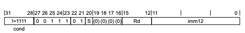
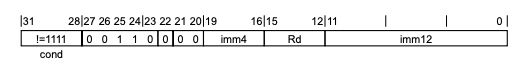
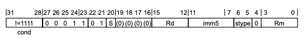
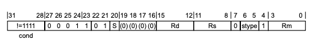

## 1.1 mov

> 如何快速从arm手册查看指令 F5:T32 and A32--F5.1

```python
mov指令,不访问内存,没有读写内存的操作。因为不访存所以没有内存操作数，只有两个操作数要么是寄存器要么是立即数。
从第二个操作数给第一个操作数，所以第一个操作数一定是寄存器。
arm指令长度就是4字节32位，所以立即数不能是任意的32位整形，指令长度不足以表示。
因为mov三种格式允许操作的立即数最多的就是A2编码16位，所以mov指令下立即数不能超16位。
```

### 1.1.1 MOV, MOVS (immediate)

####  A1

 

```
mov r0,0x80000000  即使立即数超了16位也可以，为什么呢？因为采用了A1的这种方式，这种立即数比较常见，它的有效位只有它的最高位8000。
02 01 A0 E3 MOV R0, #0x80000000

hex_str1 = "0xE3a00102"
bin：1110 0011 1010 0000 0000 0001 00000010

图上又把后12位拆成2份，8-11位以及0-7位，这个立即数就是把机器码里面的02也就是低8位立即数00000010,进行向右循环移位。移多少位呢，就是imm12的高第8-11位乘2，也就是最后8位00000010 向右移动8-11位*2(0001*2=两位)。

8位立即数向右移动，可以移动的范围就是4的2次方也就是0-16，为什么乘2?就是0-32,可以覆盖到0-32中的偶数可以移动的比较全,8位立即数可以向右移动0、2、4、8、16、32。

此指令A1作用就是 防止写入0x80000000时把机器码弄长，采用左移的方式。
```

####  A2

 

```
mov 寄存器,立即数。往寄存器写任意一个16位(imm12+imm4=16)的立即数，所以imm一定不能超过16位，0x1234可以，0x12345不行。

34 02 01 E3  MOV R0, #0x1234
hex_str = "0xE3010234"
bin: 1110 0011 0000 0001 0000 001000110100

34 12 01 E3  MOV R1, #0x1234
hex_str1 = "0xE3011234"
bin：1110 0011 0000 0001 0001 001000110100

倒数第1块后12位(imm12)就是立即数后三个字节0x234，倒数第3块4位(imm4)就是立即数第一个字节0x1，拼起来就是我们的立即数0x1234。
倒数第2块Rd就是代表寄存器，12-15有4位，2的4次方可以表示0-15的数字，int( "1111", 2)=15也就是寄存器r0-r15，后三个寄存器就是SP、LR、PC。此时我们是r0,看倒数第二块就是0，r1就是0001。
bin(16) =0b10000，16以后只能5位才能表示。
```

```
如何使用mov指令在一个寄存器里写入一个任意的32位立即数？
首先使用mov写入低16位, mov r0, #0x5678,在使用movt在下一条汇编写入高16位, MOVT R0, #0x1234
ida会自动把两句混成一句,ida会生成一个伪指令，78 06 05 E3 34 02+ mov r0, #0x12345678
arm指令时定长的,它是编译器生成的伪指令。
```

### 1.1.2 MOV, MOVS (register)

#### A1



```
mov r0, r1(寄存器，寄存器)
mov寄存器可以带shift的, 01 02 A0 E1 MOV R0, R1,LSL#4, r1左移4位给r0
此指令两个操作数 第一个r0，第二个操作数R1,LSL#4 左移4位

hex_str = "0xE1A00201"
bin：1110 0001 1 01 0 0000 0000 0010 000 0 0001

Rm = 0001 = r1, 操作的寄存器
stype = 00 = LSL
	左移右移通过stype(5-6)两位表示，2的2次方代表4种模式:逻辑左移、逻辑右移、算术右移、循环移位。
	没有算数左移，因为算数左移和逻辑左移是一样的，算术右移是带符号的不等于逻辑右移，循环移位不区分左右。
	imm5 = 移位的位数 = 00100 = 4
	移位的数就是imm5，这里imm5不是指立即数而是移多少位，7-11位就是通过5位表示，2的5次方=32就是指可以表示0-31的数字。
	移位的范围是32，因为循环左移1位和循环右移31位是一样的，所以循环移位不区分左右。
Rd = 0000 = r0
20位为1的话就是MOVS

lsl r0, r1,4 = MOV  R0, R1,LSL#4 
相当于mov指令的宏，另一种写法，ida在翻译的时候都会给翻译成mov指令，所以在ida反编译界面找不到lsl、lsr这种指令，都给翻译成了mov指令。
```

### 1.1.3 MOV, MOVS (register-shifted register)



```
寄存器带有寄存器的位移

MOV  R0, R1,LSR R2 同上，只不过imm5立即数换成了Rs，与lsr r0, r1, r2两种相等，反汇编后都是move指令。
```

