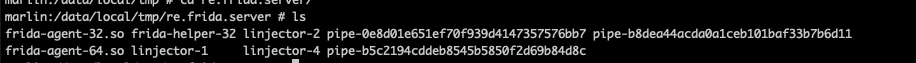
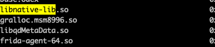

### Frida:

1. 为Frida改成非标准端口：./frida-server-12.10.2-android-arm -l 0.0.0.0:8888

2. 标准搭配：frida==12.8.0 frida-tools==5.3.0 objection1.8.4

3. 列出手机里所有包名: frida-ps -H 192.168.199.237(手机ip):8888

4. 查看frida服务是否可用：frida-ps -U  android.process.acore

5. 查看进程：frida-ps -U  | grep 包名

6. 指定多个pid：使用-p参数，指定pid

7. 脚本注入：  
   1. attach模式：frida -U android.process.acore -l s1.js
        > 直接附加到已知已存在的进程
   2. spawn模式：frida -U --no-pause -f com.xes.jazhanghui.activity -l hash.js
        > 找到指定包名的app并在启动前注入脚本进去，加“--no-pause”表示直接启动, 不暂停在app启动时

8. Options：

    1. 命令行模式:
        1. -f 为spwan模式，以全新的进程启动一个app。如果不加f，就是先让程序一段时间运行在attach上去。  
        2. -l 指定hook脚本  
        3. -o xxx.txt   把结果输出到txt文件  
        4. --no-pause 继续、恢复执行的意思，如果加-f，不加--no-pause,程序会挂起，需要在命令行手动执行%resume，让程序恢复执行，hook脚本也执行。  
        5. F  最前台进程, frida -UF    

    2. 交互模式:
        1. %resume 用命令行启动frida时,进入交互界面后，如果不加--no-pause，要输入此命令，使程序继续执行。  
        2. %reload 用来重新加载脚本  
        3. Frida   用命令行启动frida时,进入交互界面后，查看环境  
        4. console.log('hello') 可以直接运行js命令  

9. frida hook原理
   > 启动frida-server时会注入so，在so层进行java层反射。
   
   
   
10. 如果某些app检测frida的话可以用[hluda](https://github.com/hluwa/strongR-frida-android)
11. frida-ps -Ua 查看后台进程
