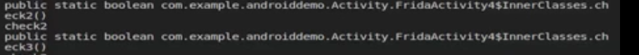
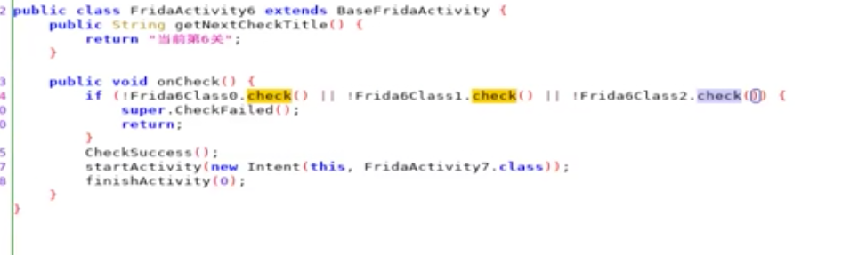

### Hook java

1. [输出bytes数组, bytesToString](https://github.com/heyhu/frida-agent-example/blob/master/code/rouse/hook_java/demo1_0516.js)  
   
   ```
    ByteString.of是用来把byte[]数组转成hex字符串的函数, Android系统自带ByteString类
    var ByteString = Java.use("com.android.okhttp.okio.ByteString");
    var j = Java.use("c.business.comm.j");
    j.x.implementation = function() {
        var result = this.x();
        console.log("j.x:", ByteString.of(result).hex());
        return result;
    };
    
    j.a.overload('[B').implementation = function(bArr) {
        this.a(bArr);
        console.log("j.a:", ByteString.of(bArr).hex());
    };
    ```     

2. [密码爆破，在内存里主动调用](https://github.com/heyhu/frida-agent-example/blob/master/code/rouse/hook_java/demo1_0516.js)     

3. 构造一个aaaa字符串
   ```
   Java.use('Java.lang.String').$new('aaa')
   含义：.$new 使用构造方法创建实例
   注：如果字符串为$new生成出来的，则可以调用java层string类的方法。
   ```  
   
4. [查找实例进行主动调用](https://github.com/heyhu/frida-agent-example/blob/master/code/rouse/hook_java/demo1_0519.js)

5. [内部变量赋值修改](https://github.com/heyhu/frida-agent-example/blob/master/code/rouse/hook_java/demo1_0519.js)
    ```
   var a = Java.use("com.android.okhttp.okio.ByteString");
   static value_a = false //属性
   void value_b = false // 属性
   void value_c = false // 属性
   value_c  //方法
   静态成员可以直接设置结果： a.value_a.value = true;
   动态成员需要找到实例： instance_a.value_b.value = true; 
   如果方法属性同在，直接调用的是方法，想调用属性的话，前面加下划线：instance_a._value_c.value = true;
   ```  

6. [查找内部类](https://github.com/heyhu/frida-agent-example/blob/master/code/rouse/hook_java/demo1_0519.js)  
   ```
    内部的a方法怎么用frida hook到 ?
    1. 用jadx看smali，内部类是有个分配给他的类似$a的名字的；
    2. 用objection去trace，打印所有类的实例，或者hook类的构造函数都可以。
   ```         
      
   innerClass是activity4的内部类。   

7. [getDeclaredMethods](https://github.com/heyhu/frida-agent-example/blob/master/code/rouse/hook_java/demo1_0519.js)
   ```
   获取本类中的所有方法，包括私有的(private、protected、默认以及public)的方法。
   ```     
      
  
8. [枚举所有classLoader](https://github.com/heyhu/frida-agent-example/blob/master/code/rouse/hook_java/demo1_0519.js)
   ```
    1. 只有找到类对应的loader，才能找到这个类以及hook对应的方法。
    2. 类是怎么加载到java虚拟机并执行？
        ClassLoader的具体作用就是将class文件加载到jvm虚拟机中去，程序就可以正确运行了。
        但是，jvm启动的时候，并不会一次性加载所有的class文件，而是根据需要去动态加载。这样会导致个别类搜索不到。
    3. ClassLoader类结构介绍, ClassLoader是一个抽象类，核心方法如下：
       defineClass()：目的是将byte字节流解析成JVM能够识别的Class对象。
       findClass()：此方法支持重载，与defineClass()配合使用，目的是获取Class对象的字节码。这个方法的意义在于，我们不仅仅可以通过class文件实例化对象，也可以通过其他方式，比如从网络上获取的字节码文件，可能会有对应的加密规则。
       loadClass()：此方法支持重载，目的是获取加载类的类对象。
       resolveClass()：实现让JVM链接这个类，此方法调用的是本地方法，不能重载。
   ```  

9. [enumerateLoadedClasses](https://github.com/heyhu/frida-agent-example/blob/master/code/rouse/hook_java/demo1_0519.js)
   ```
    枚举所有已加载的类，enumerateLoadedClasses, 过滤出自己想要的类名。
    笨方法：
    function challenge6(){
        Java.perform(function(){
            Java.use("com.example.androiddemo.Activity.Frida6.Frida6Class0").check.implementation = function(){return true};
            Java.use("com.example.androiddemo.Activity.Frida6.Frida6Class1").check.implementation = function(){return true};
            Java.use("com.example.androiddemo.Activity.Frida6.Frida6Class2").check.implementation = function(){return true};
        })
    }
   ```  
     
