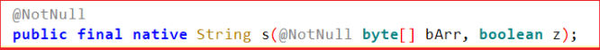
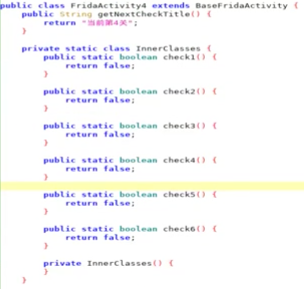

### Hook java

1. [输出bytes数组, bytesToString](https://github.com/heyhu/frida-agent-example/blob/master/code/rouse/hook_java/demo1_0516.js)  
   
   ```
    ByteString.of是用来把byte[]数组转成hex字符串的函数, Android系统自带ByteString类
    var ByteString = Java.use("com.android.okhttp.okio.ByteString");
    var j = Java.use("c.business.comm.j");
    j.x.implementation = function() {
        var result = this.x();
        console.log("j.x:", ByteString.of(result).hex());
        return result;
    };
    
    j.a.overload('[B').implementation = function(bArr) {
        this.a(bArr);
        console.log("j.a:", ByteString.of(bArr).hex());
    };
    ```     

2. [密码爆破，在内存里主动调用](https://github.com/heyhu/frida-agent-example/blob/master/code/rouse/hook_java/demo1_0516.js)     

3. 构造一个aaaa字符串
   ```
   Java.use('Java.lang.String').$new('aaa')
   含义：.$new 使用构造方法创建实例
   注：如果字符串为$new生成出来的，则可以调用java层string类的方法。
   ```  
   
4. [查找实例进行主动调用](https://github.com/heyhu/frida-agent-example/blob/master/code/rouse/hook_java/demo1_0519.js)

5. [内部变量赋值修改](https://github.com/heyhu/frida-agent-example/blob/master/code/rouse/hook_java/demo1_0519.js)
    ```
   var a = Java.use("com.android.okhttp.okio.ByteString");
   static value_a = false //属性
   void value_b = false // 属性
   void value_c = false // 属性
   value_c  //方法
   静态成员可以直接设置结果： a.value_a.value = true;
   动态成员需要找到实例： instance_a.value_b.value = true; 
   如果方法属性同在，直接调用的是方法，想调用属性的话，前面加下划线：instance_a._value_c.value = true;
   ```  

6. [查找内部类](https://github.com/heyhu/frida-agent-example/blob/master/code/rouse/hook_java/demo1_0519.js)
    
   innerClass是activity4的内部类。 
   ```
    内部的a方法怎么用frida hook到 ?
    1. 用jadx看smali，内部类是有个分配给他的类似$a的名字的；
    2. 用objection去trace，打印所有类的实例，或者hook类的构造函数都可以。
    ```