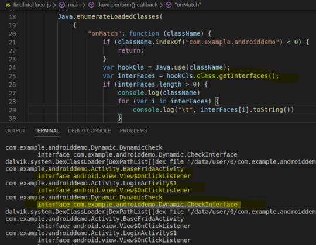
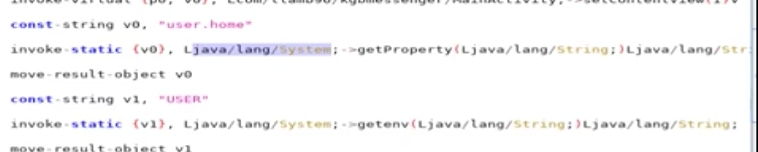
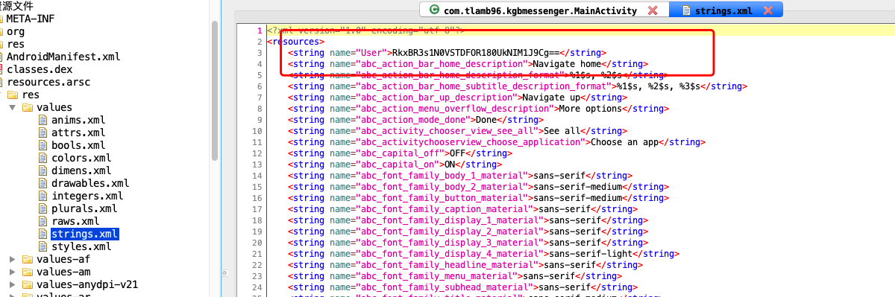

#### Hook Java

1. [案例: 密码内存爆破, 输出bytes数组, bytesToString](https://github.com/heyhu/frida-agent-example/blob/master/code/rouse/hook_java/pass_invoke.js)
   
   
   
   ```js
    // ByteString.of是用来把byte[]数组转成hex字符串的函数, Android系统自带ByteString类
   function hookSign() {
       Java.perform(function () {
           var NativeApi = Java.use('com.weibo.xvideo.NativeApi');
           // 使用系统工具类将byte数组转成hex、utf8.
           var ByteString = Java.use("com.android.okhttp.okio.ByteString");
           NativeApi.s.implementation = function (str1, str2) {
               var result = this.s(str1, str2);
               console.log("str:" + ByteString.of(str1).utf8())
               console.log("hex:" + ByteString.of(str1).hex())
               console.log(result);
               return result;
           }
       });
   } 
   ```
   
2. [构造一个字符串](https://github.com/heyhu/frida-agent-example/blob/master/code/rouse/hook_java/challenge_hook.js#L23)

   ```
   Java.use('Java.lang.String').$new('aaa')
   含义：.$new 使用构造方法创建实例
   注：如果字符串为$new生成出来的，则可以调用java层string类的方法。
   ```

3. [查找实例进行主动调用](https://github.com/heyhu/frida-agent-example/blob/master/code/rouse/hook_java/challenge_hook.js#L83)

   ```
   java 方法分静态和动态，带static的方法可以直接调用，否则需要实例, 注意时机！一般不能用spwan。
   Java.choose的使用, 原型：Java.choose(className, callbacks)
   作用：在内存中扫描Java的堆(heap) 找到指定类(className)的实例化对象
   Java.use()与Java.choose()最大的区别，就是在于前者会新建一个对象，后者会选择内存中已有的实例。
   例子：
         var a;
         Java.choose('com.Tester.Mtop.a', {
         "onMatch":function(instance){   //该类有多少个实例，该回调就会被触发多少次
             a = instance
         },
         "onComplete":function(){}
           }
         )
   注意：类名为string -> 'com.Tester.Mtop.a'
   ```

4. [内部变量赋值修改](https://github.com/heyhu/frida-agent-example/blob/master/code/rouse/hook_java/challenge_hook.js#L45)

   ```
   var a = Java.use("com.android.okhttp.okio.ByteString");
   static value_a = false //属性
   void value_b = false // 属性
   void value_c = false // 属性
   value_c  //方法
   静态成员可以直接设置结果： a.value_a.value = true;
   动态成员需要找到实例： instance_a.value_b.value = true; 
   如果方法属性同在，直接调用的是方法，想调用属性的话，前面加下划线：instance_a._value_c.value = true;
   ```

5. [查找内部类](https://github.com/heyhu/frida-agent-example/blob/master/code/rouse/hook_java/challenge_hook.js#L65)

   ```
    内部的a方法怎么用frida hook到 ?
    1. 用jadx看smali，内部类是有个分配给他的类似$a的名字的；
    2. 用objection去trace，打印所有类的实例，或者hook类的构造函数都可以。
   ```
      
   innerClass是activity4的内部类。   

6. [getDeclaredMethods](https://github.com/heyhu/frida-agent-example/blob/master/code/rouse/hook_java/challenge_hook.js#L67)

   ```
   获取本类中的所有方法，包括私有的(private、protected、默认以及public)的方法。
   ```
        

7. [枚举所有classLoader, 找到要hook的类](https://github.com/heyhu/frida-agent-example/blob/master/code/rouse/hook_java/challenge_hook.js#L90)

   ```
    1. 只有找到类对应的loader，才能找到这个类以及hook对应的方法。
    2. 类是怎么加载到java虚拟机并执行？
        ClassLoader的具体作用就是将class文件加载到jvm虚拟机中去，程序就可以正确运行了。
        但是，jvm启动的时候，并不会一次性加载所有的class文件，而是根据需要去动态加载。这样会导致个别类搜索不到。
    3. ClassLoader类结构介绍, ClassLoader是一个抽象类，核心方法如下：
       defineClass()：目的是将byte字节流解析成JVM能够识别的Class对象。
       findClass()：此方法支持重载，与defineClass()配合使用，目的是获取Class对象的字节码。这个方法的意义在于，我们不仅仅可以通过class文件实例化对象，也可以通过其他方式，比如从网络上获取的字节码文件，可能会有对应的加密规则。
       loadClass()：此方法支持重载，目的是获取加载类的类对象。
       resolveClass()：实现让JVM链接这个类，此方法调用的是本地方法，不能重载。
   ```

8. [enumerateLoadedClasses](https://github.com/heyhu/frida-agent-example/blob/master/code/rouse/hook_java/challenge_hook.js#L117)

   ```
    枚举所有已加载的类，enumerateLoadedClasses, 过滤出自己想要的类名。
    笨方法：
    function challenge6(){
        Java.perform(function(){
            Java.use("com.example.androiddemo.Activity.Frida6.Frida6Class0").check.implementation = function(){return true};
            Java.use("com.example.androiddemo.Activity.Frida6.Frida6Class1").check.implementation = function(){return true};
            Java.use("com.example.androiddemo.Activity.Frida6.Frida6Class2").check.implementation = function(){return true};
        })
    }
   ```
     

9. hook all interface
   ```
   public class milk implements liquid {
   implements //就是接口的意思。关键字，implements是一个类，实现一个接口用的关键字，它是用来实现接口中定义的抽象方法。实现一个接口，必须实现接口中的所有方法。
   ```
     

10. 如果一个类想hook，但是类/函数没有import，可以看它的smali文件，找到相应的信息
    ```
    Java.lang.System 就是System的类名。
    ```
    ​      

11. 资源文件的读取     
    

     找到对应的资源文件：

          

12. hook构造函数    
     ```
     构造函数：是一种特殊的方法。
     主要用来在创建对象时初始化对象，即为对象成员变量赋初始值，总与new运算符一起使用在创建对象的语句中。
     一个特别的类可以有多个构造函数 ，可根据其参数个数的不同或参数类型的不同来区分它们 即构造函数的重载。
     例子：
     Java.use("com.tlamb96.kgbmessenger.b.a").$init.implementation = function(x,str,str1,b){
         this.$init(x,str,str1,b);
         console.log("x,str,str1,b:",x,str,str1,b)
         printStack("print_stack");
     }
     ```

13. 打印堆栈、调用栈
     ```
     1. 格式一般
     function printStack(name) {
         Java.perform(function () {
             var Exception = Java.use("java.lang.Exception");
             var ins = Exception.$new("Exception");
             var straces = ins.getStackTrace();
             if (straces != undefined && straces != null) {
                 var strace = straces.toString();
                 var replaceStr = strace.replace(/,/g, "\\n");
                 console.log("=============================" + name + " Stack strat=======================");
                 console.log(replaceStr);
                 console.log("=============================" + name + " Stack end=======================\r\n");
                 Exception.$dispose();
             }
     });
     
     2. 格式整齐
     console.log(Java.use("android.util.Log").getStackTraceString(Java.use("java.lang.Throwable").$new()));
     ```

14. [gson 解决打印问题，打印char数组、bytes数组等](https://github.com/heyhu/frida-agent-example/blob/master/code/rouse/hook_java/0526.js#L16)

     ```
     在使用gson.dex打印[object]的时候，有时候apk里内置了一个gson，再load就会有重名的问题。
     我自己编译了一个gson，改了包名，效果如图，这样就不会再重名了。
     使用方法：解压，adb push到fridaserver同目录下之后
     Java.openClassFile("/data/local/tmp/r0gson.dex").load();
     const gson = Java.use('com.r0ysue.gson.Gson');
     console.log(gson.$new().toJson(xxx));
     ```

15. [Java.array 构造数组，构造对象](https://github.com/heyhu/frida-agent-example/blob/master/code/rouse/hook_java/0526.js#L35) 

     ```
     JNI的方法签名首先列出java数据类型与签名类型的对应关系：
     https://www.cnblogs.com/bokezhilu/p/7679527.html
     var newCharArray = Java.array('char', ['一', '去', '二', '三', '里']);
     var newR = Java.use('java.lang.String').$new(newCharArray);
     return newR
     ```

16. [Java.cast 类型强转](https://github.com/heyhu/frida-agent-example/blob/master/code/rouse/hook_java/0526.js#L60) 

     ```
      WaterHandler为实例
      子类转父类可以实现, 父类 强转子类会报错不可能实现
     ```

17. [Java.registerClass](https://github.com/heyhu/frida-agent-example/blob/master/code/rouse/hook_java/0526.js#L87)

      ```
      动态创建一个类，实现并重写别人的接口, 可以实现过ssl pingning检测以及runnable多线程
      java源码
      public class milk implements liquid {
         public String flow(){
             Log.d("3interface", "flowing : interface ");
             return "nihao";
      };
      ```

18. [Java hook enum](https://github.com/heyhu/frida-agent-example/blob/master/code/rouse/hook_java/0526.js#L104)

     ```
     java源码
     enum Signal {
         GREEN, YELLOW, RED
     }
     public class TrafficLight {
         public static Signal color = Signal.RED;
     ```

19. [hook Hashmap](https://github.com/heyhu/frida-agent-example/blob/master/code/rouse/hook_java/0526.js#L117)

     > 类似list、set等 hook到实例都可以调用原先java类的方法

20. [non-ascii类名方法名hook](https://api-caller.com/2019/03/30/frida-note/)

21. [rpc 上传到PC上打印，内外互联](https://www.freebuf.com/articles/system/190565.html)

22. [Java.use得到的类使用java的内置方法](https://github.com/heyhu/frida-agent-example/blob/master/code/rouse/hook_java/challenge_hook.js#L67)

     ```js
     // 使用类的一些反射方法
     var InnerClass = Java.use(class_name);
     var all_methods = InnerClass.class.getDeclaredMethods();
     ```

23. [java string 对象打印](https://github.com/heyhu/frida-agent-example/blob/master/code/rouse/hook_java/challenge_hook.js#L70)

     ```
     很多对象都可以用 .toString() 来打印字符串
     ```


