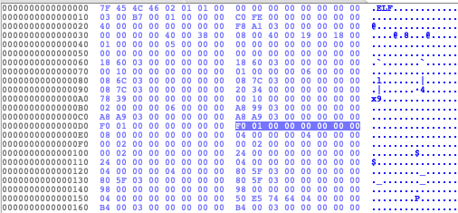
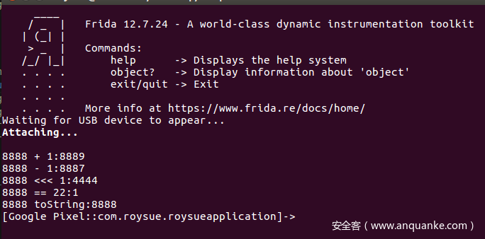

### Hook Native

1. hexdump
    hexdump，其含义:打印内存中的地址，target参数可以是ArrayBuffer或者NativePointer,
    而options参数则是自定义输出格式可以填这几个参数offset、lengt、header、ansi。
   ```js
    var libc = Module.findBaseAddress('libnative-lib.so');
    console.log(libc)
    console.log(hexdump(libc, {
        offset: 0,
        length: 64,
        header: true,
        ansi: true
    }));
    /*
    0x78472c1000
                 0  1  2  3  4  5  6  7  8  9  A  B  C  D  E  F  0123456789ABCDEF
    78472c1000  7f 45 4c 46 02 01 01 00 00 00 00 00 00 00 00 00  .ELF............
    78472c1010  03 00 b7 00 01 00 00 00 c0 fe 00 00 00 00 00 00  ................
    78472c1020  40 00 00 00 00 00 00 00 f8 a1 03 00 00 00 00 00  @...............
    78472c1030  00 00 00 00 40 00 38 00 08 00 40 00 19 00 18 00  ....@.8...@.....
    左面：内存地址。中间：数据的hex16进制表示 右边：数据的字符串显示 0X45 -> E
    */
    ```
    和ida显示的一摸一样     
    
   
2. 声明变量类型   
        索引	API	含义  
    1	new Int64(v)	定义一个有符号Int64类型的变量值为v，参数v可以是字符串或者以0x开头的的十六进制值    
    2	new UInt64(v)	定义一个无符号Int64类型的变量值为v，参数v可以是字符串或者以0x开头的的十六进制值    
    3	new NativePointer(s)	定义一个指针，指针地址为s   
    4	ptr(“0”)	同上  
    ```js
     Java.perform(function () {
    console.log("");
    console.log("new Int64(1):"+new Int64(1));
    console.log("new UInt64(1):"+new UInt64(1));
    console.log("new NativePointer(0xEC644071):"+new NativePointer(0xEC644071));
    console.log("new ptr('0xEC644071'):"+new ptr(0xEC644071));
    });
    /*
    输出效果如下：    
    new Int64(1):1 
    new UInt64(1):1    
    new NativePointer(0xEC644071):0xec644071   
    new ptr('0xEC644071'):0xec644071*/ 
    ``` 
   
    frida也为Int64(v)提供了一些相关的API： 

    索引	API	含义  
    1	add(rhs)、sub(rhs)、and(rhs)、or(rhs)、xor(rhs)	加、减、逻辑运算    
    2	shr(N)、shl(n)	向右/向左移位n位生成新的Int64  
    3	Compare(Rhs)	返回整数比较结果    
    4	toNumber()	转换为数字   
    5	toString([radix=10])	转换为可选基数的字符串(默认为10)  
    代码如下：   
    ```js
      function hello_type() {
        Java.perform(function () {
            console.log("");
            //8888 + 1 = 8889
            console.log("8888 + 1:"+new Int64("8888").add(1));
            //8888 - 1 = 8887
            console.log("8888 - 1:"+new Int64("8888").sub(1));
            //8888 << 1 = 4444
            console.log("8888 << 1:"+new Int64("8888").shr(1));
            //8888 == 22 = 1 1是false
            console.log("8888 == 22:"+new Int64("8888").compare(22));
            //转string
            console.log("8888 toString:"+new Int64("8888").toString());
        });
    }
    ``` 
    代码执行效果： 
       
