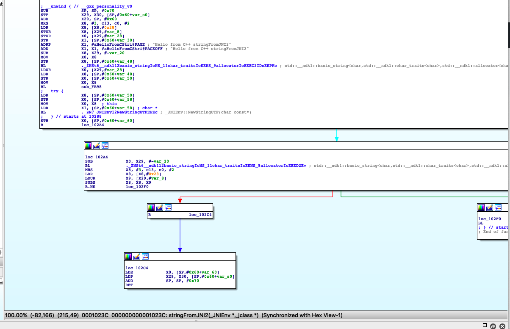
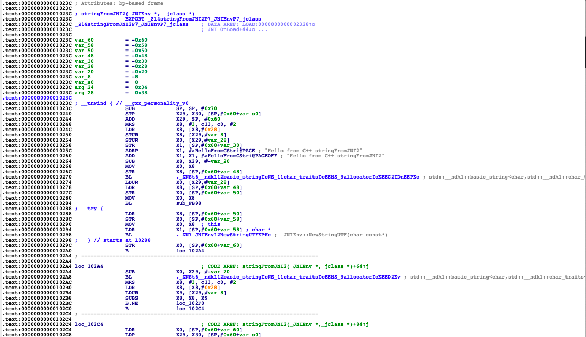

## 1.1 Symbols Hook
[以下提到的`源码`的地址](https://github.com/heyhu/demoso1)

### 1.1.1 IDA结构化JNIEnv

 IDA 分析Android so 文件时，因为缺少JNIEnv结构定义，反编译后看起来很不友好，需要导入`jni.h`使JNIEnv 的结构定义让反编译代码看起来更轻松，就可以看到函数名，例如：_JNIEnv::GetStringUTFLength();

  	找到本机的`jni.h`，在`Android/sdk`下，`tree -NCfhl | grep -i jni.h`，打开ida，点`File->Load file->Parse C header file` 找到jni.h所在位置导入。如果没有识别，按y键。

```c++
// ida导入jni.h后显示内容
{
  __int64 v4; // [xsp+30h] [xbp-20h]
  __int64 v5; // [xsp+38h] [xbp-18h]
  _JNIEnv *v6; // [xsp+48h] [xbp-8h]

  v6 = a1;
  v5 = a3;
  v4 = _JNIEnv::GetStringUTFChars(a1, a3, 0LL);
  _JNIEnv::GetStringUTFLength(v6, v5);
  if ( v4 != 0 )
  {
    __android_log_print(4LL, "r0add", "now a is %s", v4);
    __android_log_print(4LL, "r0add", "now content is %s", v5);
  }
  _JNIEnv::ReleaseStringUTFChars(v6, v5, v4);
  return _JNIEnv::NewStringUTF(v6, "Hello I`m from myfirstjnienv!");
}
```


##### Native source code view:

```java
 Log.i("r0add", MainActivity.myfirstjniJNI("fromJava"));

 public static native String myfirstjniJNI(String context);
```

```c++
extern "C" JNIEXPORT jstring JNICALL
Java_com_example_demoso1_MainActivity_myfirstjniJNI(
        JNIEnv* env,
        jclass,
        jstring content ) {
    // java.lang.String对应的JNI类型是jstring，但本地代码只能通过GetStringUTFChars这样的JNI函数来访问字符串的内容
    const char* a = env->GetStringUTFChars(content, nullptr);
    int content_size = env->GetStringUTFLength(content);
    if(a!=0){
        LOGI("now a is %s",a);
        LOGI("now content is %s",content);
    }
    env->ReleaseStringUTFChars(content,a);
    jstring result = env->NewStringUTF("Hello I`m from myfirstjnienv!");
    return result;
}
```


### 1.1.2 HOOK JAVA层，myfirstjniJNI函数

```javascript
function hook_java() {
    Java.perform(function x() {
        Java.use('com.example.demoso1.MainActivity').myfirstjniJNI.implementation = function (x) {
            var result = this.myfirstjniJNI('from hook java function');
            console.log('result', x, result);
            return result;
        };
        Java.choose('com.example.demoso1.MainActivity', {
            onMatch: function (instance) {
                instance.init();
            },
            onComplete() {
            }
        })
    })
}
```


### 1.1.3 HOOK NATIVE层，myfirstjniJNI函数

Java_com_example_demoso1_MainActivity_myfirstjniJNI函数，so库为自己开发的库。

```javascript
function hook_native() {
    // module: Process.enumerateModules() 枚举立即加载的模块，并返回一个Module对象数组。
    // JSON.stringify 打印object对象
    var modules = JSON.stringify(Process.enumerateModules());
    // 打印so库基地址
    var libnative_addr = Module.findBaseAddress('libnative-lib.so');
    console.log("libnative", libnative_addr);
    // 找到符号地址
    if (libnative_addr) {
        var JNI_address = Module.findExportByName('libnative-lib.so', 'Java_com_example_demoso1_MainActivity_myfirstjniJNI');
        // 偏移量 = 符号地址 - so地址 = start（ida 最左边function_name 右拉 ）
        console.log("JNI_address", JNI_address)
    }

    // 符号 hook  Interceptor:拦截器
    Interceptor.attach(JNI_address, {
        onEnter: function (args) {
            // tryGetEnv == getEnv
            // GetStringUTFChars: java.lang.String对应的JNI类型是jstring，但本地代码只能通过GetStringUTFChars这样的JNI函数来访问字符串的内容
            // newStringUtf、GetStringUTFChars 需要和api对应 （星球）https://github.com/frida/frida-java-bridge/blob/master/lib/env.js
            // 如果api中有才能使用JNI API
            // 第一个参数为JniEnv，第二个参数为Jclass，第三个才是自定义参数
            var content = Java.vm.getEnv().getStringUtfChars(args[2], null).readCString();
            console.log("content", content)
        },
        onLeave: function (retval) {
            // 只能在native层使用
            console.log("retval", Java.vm.getEnv().getStringUtfChars(retval, null).readCString());
            // 新建返回值替换原有值
            var new_retval = Java.vm.getEnv().newStringUtf("new retval from hook");
            // ptr: 从包含以十进制或十六进制（如果以'0x'为前缀）内存地址的字符串创建一个新的NativePointers。
            // so 操作的都是指针
            return retval.replace(ptr(new_retval));
        }
    })
}
```


### 1.1.4  HOOK ART

以libart.so举例，系统库。

```javascript
function hook_art() {
    // hook GetStringUTFChars、NewStringUTF等env调用的一些函数。
    // 寻找libart.so在不在
    var modules = JSON.stringify(Process.enumerateModules());
    // 因为name mangling的原因我们无法找到它的符号，拿到模块枚举所有的符号，然后过滤。
    var Symbols = Process.findModuleByName("libart.so").enumerateSymbols();
    // console.log(JSON.stringify(Symbols));
    var GetString_ADD;
    for (var i = 0; i < Symbols.length; i++) {
        var symbol = Symbols[i].name;
        if ((symbol.indexOf('CheckJNI') == -1) && symbol.indexOf('JNI') >= 0) {
            if (symbol.indexOf('GetStringUTFChars') >= 0) {
                // 打印符号名 // _ZN3art3JNI17GetStringUTFCharsEP7_JNIEnvP8_jstringPh 和ida显示的一样
                // 也可以ida中查看, 搜索的哪个库，就在哪个库找
                console.log("Symbols[i].name:", Symbols[i].name);
                // 打印符号地址
                console.log("Symbols[i].address:", Symbols[i].address);
                GetString_ADD = Symbols[i].address;
            }
        }
    }
    console.log("GetString Address:", GetString_ADD);
    Interceptor.attach(GetString_ADD, {
        onEnter: function (args) {
            var content = Java.vm.getEnv().getStringUtfChars(args[1], null).readCString();
            console.log("content", content);
            // console.log("args[0]",hexdump(args[0].readPointer()));
        },
        onLeave: function (retval) {
            console.log("retval", ptr(retval).readCString())
            // console.log("retval", Memory.readCString(retval))
        }
    })
}
```

[源码](https://github.com/lasting-yang/frida_hook_libart) - > frida -U --no-pause -f package_name -l hook_art.js

#####  source code view:

```c++
JNIEXPORT jstring JNICALL stringFromJNI2(JNIEnv* env, jclass clazz) {
    jclass testClass = env->FindClass("com/example/demoso1/Test");
    //jfieldID GetStaticFieldID(jclass clazz, const char* name, const char* sig)
    jfieldID publicStaticField = env->GetStaticFieldID(testClass,"publicStaticField","Ljava/lang/String;");
    jstring publicStaticField_value = (jstring)env->GetStaticObjectField(testClass,publicStaticField);
    const char* value_ptr = env->GetStringUTFChars(publicStaticField_value, nullptr);
    LOGI("now content is %s",value_ptr);

    std::string hello = "Hello from C++ stringFromJNI2";
    return env->NewStringUTF(hello.c_str());
}
```

##### script output:

```
[FindClass] name:com/example/demoso1/Test
[GetStaticFieldID] name:publicStaticField, sig:Ljava/lang/String;
[GetStringUTFChars] result:i am a publicStaticField
[NewStringUTF] bytes:Hello from C++ stringFromJNI2
[GetStringUTFChars] result:r0add
[GetStringUTFChars] result:Hello from C++ stringFromJNI2
```


### 1.1.5  HOOK Libc

libc.so 里面的函数名就是原有的，不会混淆， 例如pthread_create。

 source code view:

```java
public native int init();
```

```c++
extern "C" JNIEXPORT void JNICALL
Java_com_example_demoso1_MainActivity_init(
        JNIEnv* env,
        jobject clazz) {

    pthread_t t;
    pthread_create(&t,NULL,detect_frida_loop,(void*)NULL);
    LOGI("frida server detect loop started");
}
```

```javascript
function hook_libc() {
    // 函数名就是原有的，不会混淆
    var Symbols = Process.findModuleByName("libc.so").enumerateSymbols();
    var pthread = null;
    for (var i = 0; i < Symbols.length; i++) {
        var symbol = Symbols[i].name;
        if (symbol.indexOf('pthread_create') >= 0) {
            //console.log("Symbols[i].name:", Symbols[i].name);
            //console.log("Symbols[i].address:", Symbols[i].address);
            pthread = Symbols[i].address;
        }
    }
    // hook pthread 需要主动调用hook_java()，主动调用init(), 才能找到pthread_create
    console.log("pthread_address",pthread);
    Interceptor.attach(pthread, {
        onEnter: function(args) {
            // args[2]就是detect_frida_loop的地址，可以在nativelib.so的导出函数找到，因为此函数是在libnative-lib.so声明的。
            console.log("pthread args", args[0], args[1], args[2], args[3])
        },
        onLeave: function(retval) {
            console.log("ret", retval)
        }
    });
}

function main() {
    hook_java();
    hook_native();
    hook_art();
    hook_libc()
}
// 可以在交互页面主动调用上面的函数。
setImmediate(main);
```


### 1.1.6  hook RegisterNatives

[源码](https://github.com/lasting-yang/frida_hook_libart) -> frida -U --no-pause -f com.example.demoso1 -l hook_RegisterNatives.js

output：

```
  Spawning `com.example.demoso1`...
  RegisterNatives is at  0x722cf306ac _ZN3art3JNI15RegisterNativesEP7_JNIEnvP7_jclassPK15JNINativeMethodi
  Spawned `com.example.demoso1`. Resuming main thread!
  [Google Pixel XL::com.example.demoso1]-> [RegisterNatives] method_count: 0x1
  [RegisterNatives] java_class: com.example.demoso1.MainActivity // 类名
                    name: stringFromJNI2  // 注册的函数名
                    sig: ()Ljava/lang/String; //签名
                    fnPtr: 0x7213f1423c  // 函数地址
                    module_name: libnative-lib.so // so库的名字
                    module_base: 0x7213f04000 // so库的地址
                    offset: 0x1023c //基于so库注册函数的偏移量
```

打开ida查看, f5跳到注册函数源代码中:


选中函数名然后tab键验证和打印出的一样:



空格键切换模式:




### 1.1.7  主动调用与方法替换

```javascript
/*
主动调用、方法替换
example:
open函数文档：https://blog.csdn.net/simongyley/article/details/8330636
var openPtr = Module.getExportByName('libc.so', 'open');
// int：返回值 ['pointer', 'int']：参数列表
var open = new NativeFunction(openPtr, 'int', ['pointer', 'int']);
// pathPtr, flags 参数
Interceptor.replace(openPtr, new NativeCallback(function (pathPtr, flags) {
  // 打印路径
  var path = pathPtr.readUtf8String();
  log('Opening "' + path + '"');
  // 重新调用
  var fd = open(pathPtr, flags);
  // 返回值：若所有欲核查的权限都通过了检查则返回0 值，表示成功，只要有一个权限被禁止则返回-1。
  log('Got fd: ' + fd);
  return fd;
}, 'int', ['pointer', 'int']));
 */

function hook_replace() {
    var addr_NewStringUTF = null;
    var Symbols = Process.findModuleByName("libart.so").enumerateSymbols();
    for (var i = 0; i < Symbols.length; i++) {
        var symbol = Symbols[i].name;
        if ((symbol.indexOf('CheckJNI') == -1) && symbol.indexOf('JNI') >= 0) {
            if (symbol.indexOf('NewStringUTF') >= 0) {
                console.log("Symbols[i].name:", Symbols[i].name);
                console.log("Symbols[i].address:", Symbols[i].address);
                addr_NewStringUTF = Symbols[i].address;
            }
        }
    }

    // jstring 是一个pointer， GetStringUTF第一个参数是JNI ENV
    var NewStringUTF = new NativeFunction(addr_NewStringUTF, 'pointer', ['pointer', 'pointer']);
    Interceptor.replace(NewStringUTF, new NativeCallback(function (env, content_ptr) {
        var content = Memory.readCString(content_ptr);
        console.log('Opening "' + content + '"');

        // 方法参数替换
        var new_content_ptr = Memory.allocUtf8String("string frida native hook replace")
        var retval = NewStringUTF(env, new_content_ptr);

        //var retval = GetStringUTF(env, content_ptr);
        console.log('retval: ' + Java.vm.getEnv().getStringUtfChars(retval, null).readCString());

        return retval;
    }, 'pointer', ['pointer', 'pointer']));
}


function main() {
    hook_replace()
}

setImmediate(main)
```

#####  主动调用，过frida反调试:

```javascript
/*
主动调用过反调试
 */

function hook_java() {
    Java.perform(function x() {
        Java.choose('com.example.demoso1.MainActivity', {
            onMatch: function (instance) {
                instance.init();
            },
            onComplete() {
            }
        })
    })
}

function hook_pthread_replace() {
    // 函数名就是原有的，不会混淆
    var Symbols = Process.findModuleByName("libc.so").enumerateSymbols();
    var pthread_addr = null;
    for (var i = 0; i < Symbols.length; i++) {
        var symbol = Symbols[i].name;
        if (symbol.indexOf('pthread_create') >= 0) {
            pthread_addr = Symbols[i].address;
        }
    }
    console.log("pthread", pthread_addr)
	
    // 主动调用
    var pthread = new NativeFunction(pthread_addr, 'int', ['pointer', 'pointer', 'pointer', 'pointer']);
    // 方法参数替换
    Interceptor.replace(pthread, new NativeCallback(function (args0, args1, frida_loop, args3) {
        console.log("args",args0, args1, frida_loop, args3);
        // frida_loop地址为0x721390fdb0，强转String判断是否db0结尾，fdb0为偏移量，不会改变，ida可查看。
        var retval = null;
        if(String(frida_loop).endsWith('db0')){
            // 如果以db0结尾，不调用pthread_create函数
            console.log('anti-debug sequence')
        }else {
            // 如果不以db0结尾，主动调用
            var retval = pthread(args0, args1, frida_loop, args3);
        }
        // console.log('retval: ' + Java.vm.getEnv().getStringUtfChars(retval, null).readCString());

        return retval;
    }, 'int', ['pointer', 'pointer', 'pointer', 'pointer']));

}


function main() {
    hook_java()
    hook_pthread_replace()
}
// 运行后，需主动调用hook_java()，执行init函数，方可执行pthread_create hook到查看打印参数。
setImmediate(main)
```

##### 主动调用r0add

```javascript
function main(){
    var libnative_lib_addr = Module.findBaseAddress("libnative-lib.so");
    console.log("libnative_lib_addr is :", libnative_lib_addr);
    if (libnative_lib_addr) {
        var r0add_addr = Module.findExportByName("libnative-lib.so", "_Z5r0addii");
        console.log("r0add_addr ", r0add_addr); // 9281
        var r0add_hard_addr = libnative_lib_addr.add(0x9280 + 1) ;
        console.log("r0ad_hard_addr is:",r0add_hard_addr);
    }

    var r0add = new NativeFunction(r0add_hard_addr ,"int",["int","int"]);

    console.log("r0add result is :",r0add(50,1));
    
setImmediate(main);
```


### 1.1.8  调用栈的打印

```
var f = Module.getExportByName('libcommonCrypto.dylib','CCCryptorCreate');
Interceptor.attach(f, {
  onEnter: function (args) {
    console.log('CCCryptorCreate called from:\n' + Thread.backtrace(this.context, Backtracer.ACCURATE).map(DebugSymbol.fromAddress).join('\n') + '\n');
  }});
打印当前`so`的调用栈。
`Backtracer.ACCURATE`会准确些，但是有时候会为空，主要看`so`有没有符号了。如果用`Backtracer.FUZZY`参数则得到的结果不一定准确。
注意：可选backtracer参数指定要使用的backtracer的类型，并且必须为Backtracer.FUZZY或Backtracer.ACCURATE，
其中，如果未指定，则后者为默认值。准确的回溯跟踪器类型依赖于调试器友好的二进制文件或调试信息的存在来完成出色的工作，而模糊的回溯跟踪器在堆栈上执行取证以猜测返回地址，这意味着您会得到误报，但是它将在任何二进制文件上工作。
```


