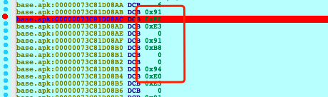
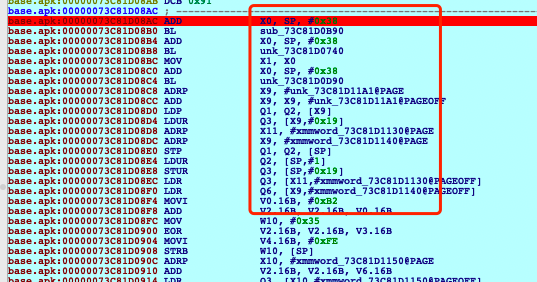
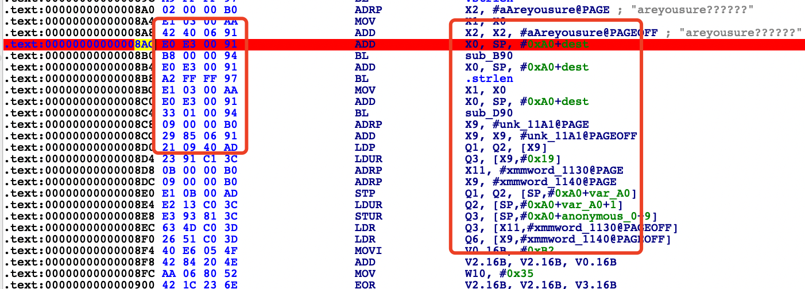
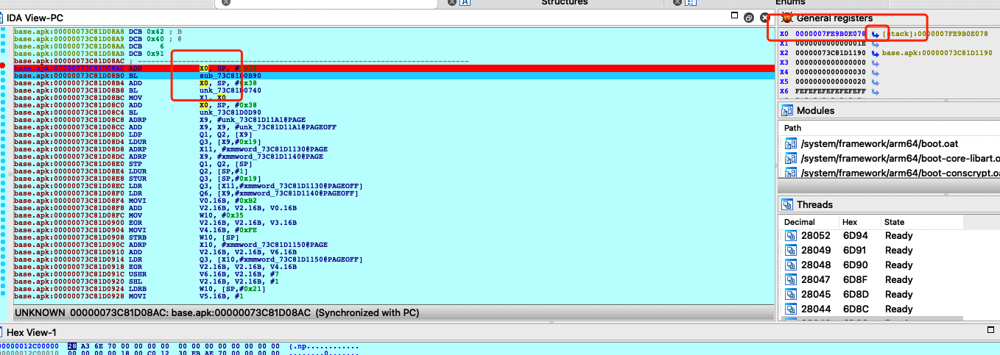
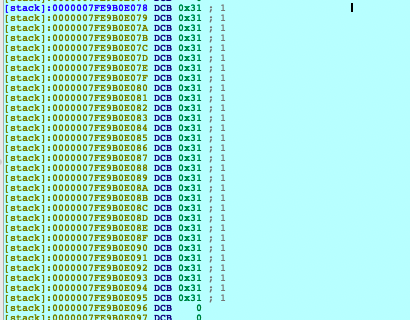
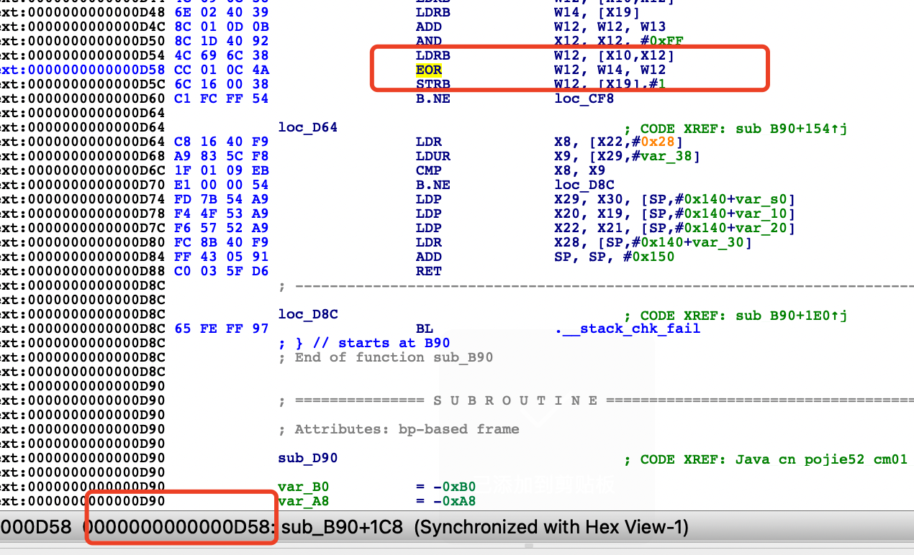
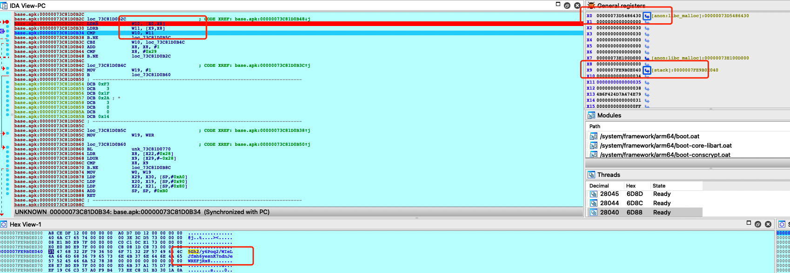
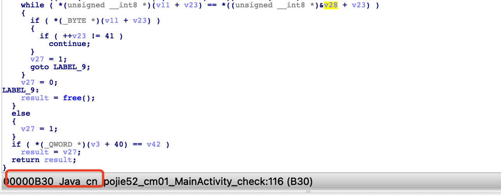
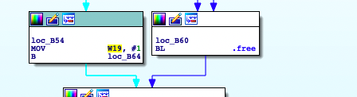
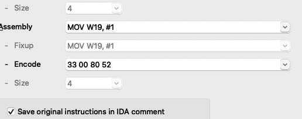

## 1.1 Frida + IDA 动静态SO层算法

题目：https://www.52pojie.cn/thread-1369661-1-1.html

目标：获取flag，输入到app中，完成验证。

### 1.1.1 jadx 分析java源码

输入玩密码后，会显示`flag 格式错误，请重试`，直接在jadx源码中搜，或者直接看MainActivity。源码如下：

```java
package cn.pojie52.cm01;

import android.os.Bundle;
import android.view.View;
import android.widget.EditText;
import android.widget.Toast;
import androidx.appcompat.app.AppCompatActivity;

public class MainActivity extends AppCompatActivity {
    public native boolean check(String str);

    static {
        System.loadLibrary("native-lib");
    }

    /* access modifiers changed from: protected */
    @Override // androidx.activity.ComponentActivity, androidx.core.app.ComponentActivity, androidx.appcompat.app.AppCompatActivity, androidx.fragment.app.FragmentActivity
    public void onCreate(Bundle bundle) {
        super.onCreate(bundle);
        setContentView(R.layout.activity_main);
        final EditText editText = (EditText) findViewById(R.id.flag);
        findViewById(R.id.check).setOnClickListener(new View.OnClickListener() {
            /* class cn.pojie52.cm01.MainActivity.AnonymousClass1 */

            public void onClick(View view) {
                // 删除头尾空白符
                String trim = editText.getText().toString().trim();
                if (trim.length() != 30) {
                    Toast.makeText(MainActivity.this, "flag格式错误，请重试", 0).show();
                } else if (MainActivity.this.check(trim)) {
                    Toast.makeText(MainActivity.this, "恭喜你，验证正确！", 0).show();
                } else {
                    Toast.makeText(MainActivity.this, "flag错误，再接再厉", 0).show();
                }
            }
        });
    }
}
```

首先可以看到，输入文本的长度必须30位，会调用`check`方法去验证你输入的密码是否正确，从代码中可以看到，`check`方法在so层，so库的名字为libnative-lib.so。

如何获取so文件: a) 解压apk中获取 b) Objection中获取加载so库，找到其在手机中对应的目录，adb pull下来。


### 1.1.2  动静态分析so

打开首先点击exports，查看导出函数，可以看到函数名`Java_cn_pojie52_cm01_MainActivity_check`，此函数是一个JNI的静态注册的函数，点击F5，查看c伪代码。

F5查看伪代码，第一行：

`__int64 __fastcall Java_cn_pojie52_cm01_MainActivity_check(JNIEnv *a1, __int64 a2, __int64 a3)`

a1: JNIEnv，a2: jclass/jobject，a3输入的值。

注意：类似`result = (*(__int64 (**)(void))(*(_QWORD *)a1 + 1344LL))();`这种形式的代码，选中a1点击y，输入`JNIEnv *`让它转换为`JNI`。如果失败需要导入jni.h，可以查看转换后的代码为`v7 = ((__int64 (__fastcall *)(JNIEnv *, __int64, _QWORD))(*v4)->GetStringUTFChars)(v4, v5, 0LL);`这行代码最终效果为把java的字符串转换为c层的字符串。我们可以按N键修改变量名方便我们进行静态查看。

查看`sub_B90(&dest, v10, (__int64)"areyousure??????");` 函数，dest为我们传入的函数，查看它进行了哪些操作。两种方式：

sub_B90 函数头部信息`unsigned __int64 __fastcall sub_B90(_BYTE *a1, unsigned int a2, __int64 a3)`

1. IDA 动态调试

   把IDA中dbgsrv下的服务端android-server[64] push到手机中。./android-server运行。

   IDA  -> go -> Debugger-> Attach -> android debugger  输入手机ip地址进行连接，选择要attach的进程，先点击运行按钮进行放行让app继续执行，点击G输入sub_B90的函数地址，点击下断点，可以选中0x91那选择edit->code转成字节码与静态分析的进行对比，查看我们下的断点位置是否正确：

   

   

   

然后点击手机app的验证按钮，只要走过断点的函数，就会被暂停，然后F7、F8进行调试。

查看值的两种方法，stack中，寄存器x0中有值才可以点击查看。





可以看到就是我们输入的值。

2. Frida 调试：

因为其函数第一个参数为*a1，就说明它是一个指针。其值可以在函数运行时改变。

```javascript
// 指针 参数程序内改变，需要函数离开时在打印下这个指针
function hook_B90() {
    var libnative_addr = Module.findBaseAddress('libnative-lib.so');
    console.log("so base address ->", libnative_addr)
    var addr_0xB90 = libnative_addr.add(0xB90);
    console.log("addr_0xB90 ->", addr_0xB90)

    Interceptor.attach(addr_0xB90, {
        onEnter: function (args) {
            this.args0 = args[0]
            this.args1 = args[1]
            this.args2 = args[2]

            console.log("calling addr_0xB90")
            console.log("args1:", hexdump(args[0]))
            console.log("args2:", args[1])
            console.log("args3:", Memory.readCString(args[2]))

        },
        onLeave: function (retval) {
            console.log("now is retval")
            // 原文: 30个1 16进制31 31 31 31 31 31 31-> 函数结束后改变为: e0 6b 37 a1 75 d7 f6 d4 ef 19 c..
            console.log("args1:", hexdump(this.args0))
            console.log("args2:", this.args1)
            console.log("args3:", Memory.readCString(this.args2))
        }
    })
}
```

我们查看其函数内部做的操作，传入值a1的引用`v4 = a1`, v4 的引用`*v4++ ^= *((_BYTE *)&v21 + (unsigned __int8)(*((_BYTE *)&v21 + v13) + v18));`可以看到传入值只有在这两处被引用过，可以直接看出此算法是一个`异或`。

异或算法还原：

```
明文 ^ 密钥 = 密文
密文 ^ 密钥 = 明文
```

我们在hook B90时，知道第一个参数就是一个指针`_BYTE *a1`,它在程序运行完指针已经指向了另一个地址，我们可以看到其值已发生改变。

```
calling addr_0xB90
args1:              0  1  2  3  4  5  6  7  8  9  A  B  C  D  E  F  0123456789ABCDEF
7fe9b0e078  31 31 31 31 31 31 31 31 31 31 31 31 31 31 31 31  1111111111111111
7fe9b0e088  31 31 31 31 31 31 31 31 31 31 31 31 31 31 00 00  11111111111111..
7fe9b0e098  00 00 00 00 00 00 00 00 00 00 00 00 00 00 00 00  ................
7fe9b0e0a8  00 00 00 00 00 00 00 00 00 00 00 00 00 00 00 00  ................
7fe9b0e0b8  45 39 1b 29 cb 94 1d cf 60 b4 ce 12 00 00 00 00  E9.)....`....... 


now is retval
args1:              0  1  2  3  4  5  6  7  8  9  A  B  C  D  E  F  0123456789ABCDEF
7fe9b0e078  e0 6b 37 a1 75 d7 f6 d4 ef 19 c6 c3 57 a0 f9 b4  .k7.u.......W...
7fe9b0e088  73 ee c8 d1 b3 30 1a 0a 09 52 06 8c 1f 7c 00 00  s....0...R...|..
7fe9b0e098  00 00 00 00 00 00 00 00 00 00 00 00 00 00 00 00  ................
7fe9b0e0a8  00 00 00 00 00 00 00 00 00 00 00 00 00 00 00 00  ................
7fe9b0e0b8  45 39 1b 29 cb 94 1d cf 60 b4 ce 12 00 00 00 00  E9.)....`.......
7fe9b0e0c8  10 28 c8 12 00 00 00 00 fc 07 1d c8 73 00 00 00  .(..........s...

```

获取密钥的两种方式：

1. 手动比对

   0x31 ^ 0xe0、0x31 ^ 0x6b 以此类推得出：

   xorkey = [209, 90, 6, 144, 68, 230, 199, 229, 222, 40, 247, 242, 102, 145, 200, 133, 66, 223, 249, 224, 130, 1, 43, 59, 56, 99, 55, 189, 46, 77]

   

2. hook

   hook `*v4++ ^= *((_BYTE *)&v21 + (unsigned __int8)(*((_BYTE *)&v21 + v13) + v18))`这条汇编指令。

   ```javascript
   function hook_D58() {
       Java.perform(function () {
           var libnative = Module.findBaseAddress("libnative-lib.so");
           console.log("libnative: " + libnative);
           // 获取异或的字节，开了会报错，但是可以获取
           var ishook = true;
           var EOR = libnative.add(0xD58);
           var eor = [];
           var eorlen = 0;
           Interceptor.attach(EOR, {
               onEnter: function (args) {
                   if (ishook) {
                       if (eorlen < 30) {
                           eor.push(this.context.x12);
                           eorlen += 1;
                       } else {
                           ishook = false;
                           console.log(eor);
                       }
                   }
               }
           })
       })
   }
   ```

   

   ida中查看，可以看到汇编指令的地址是【D58】，需要的寄存器是x12。(w是32位寄存器，X是64位寄存器)

   

eor是逻辑异或指令 将r0 和r1中值逻辑异或 存到r3

```
ldr r0, =158 
ldr r1, =42 
eor r3, r0, r1   
```

继续分析：`v12 = sub_D90((char *)&dest, dest_length);` hook此函数为Base64。

查看v12 引用 `while ( *(unsigned __int8 *)(v12 + v24) == *((unsigned __int8 *)&v29 + v24) )`

v29就是最后比对的值，v29 base64decode 之后是秘文，在用密钥 异或 得出明文。

查看v29 的值，也是两种方法。ida动态调试与frida inline hook。x0为我们的值，x9为正确base64的值。




frida hook



```
function hook_x9() {
    // hook寄存器地址，得到对比的正确的base64
    var libnative_addr = Module.findBaseAddress('libnative-lib.so');
    console.log("so base address ->", libnative_addr)
    var addr_0xB30 = libnative_addr.add(0xB30);
    console.log("addr_0xB30 ->", addr_0xB30)
    Interceptor.attach(addr_0xB30, {
        onEnter: function (args) {
            console.log(Memory.readCString(this.context.x9));
            // console.log(Memory.readByteArray(this.context.x9, 50));
            // console.log(hexdump(this.context.x9));
        },
        onLeave: function (retval) {
        }
    })
}
```

最后：

```python
import base64
xordata = [0xd1,0x5a,0x6,0x90,0x44,0xe6,0xc7,0xe5,0xde,0x28,0xf7,0xf2,0x66,0x91,0xc8,0x85,0x42,0xdf,0xf9,0xe0,0x82,0x1,0x2b,0x3b,0x38,0x63,0x37,0xbd,0x2e,0x4d]
data = base64.b64decode('5Gh2/y6Poq2/WIeLJfmh6yesnK7ndnJeWREFjRx8'.encode())
flag = bytes([xordata[i] ^ data[i] for i in range(len(xordata))]).decode()
print(flag)
```


## 1.2 Keypatch硬改算法逻辑

```
    while ( *(unsigned __int8 *)(v12 + v24) == *((unsigned __int8 *)&v29 + v24) )
    {
      if ( *(_BYTE *)(v12 + v24) )
      {
        if ( ++v24 != 41 )
          continue;
      }
      v28 = 1;
      goto LABEL_9;
    }
    v28 = 0;
LABEL_9:
    result = free();
  }
  else
  {
    v28 = 0;
  }
  if ( *(_QWORD *)(v3 + 40) == v43 )
    result = v28;
  return result;
```

使用Keypatch让v28等于1,输入任何都能成功。点击v28，显示其寄存器为w19，tab切换汇编。



选中w19，edit -> plugins -> keypunch patcher ,让w19 一直等于1，然后apply patches to input file 全局替换。

替换源so文件就可以了。




## 1.3 参考链接

https://www.jianshu.com/p/d2d28920940c

https://blog.csdn.net/hbhgyu/article/details/81321923

https://www.52pojie.cn/thread-1369661-1-1.html

https://www.52pojie.cn/thread-1378761-1-1.html

https://www.52pojie.cn/thread-1383999-1-1.html

