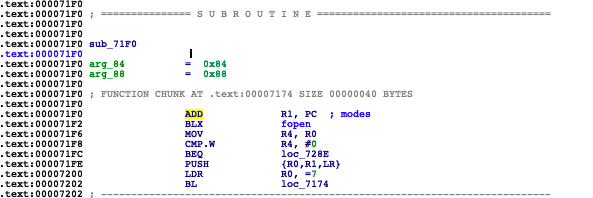
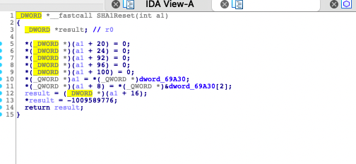
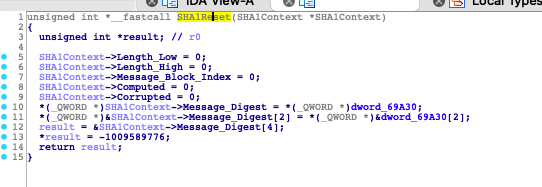

### 1.1 IDA常用快捷键及技巧

- shift + F12：查看so文件中所有常量字符串的值

- tab键：汇编和伪 C 代码之间相互切换

- / 键：添加注释

- N 键：变量重命名

- X 键：查看某变量的所有引用

- H键：常量改成16进制（便于去查看是否于加密算法的初始化链接变量一致）

- = 键：消除冗余的中间变量

  > 由于 IDA 反编译出来总是会有很多冗余的中间变量，如：v2 = v1; result = encrypt(v2); 选中 v2，按键盘上的 = 键，再点击 OK，即可消除中间变量 v2，result = encrypt(v1)

- 在汇编查看图谱引用: 汇编代码 xrefs graph from

- Options -> General -> Number of opcode bytes -> 4/8 

  > 用于查看他是thumb(2\*8)还是arm(4\*8)。thumb在hook的时候地址就需要加1

- c代码函数右击 出现fource call type ：IDA识别的不准确，一般在jni函数上用，就是把函数的参数修正了，让函数变正常；

- 动态调试时按`crtl+s`调出so表，选择想调试的(其中有多个的话选择带x权限的)。

- ida c变量星花类型代表的是指针, hook 前面加ptr

- search -> Immediate value 去搜索特征，进而去查看是否匹配出关键算法

- 当某函数不能转换为伪代码时，全是DCB等，选中那串代码按C，然后按P转成函数，然后可以F5转换为伪代码了。

  > 按`c`把数据转为代码，按P是强转为函数， 这样才能用F5强转为伪代码

  




直接按p转换成函数，bl是执行函数的意思。直接点loc7174 继续分析。


### 1.2 IDA常用插件

搜索加密算法

> findcrypt、IDASignsrch、findhash、IDAscope

插件编写

> IPYIDA


### 1.3 导入结构体

未导入结构体时：



此算法显而易见为sha1算法，直接面向谷歌搜索`sha1Reset` ，得到代码：

```c
void SHA1Reset(SHA1Context *context)
{
    context->Length_Low             = 0;
    context->Length_High            = 0;
    context->Message_Block_Index    = 0;
 
    context->Message_Digest[0]      = 0x67452301;
    context->Message_Digest[1]      = 0xEFCDAB89;
    context->Message_Digest[2]      = 0x98BADCFE;
    context->Message_Digest[3]      = 0x10325476;
    context->Message_Digest[4]      = 0xC3D2E1F0;
 
    context->Computed   = 0;
    context->Corrupted  = 0;
}
```

继续搜一下SHA1Context的结构体，导入到ida中：

```c

typedef struct SHA1Context
{
    unsigned Message_Digest[5]; /* Message Digest (output)          */
 
    unsigned Length_Low;        /* Message length in bits           */
    unsigned Length_High;       /* Message length in bits           */
 
    unsigned char Message_Block[64]; /* 512-bit message blocks      */
    int Message_Block_Index;    /* Index into message block array   */
 
    int Computed;               /* Is the digest computed?          */
    int Corrupted;              /* Is the message digest corruped?  */

} SHA1Context;
```

选中参数类型`int`右键点击`convert to struct *`，可以看到里面没有我们想转换的，需要手动导入，编辑添加到ida环境里。

view -> open subviews -> local types -> 空白点击insert。导入之后选中参数类型右键点击 convert to struct 选择你刚插入的结构体。

效果如下：



可以看到和源码没有什么差别。

有时候结构体导入存在依赖关系导入失败，比如想导入evp_md_ctx_st，但是它和evp_md_st存在着依赖关系，这就需要导入头文件openssl.h，如jni.h一样导入进去，file -> load file -> Parse C header file。


### 1.4 参考链接

https://blog.csdn.net/wuchuanpingstone/article/details/78094363
