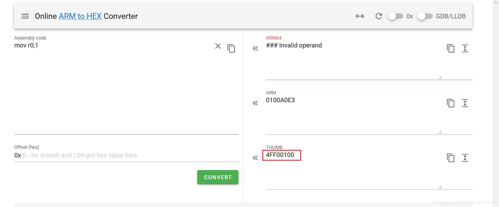

## 1.1 基础配置

### 1.1.1 前置

```java
package com.lession1;

// 导入通用且标准的类库
import com.github.unidbg.linux.android.dvm.AbstractJni;
import com.github.unidbg.AndroidEmulator;
import com.github.unidbg.Module;
import com.github.unidbg.linux.android.AndroidEmulatorBuilder;
import com.github.unidbg.linux.android.AndroidResolver;
import com.github.unidbg.linux.android.dvm.*;
import com.github.unidbg.linux.android.dvm.array.ByteArray;
import com.github.unidbg.memory.Memory;

import java.io.File;

// 继承AbstractJni类
public class oasis extends AbstractJni{
    private final AndroidEmulator emulator;
    private final VM vm;
    private final Module module;

    oasis() {
        // 创建模拟器实例,进程名建议依照实际进程名填写，可以规避针对进程名的校验
        emulator = AndroidEmulatorBuilder.for32Bit().setProcessName("com.sina.oasis").build();
        // 获取模拟器的内存操作接口
        final Memory memory = emulator.getMemory();
        // 设置系统类库解析
        memory.setLibraryResolver(new AndroidResolver(23));
        // 创建Android虚拟机,传入APK，Unidbg可以替我们做部分签名校验的工作
        // 如果创建Android虚拟机时，选择不传入APK，填入null，那么样本在JNI OnLoad中所做的签名校验，就需要手动补环境校验
        vm = emulator.createDalvikVM(new File("unidbg-android/src/test/java/com/lession1/lvzhou.apk"));
        // 加载目标SO, 加载so到虚拟内存
        DalvikModule dm = vm.loadLibrary(new File("unidbg-android/src/test/java/com/lession1/liboasiscore.so"), true); 
        //获取本SO模块的句柄,后续需要用它
        module = dm.getModule();
        // 设置JNI
        vm.setJni(this); 
        //打印日志
        vm.setVerbose(true);
        // 调用JNI OnLoad,可以看到JNI中做的事情，比如动态注册以及签名校验等。如果没有使用可以注释掉。
        dm.callJNI_OnLoad(emulator); 
    };

    public static void main(String[] args) {
        oasis test = new oasis();
    }
}
```

## 1.2 执行目标函数--参数构造

- 字节数组需要裹上unidbg的包装类，并加到本地变量里，两件事缺一不可。
- 除了基本类型，比如int，long等，其他的对象类型一律要手动 addLocalObject。
- vm.getObject(number.intValue()).getValue().toString() 解释：在DalvikVM中有Map存储了jni交互的对象，key是该对象的hash，value是该对象。你这个intValue就是这个对象的hash，通过vm.getObject方法，来取出这个hash对应的Object。

### 1.2.1 字节数组以及布尔值

```java
    public String getS(){
        // args list
        List<Object> list = new ArrayList<>(10);
        // arg1 env
        list.add(vm.getJNIEnv());
        // arg2 jobject/jclazz 一般用不到，直接填0
        list.add(0);
        // arg3 bytes
        String input = "aid=01A-khBWIm48A079Pz_DMW6PyZR8" +
                "uyTumcCNm4e8awxyC2ANU.&cfrom=28B529501" +
                "0&cuid=5999578300&noncestr=46274W9279Hr1" +
                "X49A5X058z7ZVz024&platform=ANDROID&timestamp" +
                "=1621437643609&ua=Xiaomi-MIX2S__oasis__3.5.8_" +
                "_Android__Android10&version=3.5.8&vid=10190135" +
                "94003&wm=20004_90024";
        byte[] inputByte = input.getBytes(StandardCharsets.UTF_8);
        ByteArray inputByteArray = new ByteArray(vm,inputByte);
        list.add(vm.addLocalObject(inputByteArray));
        // arg4 ,boolean false 填入0
        list.add(0);
        // 参数准备完成
        // call function
        Number number = module.callFunction(emulator, 0xC365, list.toArray())[0];
        String result = vm.getObject(number.intValue()).getValue().toString();
        return result;
    }
```

### 1.2.2 context以及字符串类型

```java
    public String calculateS(){
        List<Object> list = new ArrayList<>(10);
        // 第一个参数是env
        list.add(vm.getJNIEnv()); 
        // 第二个参数，实例方法是jobject，静态方法是jclazz，直接填0，一般用不到。
        list.add(0); 
        // 通过虚拟机创建一个context实例，其类型为DvmObject
        DvmObject<?> context = vm.resolveClass("android/content/Context").newObject(null);
        list.add(vm.addLocalObject(context));
        list.add(vm.addLocalObject(new StringObject(vm, "12345")));
        list.add(vm.addLocalObject(new StringObject(vm, "r0ysue")));
		    // 因为代码是thumb模式，别忘了+1
        Number number = module.callFunction(emulator, 0x1E7C + 1, list.toArray())[0];
        String result = vm.getObject(number.intValue()).getValue().toString();
        return result;
    };
```

## 1.3 奇技淫巧

### 1.3.1 PatchCode

报错日志：

```java
JNIEnv->FindClass(android/content/ContextWrapper) was called from RX@0x40002c4f[libutility.so]0x2c4f
JNIEnv->GetMethodID(android/content/ContextWrapper.getPackageManager()Landroid/content/pm/PackageManager;) => 0x53f2c391 was called from RX@0x40002c69[libutility.so]0x2c69
JNIEnv->FindClass(android/content/pm/PackageManager) was called from RX@0x40002c79[libutility.so]0x2c79
[14:04:03 080]  WARN [com.github.unidbg.linux.ARM32SyscallHandler] (ARM32SyscallHandler:469) - handleInterrupt intno=2, NR=0, svcNumber=0x11e, PC=unidbg@0xfffe0274, LR=RX@0x40002c8d[libutility.so]0x2c8d, syscall=null
com.github.unidbg.arm.backend.BackendException
	at com.github.unidbg.linux.android.dvm.DalvikVM$31.handle(DalvikVM.java:498)
	at com.github.unidbg.linux.ARM32SyscallHandler.hook(ARM32SyscallHandler.java:105)
	at com.github.unidbg.arm.backend.UnicornBackend$10.hook(UnicornBackend.java:323)
```

`sub_1C60`(这个函数会返回一个值，如果为真，就继续执行，为假，就返回0) --call--  `sub_2C3C`(PackageManager之流，联想到签名校验函数)

需要让`sub_2C3C`函数返回真正的值，不能返回0，否则`sub_1C60`也返回的是0，直接patch掉对`sub_2C3C`函数的调用，就是把这儿的函数跳转改成不跳转了。

```
.text:00001E7C F0 B5                       PUSH    {R4-R7,LR}
.text:00001E7E 11 1C                       MOVS    R1, R2
.text:00001E80 89 B0                       SUB     SP, SP, #0x24
.text:00001E82 1D 1C                       MOVS    R5, R3
.text:00001E84 04 1C                       MOVS    R4, R0
.text:00001E86 FF F7 EB FE                 BL      sub_1C60     PATCH掉对`sub_1C60`函数的调用
.text:00001E8A 05 95                       STR     R5, [SP,#0x38+var_24]
.text:00001E8C 00 28                       CMP     R0, #0
.text:00001E8E 00 D1                       BNE     loc_1E92
.text:00001E90 9D E0                       B       loc_1FCE
```

正常执行这个函数的话，如果校验没问题返回真，比如1，校验失败返回0。

根据ARM调用约定，入参前四个分别通过R0-R3调用，返回值通过R0返回，所以这儿可以通过“mov r0,1”实现我们的目标——不执行这个函数，并给出正确的返回值。除此之外还有一个幸运的地方在于，这个函数并没有产生一些之后需要使用的值或者中间变量，这让我们不需要管别的寄存器。

此处的机器码是FF F7 EB FE, 查看一下“mov r0,1”的机器码，这里我们使用[ARMConvert](https://armconverter.com/?code=mov r0,1)看一下，除此之外，使用别的工具查看汇编代码也是可以的。



即把 FF F7 EB FE 替换成 4FF00100 即可。

Unidbg提供了`两种`方法打Patch，简单的需求可以调用Unicorn对虚拟内存进行修改，如下:

- 使用机器码，**这里的地址不需要+1，Thumb的+1只在运行和Hook时需要考虑**，打Patch不需要。

  ```java
      public void  patchVerify() {
          // arm指令为 `mov r0,1` 转换为机器码
          int patchCode = 0x4FF00100;
          // 不用加1，Thumb的+1只在运行和Hook时需要考虑
          emulator.getMemory().pointer(module.base + 0x1E86).setInt(0, patchCode);
      }
  ```

- 使用指令，先确认有没有找对地方，地址上是不是 FF F7 EB FE，再用Unicorn的好兄弟Keystone 把patch代码“mov r0,1"转成机器码，填进去，校验一下长度是否相等。

  ```java
      public void patchVerify1() {
          Pointer pointer = UnidbgPointer.pointer(emulator, module.base + 0x1E86);
          assert pointer != null;
          // 获取前4个机器码 FF F7 EB FE
          byte[] code = pointer.getByteArray(0, 4);
          // 判断是否相等，相等才操作
          if (!Arrays.equals(code, new byte[]{(byte) 0xFF, (byte) 0xF7, (byte) 0xEB, (byte) 0xFE})) {
              throw new IllegalStateException(Inspector.inspectString(code, "patch32 code=" + Arrays.toString(code)));
          }
          try (Keystone keystone = new Keystone(KeystoneArchitecture.Arm, KeystoneMode.ArmThumb)) {
              KeystoneEncoded encoded = keystone.assemble("mov r0,1");
              // 指令转为机器码
              byte[] patch = encoded.getMachineCode();
              if (patch.length != code.length) {
                  throw new IllegalStateException(Inspector.inspectString(patch, "patch32 length=" + patch.length));
              }
              pointer.write(0, patch, 0, patch.length);
          }
      }
  ```

### 1.3.2 HookZz--参数位置

```java
public void HookMDStringold() {
        // 加载HookZz
        IHookZz hookZz = HookZz.getInstance(emulator);
        // inline wrap导出函数
        hookZz.wrap(module.base + 0x1BD0 + 1, new WrapCallback<HookZzArm32RegisterContext>() {
            @Override
            // 类似于 frida onEnter
            public void preCall(Emulator<?> emulator, HookZzArm32RegisterContext ctx, HookEntryInfo info) {
                // 类似于Frida args[0]
                Pointer input = ctx.getPointerArg(0);
                System.out.println("input:" + input.getString(0));
            }

            @Override
            // 类似于 frida onLeave
            public void postCall(Emulator<?> emulator, HookZzArm32RegisterContext ctx, HookEntryInfo info) {
                Pointer result = ctx.getPointerArg(0);
                System.out.println("result:" + result.getString(0));
            }
        });
    }
```

### 1.3.3 HookZ--寄存器

- 编写对该函数的Hook，首先因为不确定三个参数是指针还是数值，所以先全部做为数值处理，作为long类型看待，防止整数溢出
- Inspector.inspect其效果类似于frida中hexdump
- getR0long == emulator.getBackend().reg_read(ArmConst.UC_ARM_REG_R0)

```java
public void hook65540(){
  // 加载HookZz
  IHookZz hookZz = HookZz.getInstance(emulator);

  hookZz.wrap(module.base + 0x65540 + 1, new WrapCallback<HookZzArm32RegisterContext>() { // inline wrap导出函数
    @Override
    // 类似于 frida onEnter
    public void preCall(Emulator<?> emulator, HookZzArm32RegisterContext ctx, HookEntryInfo info) {
      // 类似于Frida hook寄存器r0
      Inspector.inspect(ctx.getR0Pointer().getByteArray(0, 0x10), "Arg1");
      // 因为是长度，所以用getR1Long
      System.out.println(ctx.getR1Long());
      Inspector.inspect(ctx.getR2Pointer().getByteArray(0, 0x10), "Arg3");
      // push
      ctx.push(ctx.getR2Pointer());
    };

    @Override
    // 类似于 frida onLeave
    public void postCall(Emulator<?> emulator, HookZzArm32RegisterContext ctx, HookEntryInfo info) {
      // pop 取出
      Pointer output = ctx.pop();
      Inspector.inspect(output.getByteArray(0, 0x10), "Arg3 after function");
    }
  })
}
```

### 1.3.4 主动调用

```java
public void callMd5(){
        List<Object> list = new ArrayList<>(10);
        // arg1
        String input = "r0ysue";
        // malloc memory
        MemoryBlock memoryBlock1 = emulator.getMemory().malloc(16, false);
        // get memory pointer
        UnidbgPointer input_ptr=memoryBlock1.getPointer();
        // write plainText on it
        input_ptr.write(input.getBytes(StandardCharsets.UTF_8));

        // arg2
        int input_length = input.length();

        // arg3 -- buffer
        MemoryBlock memoryBlock2 = emulator.getMemory().malloc(16, false);
        UnidbgPointer output_buffer=memoryBlock2.getPointer();

        // 填入参入
        list.add(input_ptr);
        list.add(input_length);
        list.add(output_buffer);
        // run
        module.callFunction(emulator, 0x65540 + 1, list.toArray());

        // print arg3
        Inspector.inspect(output_buffer.getByteArray(0, 0x10), "output");
    };
```

### 1.3.5 Inline hook

- 通过base+offset inline wrap内部函数，在IDA看到为sub_xxx那些

```java
    public void hook_315B0(){
        IHookZz hookZz = HookZz.getInstance(emulator);
        hookZz.enable_arm_arm64_b_branch();
        hookZz.instrument(module.base + 0x315B0 + 1, new InstrumentCallback<Arm32RegisterContext>() {
            @Override
            public void dbiCall(Emulator<?> emulator, Arm32RegisterContext ctx, HookEntryInfo info) {
                System.out.println("R2:"+ctx.getR2Long());
            }
        })
    }
```


## 1.4 补环境

### 1.4.1 构造最基本Context实例

```java
@Override
public DvmObject<?> callStaticObjectMethodV(BaseVM vm, DvmClass dvmClass, String signature, VaList vaList) {
  switch (signature) {
    case "com/izuiyou/common/base/BaseApplication->getAppContext()Landroid/content/Context;":
      // 链接一个android.content.Context的类并通过构造方法创建一个实例
      return vm.resolveClass("android/content/Context").newObject(null);
  }
  return super.callStaticObjectMethodV(vm, dvmClass, signature, vaList);
}
```

### 1.4.2 Context实例的getClass方法

```java
@Override
public DvmObject<?> callObjectMethodV(BaseVM vm, DvmObject<?> dvmObject, String signature, VaList vaList) {
  switch (signature) {
    case "android/content/Context->getClass()Ljava/lang/Class;":{
      // 此时的dvmObject就是Context实例,.getObjectType方法获取类型
      return dvmObject.getObjectType();
    }
    case "java/util/UUID->toString()Ljava/lang/String;":{
      // 此时的dvmObject就是包裹Java.util.UUID实例
       String uuid = dvmObject.getValue().toString();
       return new StringObject(vm, uuid);
    }
    case "java/lang/Class->getSimpleName()Ljava/lang/String;":{
      // 使用Wallbreaker查看com.izuiyou.common.base.BaseApplication的getClass的getSimpleName
      return new StringObject(vm, "AppController");
    }
    case "android/content/Context->getFilesDir()Ljava/io/File;":
    case "java/lang/String->getAbsolutePath()Ljava/lang/String;":
      {
        return new StringObject(vm, "/data/user/0/cn.xiaochuankeji.tieba/files");
      }
  }
  return super.callObjectMethodV(vm, dvmObject, signature, vaList);
};
```

### 1.4.3 返回PID

```java
@Override
public int callStaticIntMethodV(BaseVM vm, DvmClass dvmClass, String signature, VaList vaList) {
  switch (signature){
    case "android/os/Process->myPid()I":{
      return emulator.getPid();
    }
  }
  throw new UnsupportedOperationException(signature);
}
```

### 1.4.4 使用java的api返回一个对象

- Java.util.UUID为Java的工具类，可以直接引用并构造。
- 为什么不使用context那样构造，因为那个类不是Java的工具类，是和app有关，不可用直接引用。

```java
@Override
public DvmObject<?> callStaticObjectMethodV(BaseVM vm, DvmClass dvmClass, String signature, VaList vaList) {
  switch (signature) {
    case "java/util/UUID->randomUUID()Ljava/util/UUID;":{
      return dvmClass.newObject(UUID.randomUUID());
    }
  }
  return super.callStaticObjectMethodV(vm, dvmClass, signature, vaList);
};
```

