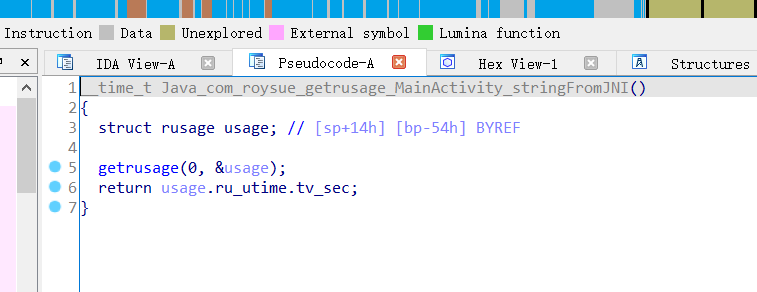
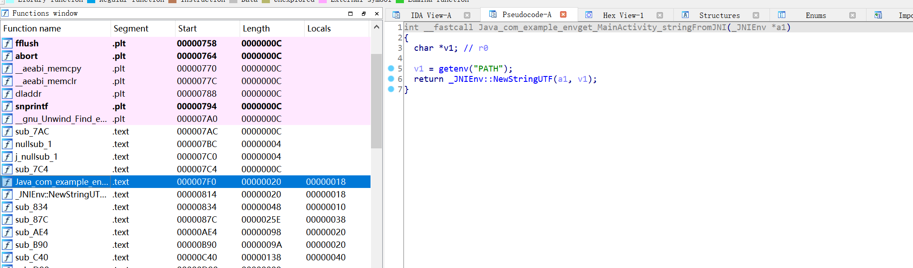
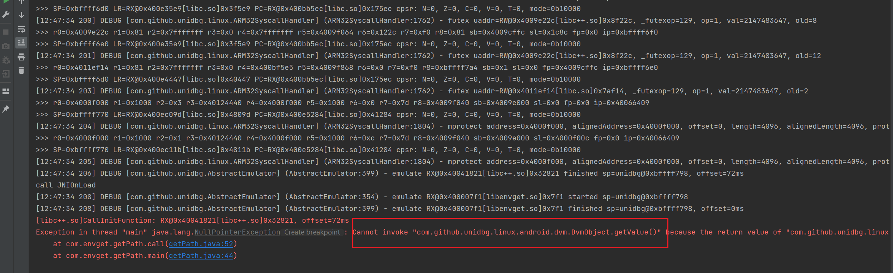
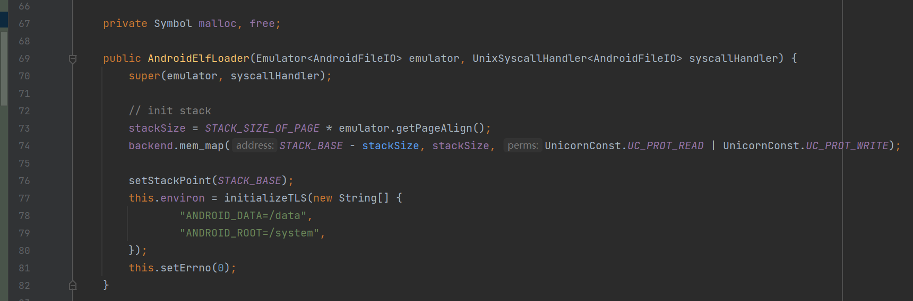
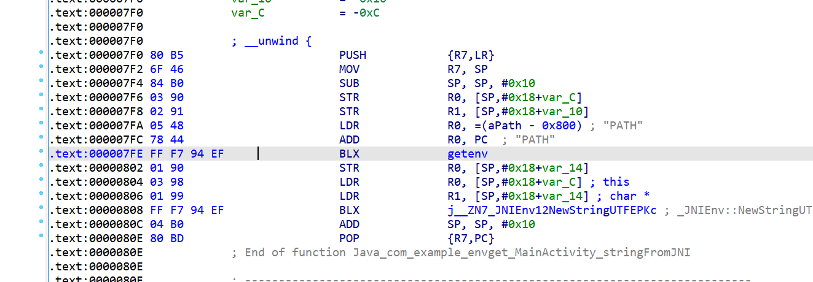

<!-- @import "[TOC]" {cmd="toc" depthFrom=1 depthTo=6 orderedList=false} -->
<!-- code_chunk_output -->

* [补环境](#奇技淫巧)
  * [0x01. JNI以及相关API](#0x01-JNI以及相关API)
    - [构造最基本Context实例](#构造最基本Context实例)
    - [resolveClass解释](#resolveClass解释)
    - [Context实例的getClass方法](#Context实例的getClass方法)
    - [返回PID](#返回PID)
    - [使用java的api返回一个对象](#使用java的api返回一个对象)
    - [VarArg的使用](#VarArg的使用)
    - [VaList的使用](#VaList的使用)
    - [newObject](#newObject)
  * [0x02. 文件访问](#0x02-文件访问)
    * [实体路径](#实体路径)
    * [代码方式](#代码方式)
  * [0x03. 加载Unidbg中不支持的SO](#0x03-加载Unidbg中不支持的SO)
  * [0x04. 补系统调用](#0x04-补系统调用)
    - [getrusage](#getrusage)
    - [popen](#popen)
  * [0x05. 补系统属性](#0x05-补系统属性)
    - [JNI调用](#JNI调用)
    - [system_property_get](#system_property_get)
    - [文件访问](#文件访问)
    - [popen获取系统属性](#popen获取系统属性)
    - [getenv](#getenv)
    - [系统调用](#系统调用)

<!-- /code_chunk_output -->


## 补环境

### 0x01. JNI以及相关API

#### 构造最基本Context实例

- 如果这个东西后续用不到，是应付了事，就填null，如果后续只需要唯一标识这个对象，那就填signature，如果后续需要真的使用这个对象的内容，那就填其内容。

```java
@Override
public DvmObject<?> callStaticObjectMethodV(BaseVM vm, DvmClass dvmClass, String signature, VaList vaList) {
  switch (signature) {
    case "com/izuiyou/common/base/BaseApplication->getAppContext()Landroid/content/Context;":
      // 链接一个android.content.Context的类并通过构造方法创建一个实例
      return vm.resolveClass("android/content/Context").newObject(null);
  }
  return super.callStaticObjectMethodV(vm, dvmClass, signature, vaList);
}
```

- 案例：https://blog.csdn.net/qq_38851536/article/details/118024298

  假设APP在JNI中从五个SharedPreferences里读了十五个键值对，并且不同xml的键名有重复，如果每次取SharedPreferences时我们都返回空对象，那后面怎么区分a.xml和b.xml里键名都是name的数据呢？

  先前我们说，参数1是想要获取的SharedPreferences的名字，应该把它放对象里返回，这样就有了”标识性“


```java
@Override
public DvmObject<?> callObjectMethodV(BaseVM vm, DvmObject<?> dvmObject, String signature, VaList vaList) {
    switch (signature) {
        case "android/content/Context->getSharedPreferences(Ljava/lang/String;I)Landroid/content/SharedPreferences;":
            return vm.resolveClass("android/content/SharedPreferences").newObject(vaList.getObject(0));
    }
    return super.callObjectMethodV(vm, dvmObject, signature, vaList);
}
```
#### resolveClass解释

[原文链接](https://t.zsxq.com/RBujayn)

```java
@Override
public DvmObject<?> callObjectMethodV(BaseVM vm, DvmObject<?> dvmObject, String signature, VaList vaList) {
    switch (signature){ case "android/app/ActivityThread->getApplication()Landroid/app/Application;":{
            return vm.resolveClass("android/app/Application", vm.resolveClass("android/content/ContextWrapper",
									 vm.resolveClass("android/content/Context"))).newObject(signature);
       }  
   }
    return super.callObjectMethodV(vm, dvmObject, signature, vaList);
}
```

- callObjectMethodV或者之前的getStaticObjectField，返回的都是jobject，Unidbg中如何构造一个Jobject?

  jString在Unidbg中被封装成了StringObject，除此之外，下图中标准和的jobject也都封装好了。

  Unidbg源码如下：`unidbg-android/src/main/java/com/github/unidbg/linux/android/dvm/array/`

  

- 那么Unidbg中没有的Jobject该怎么处理呢，比如返回**ctrip.android.security.a**的实例?

  ```java
  return vm.resolveClass("ctrip/android/security/a").newObject(null);
  ```

  类名全路径中“.”替换成”/“，传入resolveClass，即创建了目标类，newObject即创建实例，newObject 的参数为null即可，这样就创建了一个目标类的实例jobject。除此之外，我们一般还会将signature签名 填入newObject，用于区分jobject，方便后续分别处理。

  ```java
  return vm.resolveClass("ctrip/android/security/a").newObject(signature);
  ```

  Application在Unidbg中并没有封装，所以按照上面的说法，Application对象应该这么表示

  ```java
  return vm.resolveClass("android/app/Application").newObject(signature);
  ```

  拆开来看

  ```java
  DvmClass context = vm.resolveClass("android/content/Context");
  DvmClass ContextWrapper = vm.resolveClass("android/content/ContextWrapper", context);
  DvmClass Application = vm.resolveClass("android/app/Application",ContextWrapper);
  return Application.newObject(signature);
  ```

  resolveClass其实是个可变参数方法，如果有第二个参数，那它代表我们创建的类其父类。 所以实际上这里是明确了继承关系。

  

- 为什么我们要在Unidbg中表明这个继承关系? 假如不填写继承关系，查看报错：

  ```java
  switch (signature) {
     case "android/app/ActivityThread->getApplication()Landroid/app/Application;": {
          DvmClass Application = vm.resolveClass("android/app/Application");
          return Application.newObject(signature);
  }
  ```

  

  查看526行代码：

  ```java
  DvmClass dvmClass = dvmObject == null ? null : dvmObject.getObjectType();
  DvmMethod dvmMethod = dvmClass == null ? null : dvmClass.getMethod(jmethodID.toIntPeer());
  if (dvmMethod == null) {
       throw new BackendException("dvmObject=" + dvmObject + ", dvmClass=" + dvmClass + ", jmethodID=" + jmethodID);
  }
  ```

  说明dvmMethod没有找到，方法找不到，methodID肯定有问题，我们发现了一个问题，对象是Application实例，但MethodID是从Context类找来的，为什么能这样做 呢?Application是Context的子孙类，getContentResolver是Context中的抽象方法，JAVA允许这么玩儿。Unidbg处理为什么出现问题了呢?

  首先，Unidbg中执行GetMethodID方法时建立了一个对应关系，Context的methodMap中存储了这个对应关系，而CallObjectMethodV时，因为对象是Application实例，所以它去Application的methodMap里乱找一通，发现啥都没有，自然就报错了。但从Unidbg的代码逻辑中我们发现，当找不到方法时，它会去父类以及超类的methodMap中去寻找，当我们写如下代码时：

  ```java
  DvmClass context = vm.resolveClass("android/content/Context");
  DvmClass ContextWrapper = vm.resolveClass("android/content/ContextWrapper", context);
  DvmClass Application = vm.resolveClass("android/app/Application",ContextWrapper);
  return Application.newObject(signature);
  ```

  Unidbg先在Application自己的methodMap里找，找不到的话去ContextWrapper的methodMap里 找，最后在Context的methodMap里找，除此之外，它还会在接口类里找(resolveClass的第三个参数 开始代表所实现的接口类)。因此，AbstractJNI中给Application补齐了继承链，就是担心ID在超类的 methodMap里。

  在我们自己分析样本时，可以不这么复杂，每次需要resolveClass+newObject声明jObject时候，就别管 什么继承，就当它没爹，但如果报错就直接检索methodID，看是哪个超类生成的ID，别管它在”**真实代码逻辑**“中是太爷爷、爷爷还是爸爸， 直接安排它做爸爸。这里直接省略了`ContextWrapper`

  ```java
  case "android/app/ActivityThread->getApplication()Landroid/app/Application;": {
  	DvmClass context = vm.resolveClass("android/content/Context");
  	DvmClass Application = vm.resolveClass("android/app/Application", context);
  	return Application.newObject(signature);
  }
  ```

#### Context实例的getClass方法

```java
@Override
public DvmObject<?> callObjectMethodV(BaseVM vm, DvmObject<?> dvmObject, String signature, VaList vaList) {
  switch (signature) {
    case "android/content/Context->getClass()Ljava/lang/Class;":{
      // 此时的dvmObject就是Context实例,.getObjectType方法获取类型
      // Context为主体所以用dvmObject获取
      return dvmObject.getObjectType();
    }
    case "java/util/UUID->toString()Ljava/lang/String;":{
      // 此时的dvmObject就是包裹Java.util.UUID实例
       String uuid = dvmObject.getValue().toString();
       return new StringObject(vm, uuid);
    }
    case "java/lang/Class->getSimpleName()Ljava/lang/String;":{
      // 使用Wallbreaker查看com.izuiyou.common.base.BaseApplication的getClass的getSimpleName
      return new StringObject(vm, "AppController");
    }
    case "android/content/Context->getFilesDir()Ljava/io/File;":
    case "java/lang/String->getAbsolutePath()Ljava/lang/String;":
      {
        return new StringObject(vm, "/data/user/0/cn.xiaochuankeji.tieba/files");
      }
  }
  return super.callObjectMethodV(vm, dvmObject, signature, vaList);
};
```

#### 返回PID

```java
@Override
public int callStaticIntMethodV(BaseVM vm, DvmClass dvmClass, String signature, VaList vaList) {
  switch (signature){
    case "android/os/Process->myPid()I":{
      return emulator.getPid();
    }
  }
  throw new UnsupportedOperationException(signature);
}
```

#### 使用java的api返回一个对象

- Java.util.UUID为Java的工具类，可以直接引用并构造。
- 为什么不使用context那样构造，因为context个类不是Java的工具类，是和app有关，不可用直接引用。

```java
@Override
public DvmObject<?> callStaticObjectMethodV(BaseVM vm, DvmClass dvmClass, String signature, VaList vaList) {
  switch (signature) {
    case "java/util/UUID->randomUUID()Ljava/util/UUID;":{
      return dvmClass.newObject(UUID.randomUUID());
    }
  }
  return super.callStaticObjectMethodV(vm, dvmClass, signature, vaList);
};
```

#### VarArg的使用


- 主体: dvmObject.getValue是获取treeMap的对象，参数: key的对象用VarArg获取(从app中)不是自己构造。

```java
    @Override
    public DvmObject<?> callObjectMethod(BaseVM vm, DvmObject<?> dvmObject, String signature, VarArg varArg) 		{
        switch (signature) {
            case "java/util/Map->get(Ljava/lang/Object;)Ljava/lang/Object;":
                StringObject keyobject = varArg.getObjectArg(0);
                String key = keyobject.getValue();
                // getValue得到的就是本身对象，可以各种使用对应的api
                TreeMap<String, String> treeMap = (TreeMap<String, String>)dvmObject.getValue();
                String value = treeMap.get(key);
                return new StringObject(vm, value);
        }
        return super.callObjectMethod(vm, dvmObject, signature, varArg);
		}
```

```java
    @Override
    public DvmObject<?> callStaticObjectMethod(BaseVM vm, DvmClass dvmClass, String signature, VarArg varArg) {
        switch (signature){
            // SignedQuery的r方法自己定义
            case "com/bilibili/nativelibrary/SignedQuery->r(Ljava/util/Map;)Ljava/lang/String;":{
                DvmObject<?> mapObject = varArg.getObjectArg(0);
                // getValue 获取对象本身
                TreeMap<String, String> mymap = (TreeMap<String, String>) mapObject.getValue();
                String result = utils.r(mymap);
                return new StringObject(vm, result);
            }
        }
        return super.callStaticObjectMethod(vm, dvmClass, signature, varArg);
    }
```

#### VaList的使用

```java
    @Override
    public DvmObject<?> callObjectMethodV(BaseVM vm, DvmObject<?> dvmObject, String signature, VaList vaList) {
        switch (signature) {
            case "android/content/Context>getSharedPreferences(Ljava/lang/String;I)Landroid/content/SharedPreferences;":
                return vm.resolveClass("android/content/SharedPreferences").newObject(vaList.getObject(0));
        }
        return super.callObjectMethodV(vm, dvmObject, signature, vaList);
    }
```

#### newObject

```java
@Override
public DvmObject<?> newObject(BaseVM vm, DvmClass dvmClass, String signature,
VarArg varArg) {
    switch (signature){
        case "java/lang/Throwable-><init>()V":{
            return vm.resolveClass("java/lang/Throwable").newObject(new Throwable());
        }
        case "java/io/ByteArrayOutputStream-><init>()V":{
            return vm.resolveClass("java/io/ByteArrayOutputStream").newObject(new ByteArrayOutputStream());
	} }
    return super.newObject(vm, dvmClass, signature, varArg);
}
```

另一种方式：

```java
@Override
public DvmObject<?> newObject(BaseVM vm, DvmClass dvmClass, String signature,
VarArg varArg) {
    switch (signature){
        case "java/lang/Throwable-><init>()V":{
            return dvmClass.newObject(new Throwable());
        }
        case "java/io/ByteArrayOutputStream-><init>()V":{
            return dvmClass.newObject(new ByteArrayOutputStream());
	} }
    return super.newObject(vm, dvmClass, signature, varArg);
}
```


### 0x02. 文件访问

#### 实体路径

文件访问的情况各种各样，比如从app的某个xml文件中读取key，读取某个资源文件的图片做运算，读取proc/self 目录下的文件反调试等等。当样本做文件访问时，Unidbg重定向到本机的某个位置，进入 src/main/java/com/github/unidbg/file/BaseFileSystem.java，打印一下路径

```java
[15:14:10 318]  INFO [com.github.unidbg.linux.ARM32SyscallHandler] (ARM32SyscallHandler:1890) - openat dirfd=-100, pathname=/data/app/com.sankuai.meituan-TEfTAIBttUmUzuVbwRK1DQ==/base.apk, oflags=0x20000, mode=0
```

接下来我们按照要求，在data目录下新建对应文件夹`/data/app/com.sankuai.meituan-TEfTAIBttUmUzuVbwRK1DQ==`，并把我们的apk复制进去，改名成base.apk，就可以了。[原文传送](https://blog.csdn.net/qq_38851536/article/details/118000259)

或者使用虚拟文件系统，将样本中对Android文件系统的访问重定位到本机电脑的某个目录或者叫文件夹，按照Android系统中的层级关系将文件放到这个文件夹里就可以了。初始化模拟器中的 **setRootDir(new File("target/rootfs"))** 是指定当前项目的文件系统位置，运 行测试你会在Unidbg目录中看到它。假设要访问tmp/a.txt，你可以将电脑里的a.txt 通过adb pull 出来，然后放在target/rootfs/tmp下，Unidbg即可完成该样本中对该文件的访问。

#### 代码方式

1. public class NBridge extends AbstractJni implements IOResolver 

2. emulator.getSyscallHandler().addIOResolver(this)

3. 

```java
   @Override
       public FileResult resolve(Emulator emulator, String pathname, int oflags) {
           if (("proc/"+emulator.getPid()+"/cmdline").equals(pathname)) {
               // 填入想要重定位的文件
               return FileResult.success(new SimpleFileIO(oflags, new File("D:\\unidbg-teach\\unidbg-android\\src\\test\\java\\com\\lession1\\cmdline"), pathname));
           }
           return null;
       }
```

或者：

```java
 @Override
  public FileResult resolve(Emulator emulator, String pathname, int oflags) {
    if (("proc/"+emulator.getPid()+"/cmdline").equals(pathname)) {
      return FileResult.success(new ByteArrayFileIO(oflags, pathname, "ctrip.android.view".getBytes()));
    }
    return null;
  }
```

### 0x03. 加载Unidbg中不支持的SO

- [CSDN-样本八](https://blog.csdn.net/qq_38851536/article/details/118024298)  [知识星球-样本二](https://t.zsxq.com/RBujayn)

- 查看Unidbg 支持哪些so: `unidbg-android/src/main/resources/android/sdk23/lib`

  > 为什么Unidbg不内置支持所有系统SO的加载？
  >
  > 1. 大部分SO中主要的依赖项，就是Unidbg已经支持的这些，即已经够用了。
  > 2. 把Android系统中全部SO都成功加载进Unidbg虚拟内存中，既是很大的工作量，又会占用过多内存。
  > 3. 另一个原因是，比如libandroid.so，其依赖SO实在太多了，想顺利加载整个SO确确实实是个苦差事。

- 如果SO的依赖项中有Unidbg不支持的系统SO，怎么办？

  > 首先Unidbg会给予提示：比如libnative-lib.so load dependency libandroid.so failed
  >
  > 然后去网上搜下是不是系统库，如果是APK本身自带的SO，手动加载一下即可，并默认执行其init函数，并调用JNIOnLoad，
  > 注意：依赖项必须先加载
  >
  > 其次，尽管SO加载了Unidbg不支持的SO，但有可能我们的目标函数并没有使用到这个系统SO，这种情况下就不用理会，当作不存在就行。

- 但如果目标函数使用到了这个系统SO，那就麻烦了，我们就得直面这个问题，一般有两种处理办法。

  1. Patch/Hook 这个不支持的SO所使用的函数

  2. 使用Unidbg VirtualModule

     > VirtualModule是Unidbg为此种情况所提供的官方解决方案，并在代码中提供了两个示例，路径：unidbg-android/src/main/java/com/github/unidbg/virtualmodule/android

    比如libandroid.so可以使用`AndroidModule`，只实现了libandroid中这几个常用的导出函数。

  ```java
  vm = emulator.createDalvikVM(new File("unidbg-android/src/test/java/com/lession8/demo2.apk"));
  // 注册libandroid.so虚拟模块
  new AndroidModule(emulator, vm).register(memory);
  
  DalvikModule dm = vm.loadLibrary(new File("unidbg-android/src/test/java/com/lession8/readassets.so"), true);
  module = dm.getModule();
  ```

  需要注意，一定要在样本SO加载前加载它，道理也很简单，系统SO肯定比用户SO加载的早。VirtualModule并不是一种真正意义上的加载SO，它本质上也是Hook，只不过实现了SO中少数几个函数罢了。

  需要注意的是，VirtualModule并不是一种真正意义上的加载SO，它本质上也是Hook，只不过实现了SO中少数几个函数罢了。

### 0x04. 补系统调用

#### getrusage

[原文](https://t.zsxq.com/faQbqjm)

目标函数



getrusage 是libc里的库函数，它用于查看进程的资源消耗情况。每个进程都会消耗诸如内存和 CPU 时间之类的系统资源。该函数允许一个进程监控自己及其子进程已经用掉的资源。

函数定义：`int getrusage(int who, struct rusage *usage);`

它有两个入参，先说参数1，参数1有四个可选的值:

```c
#define RUSAGE_SELF 0   当前进程
#define RUSAGE_CHILDREN (- 1)  所有子进程
#define RUSAGE_BOTH (- 2)  当前进程+所有子进程 
#define RUSAGE_THREAD 1  线程
```

参数2是一个指向 rusage 结构的指针，资源消耗情况返回到该指针指向的结构体:

```
struct rusage {
    struct timeval ru_utime; /* user CPU time used */          返回进程在用户模式下的执行时间
    struct timeval ru_stime; /* system CPU time used */        返回进程在内核模式下的执行时间
    long   ru_maxrss;        /* maximum resident set size */
    long   ru_ixrss;         /* integral shared memory size */
    long   ru_idrss;         /* integral unshared data size */
    long   ru_isrss;         /* integral unshared stack size */
    long   ru_minflt;        /* page reclaims (soft page faults) */
    long   ru_majflt;        /* page faults (hard page faults) */
    long   ru_nswap;         /* swaps */
    long   ru_inblock;       /* block input operations */
    long   ru_oublock;       /* block output operations */
    long   ru_msgsnd;        /* IPC messages sent */
    long   ru_msgrcv;        /* IPC messages received */
    long   ru_nsignals;      /* signals received */
    long   ru_nvcsw;         /* voluntary context switches */
    long   ru_nivcsw;        /* involuntary context switches */
};
```

ru_utime：返回进程在用户模式下的执行时间，以timeval结构的形式返回,timeval一般长这样:

```
struct timeval {
  long tv_sec;    // 秒
  long tv_usec;   // 微妙
};
```

至于函数的返回值，执行成功返回0，发生错误返回 -1。

程序报错：

ARM32SyscallHandler中的日志一定要重视，它代表了系统调用方面所发生的调用或者错误。

```java
[10:19:59 730]  WARN [com.github.unidbg.linux.ARM32SyscallHandler] (ARM32SyscallHandler:469) - handleInterrupt intno=2, NR=77, svcNumber=0x0, PC=RX@0x400e5088[libc.so]0x41088, LR=RX@0x400007cb[libnative-lib.so]0x7cb, syscall=null
1074392424
```

NR=77即系统调用号下77，在网站中查一下是哪个系统调用[Chromium OS Docs - Linux System Call Table (googlesource.com)](https://chromium.googlesource.com/chromiumos/docs/+/master/constants/syscalls.md#arm-32_bit_EABI)，77正好是getrusage。DEMO里我们没用系统调用啊，分析SO发现getrusage是导入函数，在libc里，这儿怎么又成了系统调用了呢？事实上，一部分libc里的函数，只是对系统调用的简单封装，比如getrusage函数，libc中的代码，就是简单封装罢了，因此我们使用getrusage相当于间接用了系统调用。而我们的Unidbg中没有实现这个系统调用：


做一个简单实现，对于who，即读取模式（主进程、子进程、线程等）情形，没做分门别类的处理，其次，我们也没用给usage结构体的每个内容适合的返回值，只将ru_utime 的结构体 设置成了1秒，0x10000毫秒，其余都没有做处理，即都默认0，这是不合适的。在真实样本中，建议Frida hook 真实的、样本返回的usage结构体信息，填入此函数中。

```java
private static final int RUSAGE_SELF = 0;
private static final int RUSAGE_CHILDREN = -1;
private static final int RUSAGE_BOTH = -2;
private static final int RUSAGE_THREAD = 1;

private int getrusage(Backend backend, Emulator<?> emulator){
    int who = backend.reg_read(ArmConst.UC_ARM_REG_R0).intValue();
    Pointer usage = UnidbgPointer.register(emulator, ArmConst.UC_ARM_REG_R1);
    usage.setLong(0, 1);
    usage.setLong(8,0x10000);
    return 0;
};
```

#### popen

popen内部实现较为复杂，调用了wait4、fork等Unidbg尚不能良好实现的系统调用。理论上有两种方法：

- 那么直接Hook替换了这个函数，我们自己根据参数，返回合适的值，SystemPropertyHook不就是一个现成的例子吗？

  还有点儿不太一样，SystemPropertyHook函数返回的是字符串，可以方便处理，而popen返回的是文件描述符，Unidbg中相关的实现在UnixSyscallHandler类中，使用起来好像有点儿不方便。

- Unidbg提供了一种在底层修复和实现popen函数的法子。

  首先我们要实现自己的ARM32SyscallHandler，完整代码如下，你可以把它当成固定讨论，它是针对popen报错的官方解决方案。

  首先在hook popen的代码添加` emulator.set("command", command);`，使用emulator的全局变量，对应的yodaSyscallHandler代码，其中 *cd /system/bin && ls -l* 和 *stat /root* 的结果来自adb shell，大家根据自己的测试机情况填入合适的结果。

  ```java
  package com.lession5;
  
  import com.github.unidbg.Emulator;
  import com.github.unidbg.arm.context.EditableArm32RegisterContext;
  import com.github.unidbg.linux.ARM32SyscallHandler;
  import com.github.unidbg.linux.file.ByteArrayFileIO;
  import com.github.unidbg.linux.file.DumpFileIO;
  import com.github.unidbg.memory.SvcMemory;
  import com.sun.jna.Pointer;
  
  import java.util.concurrent.ThreadLocalRandom;
  
  class yodaSyscallHandler extends ARM32SyscallHandler {
  
      public yodaSyscallHandler(SvcMemory svcMemory) {
          super(svcMemory);
      }
  
  
      @Override
      protected boolean handleUnknownSyscall(Emulator emulator, int NR) {
          switch (NR) {
              case 190:
                  vfork(emulator);
                  return true;
              case 114:
                  wait4(emulator);
                  return true;
          }
  
          return super.handleUnknownSyscall(emulator, NR);
      }
  
      private void vfork(Emulator<?> emulator) {
          EditableArm32RegisterContext context = (EditableArm32RegisterContext) emulator.getContext();
          int childPid = emulator.getPid() + ThreadLocalRandom.current().nextInt(256);
          int r0 = childPid;
          System.out.println("vfork pid=" + r0);
          context.setR0(r0);
      }
  
      private void wait4(Emulator emulator) {
          EditableArm32RegisterContext context = (EditableArm32RegisterContext) emulator.getContext();
          int pid = context.getR0Int();
          Pointer wstatus = context.getR1Pointer();
          int options = context.getR2Int();
          Pointer rusage = context.getR3Pointer();
          System.out.println("wait4 pid=" + pid + ", wstatus=" + wstatus + ", options=0x" + Integer.toHexString(options) + ", rusage=" + rusage);
      }
  
      protected int pipe2(Emulator<?> emulator) {
          EditableArm32RegisterContext context = (EditableArm32RegisterContext) emulator.getContext();
          Pointer pipefd = context.getPointerArg(0);
          int flags = context.getIntArg(1);
          int write = getMinFd();
          this.fdMap.put(write, new DumpFileIO(write));
          int read = getMinFd();
          String stdout = "\n";
          // stdout中写入popen command 应该返回的结果
          String command = emulator.get("command");
          switch (command){
              case "uname -a":{
                  stdout = "Linux localhost 4.9.186-perf-gd3d6708 #1 SMP PREEMPT Wed Nov 4 01:05:59 CST 2020 aarch64\n";
              }
              break;
              case "cd /system/bin && ls -l":{
                  stdout = "total 25152\n" +
                          "-rwxr-xr-x 1 root   shell     128688 2009-01-01 08:00 abb\n" +
                          "lrwxr-xr-x 1 root   shell          6 2009-01-01 08:00 acpi -> toybox\n" +
                          "-rwxr-xr-x 1 root   shell      30240 2009-01-01 08:00 adbd\n" +
                          "-rwxr-xr-x 1 root   shell        207 2009-01-01 08:00 am\n" +
                          "-rwxr-xr-x 1 root   shell     456104 2009-01-01 08:00 apexd\n" +
                          "lrwxr-xr-x 1 root   shell         13 2009-01-01 08:00 app_process -> app_process64\n" +
                          "-rwxr-xr-x 1 root   shell      25212 2009-01-01 08:00 app_process32\n"
              }
              break;
              case "stat /root":{
                  stdout = "stat: '/root': No such file or directory\n";
              }
              break;
              default:
                  System.out.println("command do not match!");
          }
  
          this.fdMap.put(read, new ByteArrayFileIO(0, "pipe2_read_side", stdout.getBytes()));
          pipefd.setInt(0, read);
          pipefd.setInt(4, write);
          System.out.println("pipe2 pipefd=" + pipefd + ", flags=0x" + flags + ", read=" + read + ", write=" + write + ", stdout=" + stdout);
          context.setR0(0);
          return 0;
      }
  }
  ```

  接下来让我们的emulator使用我们自己的syscallHandler，**emulator = new AndroidARMEmulator(new File("target/rootfs")); **由如下洋洋洒洒十来行取代。

  ```java
  	AndroidEmulatorBuilder builder = new AndroidEmulatorBuilder(false) {
          public AndroidEmulator build() {
              return new AndroidARMEmulator(processName, rootDir,
                      backendFactories) {
                  @Override
                  protected UnixSyscallHandler<AndroidFileIO>
                  createSyscallHandler(SvcMemory svcMemory) {
                      return new yodaSyscallHandler(svcMemory);
                  }
              };
          }
      };
      emulator = builder.setRootDir(new File("target/rootfs")).build();
  ```

### 0x05. 补系统属性

[原文](https://t.zsxq.com/vb2zjEu)

当认为样本可能会大量获取系统属性的时候，就可以像如下这么做，它有两个好处

- 如果样本使用了它们，能被我们迅速发现。
- 如果这些API调用过程中出了错误，报错结果可能很晦涩，典型就是popen，但我们主动Hook这些函数后，就会提前意识到是哪个函数出了问题。

以下是获取系统属性常见的几种的方式，并添加对应的hook。

#### JNI调用

NDK中最常见的方式是通过JNI调用，比如如下代码获取SERIAL

```c++
jclass androidBuildClass = env->FindClass("android/os/Build");
jfieldID SERIAL = env->GetStaticFieldID(androidBuildClass, "SERIAL", "Ljava/lang/String;");
jstring serialNum = (jstring) env->GetStaticObjectField(androidBuildClass, SERIAL);
```

通过JNI调用JAVA方法获取本机的属性和信息是最常见的做法，除了Build类，常见的还有`System.getProperty`和`Systemproperties.get`等API。Unidbg补环境过程中，最好补而且不会遗漏的就是这一类，因为Unidbg会给出清楚的报错，你没法对它置之不理。

#### system_property_get

通过`system_property_get `函数获取系统属性，这类环境缺失`容易被忽视，因为没有日志提示`，即使src/test/resources/log4j.properties中日志全开，也不会打印相关信息。

```c
char *key = "ro.build.id";
char value[PROP_VALUE_MAX] = {0};
__system_property_get(key, value);
```

如何hook？该函数在libc里，实现比较复杂，但使用上又很频繁。因此Unidbg 在src/main/java/com/github/unidbg/linux/android 目录下有相关类对它进行了Hook和封装，我们可以直接拿来用。

```java
    yoda(){
        // 创建模拟器实例，要模拟32位或者64位，在这里区分
        emulator = AndroidEmulatorBuilder.for32Bit().build();
        // 模拟器的内存操作接口
        final Memory memory = emulator.getMemory();
        // 设置系统类库解析
        memory.setLibraryResolver(new AndroidResolver(23));
        // 注册绑定IO重定向
        emulator.getSyscallHandler().addIOResolver(this);
        SystemPropertyHook systemPropertyHook = new SystemPropertyHook(emulator);
        systemPropertyHook.setPropertyProvider(new SystemPropertyProvider() {
            @Override
            public String getProperty(String key) {
                System.out.println("yoda Systemkey:"+key);
                switch (key){

                }
                return "";
            };
        });
        memory.addHookListener(systemPropertyHook);
        // 创建Android虚拟机
        vm = emulator.createDalvikVM(new File("unidbg-android/src/test/resources/XXX/xxx.apk"));
        // 设置是否打印相关调用细节
        vm.setVerbose(true);
        // 加载so到虚拟内存，加载成功以后会默认调用init_array等函数
        DalvikModule dm = vm.loadLibrary(new File("unidbg-android/src/test/resources/XXX/XXX.so"), true);
        module = dm.getModule();
        // 设置JNI
        vm.setJni(this);
        System.out.println("call JNIOnLoad");
        dm.callJNI_OnLoad(emulator);
    }
```

> 六处访问：
>
> lilac Systemkey:ro.kernel.qemu
> lilac Systemkey:libc.debug.malloc
> lilac Systemkey:ro.serialno
> lilac Systemkey:ro.product.manufacturer
> lilac Systemkey:ro.product.brand
> lilac Systemkey:ro.product.model
>
> 系统属性获取的前两次不需要我们管，也是libc里的初始化，只需要查看后4个即可。

可以通过adb shell 获取这些信息，一 一填入正确的值，建议使用Unidbg时，对应的测试机Android版本为`6.0`，这样或许可以避免潜在的麻烦。

```shell
polaris:/ $ su
polaris:/ # getprop ro.serialno
f8a995f5
polaris:/ # getprop ro.product.manufacturer
Xiaomi
polaris:/ # getprop ro.product.brand
Xiaomi
polaris:/ # getprop ro.product.model
MIX 2S
polaris:/ #
```

```java
emulator = builder.setRootDir(new File("target/rootfs")).build();
final Memory memory = emulator.getMemory();
memory.setLibraryResolver(new AndroidResolver(23
SystemPropertyHook systemPropertyHook = new SystemPropertyHook(emulator);
systemPropertyHook.setPropertyProvider(new SystemPropertyProvider() {
    @Override
    public String getProperty(String key) {
        System.out.println("yoda Systemkey:"+key);
        switch (key){
            case "ro.serialno": {
                return "HT7220201596";
            }
            case "ro.product.manufacturer": {
                return "Google";
            }
            case "ro.product.brand": {
                return "google";
            }
            case "ro.product.model": {
                return "Pixel";
            }
        }
        return "";
    };
});
memory.addHookListener(systemPropertyHook);
vm = emulator.createDalvikVM(new File("unidbg-android/src/test/java/planet/lession8/qtt_new.apk"));
vm.setVerbose(true);
```

#### 文件访问

比如读取/proc/pid/maps，此种情况，假如需要补此类环境，Unidbg会提供日志输出，不用手动输出。具体代码查看[0x02. 文件访问](#0x02-文件访问)

```java
@Override
public FileResult resolve(Emulator emulator, String pathname, int oflags) {
  // 把调用的路径打印出来
	System.out.println("yoda path:" + pathname);
	return null;
}
```

运行代码，两处调用：

> lilac path:/dev/__properties__
>
> lilac path:/proc/stat
>
> 注意: 前两个文件访问，并不需要我们管，这是libc初始化的内部逻辑，与样本无关。

#### popen获取系统属性

通过`popen()`管道从shell中获取系统属性，其效果可以理解成在NDK中使用adb shell，popen参数一就是shell命令，返回值是一个fd文件描述符，可以read其内容，其中内容就是adb shell执行该命令应该返回的内容。

```c
char value[PROP_VALUE_MAX] = {0};
std::string cmd = "getprop ro.build.id";
FILE* file = popen(cmd.c_str(), "r");
fread(value, PROP_VALUE_MAX, 1, file);
pclose(file);
```

`system`函数也可以做这一件事，两者在底层都依赖于execve系统调用。

Hook这个函数，如果产生调用就打印日志，Unidbg Hook方案了，总体分成两派，以HookZz为代表的Hook框架，以及基于Unidbg原生Hook封装的各种Hook。我们这里选择后者，在大多数情况下我都更建议后者，因为复杂度更低，更不容易出BUG。

```java
DalvikModule dm = vm.loadLibrary(new File("unidbg-android/src/test/java/planet/lession8/libyoda.so"), true);
module = dm.getModule();

// HOOK popen
int popenAddress = (int) module.findSymbolByName("popen").getAddress();
// 函数原型：FILE *popen(const char *command, const char *type);
emulator.attach().addBreakPoint(popenAddress, new BreakPointCallback() {
    @Override
    public boolean onHit(Emulator<?> emulator, long address) {
        RegisterContext registerContext = emulator.getContext();
        String command = registerContext.getPointerArg(0).getString(0);
        System.out.println("lilac popen command:"+command);
        emulator.set("command", command);
        return true;
    }
});

vm.setJni(this);
System.out.println("call JNIOnLoad");
dm.callJNI_OnLoad(emulator);
```

addBreakPoint 我们一般用于下断点，添加回调，在命中断点时打印输出popen的参数1(即传给shell的命令)，并设置返回值为true，即做完打印程序继续跑，不用真断下来。通过它发现样本在通过popen执行uname -a等命令，`uname -a `返回的是一些系统信息，其实内容就是系统调用uname返回的那些。

```shell
polaris:/ # uname -a
Linux localhost 4.9.186-perf-gd3d6708 #1 SMP PREEMPT Wed Nov 4 01:05:59 CST 2020 aarch64
```

但接下来有两个大问题在等着我们，思考一下

- 我们的HOOK时机够早吗？这个样本的popen调用发生在目标函数中，如果发生在init中呢？
- 我们通过HOOK得到了其参数，那怎么给它返回正确的值呢？

先考虑第一个问题，我们现在的HOOK时机是Loadlibrary之后，JNIOnLoad之前，如果SO存在init_proc函数，或者init_array非空，都会在Loadlibrary的过程中执行，我们的时机晚于这些初始化函数，这是绝对不能接受的。

我们需要在Loadlibrary前面开始Hook，为了实现这个目标，我们提前将libc加载进Unidbg内存中，看一下完整代码：

但它并非好无副作用，我们的样本SO的基地址就并非`0x40000000`了，做算法分析时需要注意一下。

```java
vm = emulator.createDalvikVM(new File("unidbg-android/src/test/java/planet/lession8/xxx.apk"));
vm.setVerbose(true);

DalvikModule dmLibc = vm.loadLibrary(new File("unidbg-android/src/main/resources/android/sdk23/lib/libc.so"), true);
Module moduleLibc = dmLibc.getModule();

// HOOK popen
int popenAddress = (int) moduleLibc.findSymbolByName("popen").getAddress();
// 函数原型：FILE *popen(const char *command, const char *type);
emulator.attach().addBreakPoint(popenAddress, new BreakPointCallback() {
    @Override
    public boolean onHit(Emulator<?> emulator, long address) {
        RegisterContext registerContext = emulator.getContext();
        String command = registerContext.getPointerArg(0).getString(0);
        System.out.println("lilac popen command:"+command);
        emulator.set("command", command);
        return true;
    }
});

// 加载so到虚拟内存，加载成功以后会默认调用init_array等函数
DalvikModule dm = vm.loadLibrary(new File("unidbg-android/src/test/java/planet/lession8/xxx.so"), true);
module = dm.getModule();

// 设置JNI
vm.setJni(this);
System.out.println("call JNIOnLoad");
dm.callJNI_OnLoad(emulator);
```

具体补的细节[popen](#popen)

#### getenv

通过`getenv`函数获取进程环境变量。Android系统层面存在一些默认的环境变量，样本可以设置自己进程内的环境变量。因此，样本可以在Native层获取系统环境变量或者自身JAVA层设置的环境变量。

> getenv()用来取得环境变量的内容。参数为环境变量的名称，如果该变量存在则会返回指向该内容的指针，如果不存在则返回null。

我们可以通过ADB 查看环境变量有哪些，也可以查看环境变量的值。

```
adb shell
sailfish:/system/bin # export
ANDROID_ASSETS
ANDROID_BOOTLOGO
ANDROID_DATA
ANDROID_ROOT
ANDROID_SOCKET_adbd
ANDROID_STORAGE
ASEC_MOUNTPOINT
BOOTCLASSPATH
DOWNLOAD_CACHE
EXTERNAL_STORAGE
HOME
HOSTNAME
LOGNAME
PATH
SHELL
SYSTEMSERVERCLASSPATH
TERM
TMPDIR
USER
_
sailfish:/system/bin # echo $ANDROID_ASSETS
/system/app
```

案列SO：

作用就是查看系统环境变量PATH的值。



Unidbg：

```java
    public void call() {
        List<Object> list = new ArrayList<>(10);
        list.add(vm.getJNIEnv());
        list.add(0);
        Number number = module.callFunction(emulator, 0x7f1, list.toArray())[0];
        System.out.println("result:"+vm.getObject(number.intValue()).getValue().toString());
    }
```

报错：



getValue取不到结果，原因就是getenv没有返回值，那么该怎么办呢？这里给env返回正确的值有几种办法呢？

- 方法一

  Unidbg提供了对环境变量的初始化，它在src/main/java/com/github/unidbg/linux/AndroidElfLoader.java中。

  

  直接填上就可以了：

  ```java
  this.environ = initializeTLS(new String[] {
          "ANDROID_DATA=/data",
          "ANDROID_ROOT=/system",
          "PATH=1",
  });
  ```

- 方法二

  libc 提供了setenv方法，可以设置环境变量。

  ```java
     public static void main(String[] args) {
          getPath demo = new getPath();
          demo.setEnv();
      }
  
      // setenv设置环境变量
      public void setEnv(){
          Symbol setenv = module.findSymbolByName("setenv", true);
          setenv.call(emulator, "PATH", "2", 0);
      };
  ```

- 方法三

  我们也可以通过HookZz hook函数，替换结果

  ```java
  public void hookgetEnvByHookZz(){
          IHookZz hookZz = HookZz.getInstance(emulator);
  
          hookZz.wrap(module.findSymbolByName("getenv"), new WrapCallback<EditableArm32RegisterContext>() {
              String name;
              @Override
              public void preCall(Emulator<?> emulator, EditableArm32RegisterContext ctx, HookEntryInfo info){
                  name = ctx.getPointerArg(0).getString(0);
              }
              @Override
              public void postCall(Emulator<?> emulator, EditableArm32RegisterContext ctx, HookEntryInfo info) {
                  switch (name){
                      case "PATH":{
                          // 申请内存
                          MemoryBlock replaceBlock = emulator.getMemory().malloc(0x100, true);
                          // 获取内存指针
                          UnidbgPointer replacePtr = replaceBlock.getPointer();
                          String pathValue = "3";
                          // 往内存里写值
                          replacePtr.write(0, pathValue.getBytes(StandardCharsets.UTF_8), 0, pathValue.length());
                          // 为r0寄存器设置值
                          ctx.setR0(replacePtr.toIntPeer());
                      }
                  }
              }
          });
      };
  ```

- 方法四

  通过断点的方式hook

  ```java
  public void hookgetEnvByBreakPointer(){
          emulator.attach().addBreakPoint(module.base + 0x7FE, new BreakPointCallback() {
              @Override
              public boolean onHit(Emulator<?> emulator, long address) {
                  EditableArm32RegisterContext registerContext = emulator.getContext();
                  registerContext.getPointerArg(0).setString(0, "4");
                  emulator.getBackend().reg_write(ArmConst.UC_ARM_REG_PC, (address)+5);
                  return true;
              }
          });
      }
  ```

  我们直接让R0指针指向正确的值，并操纵PC寄存器跳过这条指令

  

  这条指令四个字节长度，又因为thumb模式+1，所以address+5。

- 方法五

  仿照SystemPropertyHook写一下，代码如下

  ```java
  package com.envget;
  
  import com.github.unidbg.Emulator;
  import com.github.unidbg.arm.ArmHook;
  import com.github.unidbg.arm.HookStatus;
  import com.github.unidbg.arm.context.RegisterContext;
  import com.github.unidbg.hook.HookListener;
  import com.github.unidbg.memory.SvcMemory;
  import com.github.unidbg.pointer.UnidbgPointer;
  
  public class EnvHook implements HookListener {
  
      private final Emulator<?> emulator;
  
      public EnvHook(Emulator<?> emulator) {
          this.emulator = emulator;
      }
  
      @Override
      public long hook(SvcMemory svcMemory, String libraryName, String symbolName, final long old) {
          if ("libc.so".equals(libraryName) && "getenv".equals(symbolName)) {
              if (emulator.is32Bit()) {
                  return svcMemory.registerSvc(new ArmHook() {
                      @Override
                      protected HookStatus hook(Emulator<?> emulator) {
                          return getenv(old);
                      }
                  }).peer;
              }
          }
          return 0;
      }
  
      private HookStatus getenv(long old) {
          RegisterContext context = emulator.getContext();
          UnidbgPointer pointer = context.getPointerArg(0);
          String key = pointer.getString(0);
          switch (key){
              case "PATH":{
                  pointer.setString(0, "5");
                  return HookStatus.LR(emulator, pointer.peer);
              }
          }
          return HookStatus.RET(emulator, old);
      }
  }
  ```

  ```java
  package com.envget;
  
  import com.github.unidbg.AndroidEmulator;
  import com.github.unidbg.Module;
  import com.github.unidbg.linux.android.AndroidEmulatorBuilder;
  import com.github.unidbg.linux.android.AndroidResolver;
  import com.github.unidbg.linux.android.dvm.AbstractJni;
  import com.github.unidbg.linux.android.dvm.DalvikModule;
  import com.github.unidbg.linux.android.dvm.VM;
  import com.github.unidbg.memory.Memory;
  
  import java.io.File;
  import java.util.ArrayList;
  import java.util.List;
  
  public class getPath extends AbstractJni {
      private final AndroidEmulator emulator;
      private final VM vm;
      private final Module module;
  
  
      getPath(){
          // 创建模拟器实例，要模拟32位或者64位，在这里区分
          emulator = AndroidEmulatorBuilder.for32Bit().build();
        
          // 模拟器的内存操作接口
          final Memory memory = emulator.getMemory();
          // 设置系统类库解析
          memory.setLibraryResolver(new AndroidResolver(23));
        
          // 创建Android虚拟机
          vm = emulator.createDalvikVM();
          // 设置是否打印相关调用细节
          vm.setVerbose(true);
  
          EnvHook envHook = new EnvHook(emulator);
          memory.addHookListener(envHook);
  
          // 加载so到虚拟内存，加载成功以后会默认调用init_array等函数
          DalvikModule dm = vm.loadLibrary(new File("unidbg-android/src/test/resources/envget/libenvget.so"), true);
          module = dm.getModule();
          // 设置JNI
          vm.setJni(this);
          System.out.println("call JNIOnLoad");
          dm.callJNI_OnLoad(emulator);
      }
  }
  ```

#### 系统调用

使用系统调用获取相关属性，不管是通过syscall函数还是内联汇编，都属此类。

常见的比如uname系统调用：日志全开的情况下，系统调用的相关调用会被全部打印，仔细一些就没什么问题。

> uname - 获取当前内核的名称和信息
>
> 返回的信息是一个结构体
>
> ```c
> struct utsname {
>    char sysname[];    /* 操作系统名称 (例如 "Linux") */
>    char nodename[];   /* "一些实现了的网络”内的名称*/
>    char release[];    /* 操作系统版本 (例如 "2.6.28")*/
>    char version[];    /* 操作系统发布日期 */
>    char machine[];    /* 硬件标识符 */
>    char domainname[]; /* NIS或YP域名 */
> };
> ```
