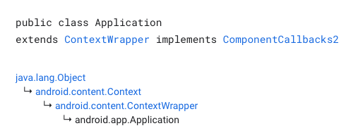
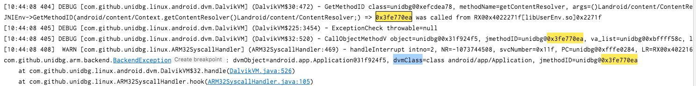

<!-- @import "[TOC]" {cmd="toc" depthFrom=1 depthTo=6 orderedList=false} -->
<!-- code_chunk_output -->

* [补环境](#奇技淫巧)
  * [0x01. JNI以及相关API](#0x01-JNI以及相关API)
    - [构造最基本Context实例](#构造最基本Context实例)
    - [resolveClass解释](#resolveClass解释)
    - [Context实例的getClass方法](#Context实例的getClass方法)
    - [返回PID](#返回PID)
    - [使用java的api返回一个对象](#使用java的api返回一个对象)
    - [VarArg的使用](#VarArg的使用)
    - [VaList的使用](#VaList的使用)
    - [newObject](#newObject)
  * [0x02. 文件访问](#0x02-文件访问)
    * [实体路径](#实体路径)
    * [代码方式](#代码方式)
  * [0x03. 加载Unidbg中不支持的SO](#0x03-加载Unidbg中不支持的SO)
  * 

<!-- /code_chunk_output -->


## 补环境

### 0x01. JNI以及相关API

#### 构造最基本Context实例

- 如果这个东西后续用不到，是应付了事，就填null，如果后续只需要唯一标识这个对象，那就填signature，如果后续需要真的使用这个对象的内容，那就填其内容。

```java
@Override
public DvmObject<?> callStaticObjectMethodV(BaseVM vm, DvmClass dvmClass, String signature, VaList vaList) {
  switch (signature) {
    case "com/izuiyou/common/base/BaseApplication->getAppContext()Landroid/content/Context;":
      // 链接一个android.content.Context的类并通过构造方法创建一个实例
      return vm.resolveClass("android/content/Context").newObject(null);
  }
  return super.callStaticObjectMethodV(vm, dvmClass, signature, vaList);
}
```

- 案例：https://blog.csdn.net/qq_38851536/article/details/118024298

  假设APP在JNI中从五个SharedPreferences里读了十五个键值对，并且不同xml的键名有重复，如果每次取SharedPreferences时我们都返回空对象，那后面怎么区分a.xml和b.xml里键名都是name的数据呢？

  先前我们说，参数1是想要获取的SharedPreferences的名字，应该把它放对象里返回，这样就有了”标识性“


```java
@Override
public DvmObject<?> callObjectMethodV(BaseVM vm, DvmObject<?> dvmObject, String signature, VaList vaList) {
    switch (signature) {
        case "android/content/Context->getSharedPreferences(Ljava/lang/String;I)Landroid/content/SharedPreferences;":
            return vm.resolveClass("android/content/SharedPreferences").newObject(vaList.getObject(0));
    }
    return super.callObjectMethodV(vm, dvmObject, signature, vaList);
}
```
#### resolveClass解释

[原文链接](https://t.zsxq.com/RBujayn)

```java
@Override
public DvmObject<?> callObjectMethodV(BaseVM vm, DvmObject<?> dvmObject, String signature, VaList vaList) {
    switch (signature){ case "android/app/ActivityThread->getApplication()Landroid/app/Application;":{
            return vm.resolveClass("android/app/Application", vm.resolveClass("android/content/ContextWrapper",
									 vm.resolveClass("android/content/Context"))).newObject(signature);
       }  
   }
    return super.callObjectMethodV(vm, dvmObject, signature, vaList);
}
```

- callObjectMethodV或者之前的getStaticObjectField，返回的都是jobject，Unidbg中如何构造一个Jobject?

  jString在Unidbg中被封装成了StringObject，除此之外，下图中标准和的jobject也都封装好了。

  Unidbg源码如下：`unidbg-android/src/main/java/com/github/unidbg/linux/android/dvm/array/`

  

- 那么Unidbg中没有的Jobject该怎么处理呢，比如返回**ctrip.android.security.a**的实例?

  ```java
  return vm.resolveClass("ctrip/android/security/a").newObject(null);
  ```

  类名全路径中“.”替换成”/“，传入resolveClass，即创建了目标类，newObject即创建实例，newObject 的参数为null即可，这样就创建了一个目标类的实例jobject。除此之外，我们一般还会将signature签名 填入newObject，用于区分jobject，方便后续分别处理。

  ```java
  return vm.resolveClass("ctrip/android/security/a").newObject(signature);
  ```

  Application在Unidbg中并没有封装，所以按照上面的说法，Application对象应该这么表示

  ```java
  return vm.resolveClass("android/app/Application").newObject(signature);
  ```

  拆开来看

  ```java
  DvmClass context = vm.resolveClass("android/content/Context");
  DvmClass ContextWrapper = vm.resolveClass("android/content/ContextWrapper", context);
  DvmClass Application = vm.resolveClass("android/app/Application",ContextWrapper);
  return Application.newObject(signature);
  ```

  resolveClass其实是个可变参数方法，如果有第二个参数，那它代表我们创建的类其父类。 所以实际上这里是明确了继承关系。

  

- 为什么我们要在Unidbg中表明这个继承关系? 假如不填写继承关系，查看报错：

  ```java
  switch (signature) {
     case "android/app/ActivityThread->getApplication()Landroid/app/Application;": {
          DvmClass Application = vm.resolveClass("android/app/Application");
          return Application.newObject(signature);
  }
  ```

  

  查看526行代码：

  ```java
  DvmClass dvmClass = dvmObject == null ? null : dvmObject.getObjectType();
  DvmMethod dvmMethod = dvmClass == null ? null : dvmClass.getMethod(jmethodID.toIntPeer());
  if (dvmMethod == null) {
       throw new BackendException("dvmObject=" + dvmObject + ", dvmClass=" + dvmClass + ", jmethodID=" + jmethodID);
  }
  ```

  说明dvmMethod没有找到，方法找不到，methodID肯定有问题，我们发现了一个问题，对象是Application实例，但MethodID是从Context类找来的，为什么能这样做 呢?Application是Context的子孙类，getContentResolver是Context中的抽象方法，JAVA允许这么玩儿。Unidbg处理为什么出现问题了呢?

  首先，Unidbg中执行GetMethodID方法时建立了一个对应关系，Context的methodMap中存储了这个对应关系，而CallObjectMethodV时，因为对象是Application实例，所以它去Application的methodMap里乱找一通，发现啥都没有，自然就报错了。但从Unidbg的代码逻辑中我们发现，当找不到方法时，它会去父类以及超类的methodMap中去寻找，当我们写如下代码时：

  ```java
  DvmClass context = vm.resolveClass("android/content/Context");
  DvmClass ContextWrapper = vm.resolveClass("android/content/ContextWrapper", context);
  DvmClass Application = vm.resolveClass("android/app/Application",ContextWrapper);
  return Application.newObject(signature);
  ```

  Unidbg先在Application自己的methodMap里找，找不到的话去ContextWrapper的methodMap里 找，最后在Context的methodMap里找，除此之外，它还会在接口类里找(resolveClass的第三个参数 开始代表所实现的接口类)。因此，AbstractJNI中给Application补齐了继承链，就是担心ID在超类的 methodMap里。

  在我们自己分析样本时，可以不这么复杂，每次需要resolveClass+newObject声明jObject时候，就别管 什么继承，就当它没爹，但如果报错就直接检索methodID，看是哪个超类生成的ID，别管它在”**真实代码逻辑**“中是太爷爷、爷爷还是爸爸， 直接安排它做爸爸。这里直接省略了`ContextWrapper`

  ```java
  case "android/app/ActivityThread->getApplication()Landroid/app/Application;": {
  	DvmClass context = vm.resolveClass("android/content/Context");
  	DvmClass Application = vm.resolveClass("android/app/Application", context);
  	return Application.newObject(signature);
  }
  ```

#### Context实例的getClass方法

```java
@Override
public DvmObject<?> callObjectMethodV(BaseVM vm, DvmObject<?> dvmObject, String signature, VaList vaList) {
  switch (signature) {
    case "android/content/Context->getClass()Ljava/lang/Class;":{
      // 此时的dvmObject就是Context实例,.getObjectType方法获取类型
      // Context为主体所以用dvmObject获取
      return dvmObject.getObjectType();
    }
    case "java/util/UUID->toString()Ljava/lang/String;":{
      // 此时的dvmObject就是包裹Java.util.UUID实例
       String uuid = dvmObject.getValue().toString();
       return new StringObject(vm, uuid);
    }
    case "java/lang/Class->getSimpleName()Ljava/lang/String;":{
      // 使用Wallbreaker查看com.izuiyou.common.base.BaseApplication的getClass的getSimpleName
      return new StringObject(vm, "AppController");
    }
    case "android/content/Context->getFilesDir()Ljava/io/File;":
    case "java/lang/String->getAbsolutePath()Ljava/lang/String;":
      {
        return new StringObject(vm, "/data/user/0/cn.xiaochuankeji.tieba/files");
      }
  }
  return super.callObjectMethodV(vm, dvmObject, signature, vaList);
};
```

#### 返回PID

```java
@Override
public int callStaticIntMethodV(BaseVM vm, DvmClass dvmClass, String signature, VaList vaList) {
  switch (signature){
    case "android/os/Process->myPid()I":{
      return emulator.getPid();
    }
  }
  throw new UnsupportedOperationException(signature);
}
```

#### 使用java的api返回一个对象

- Java.util.UUID为Java的工具类，可以直接引用并构造。
- 为什么不使用context那样构造，因为context个类不是Java的工具类，是和app有关，不可用直接引用。

```java
@Override
public DvmObject<?> callStaticObjectMethodV(BaseVM vm, DvmClass dvmClass, String signature, VaList vaList) {
  switch (signature) {
    case "java/util/UUID->randomUUID()Ljava/util/UUID;":{
      return dvmClass.newObject(UUID.randomUUID());
    }
  }
  return super.callStaticObjectMethodV(vm, dvmClass, signature, vaList);
};
```

#### VarArg的使用


- 主体: dvmObject.getValue是获取treeMap的对象，参数: key的对象用VarArg获取(从app中)不是自己构造。

```java
    @Override
    public DvmObject<?> callObjectMethod(BaseVM vm, DvmObject<?> dvmObject, String signature, VarArg varArg) 		{
        switch (signature) {
            case "java/util/Map->get(Ljava/lang/Object;)Ljava/lang/Object;":
                StringObject keyobject = varArg.getObjectArg(0);
                String key = keyobject.getValue();
                // getValue得到的就是本身对象，可以各种使用对应的api
                TreeMap<String, String> treeMap = (TreeMap<String, String>)dvmObject.getValue();
                String value = treeMap.get(key);
                return new StringObject(vm, value);
        }
        return super.callObjectMethod(vm, dvmObject, signature, varArg);
		}
```

```java
    @Override
    public DvmObject<?> callStaticObjectMethod(BaseVM vm, DvmClass dvmClass, String signature, VarArg varArg) {
        switch (signature){
            // SignedQuery的r方法自己定义
            case "com/bilibili/nativelibrary/SignedQuery->r(Ljava/util/Map;)Ljava/lang/String;":{
                DvmObject<?> mapObject = varArg.getObjectArg(0);
                // getValue 获取对象本身
                TreeMap<String, String> mymap = (TreeMap<String, String>) mapObject.getValue();
                String result = utils.r(mymap);
                return new StringObject(vm, result);
            }
        }
        return super.callStaticObjectMethod(vm, dvmClass, signature, varArg);
    }
```

#### VaList的使用

```java
    @Override
    public DvmObject<?> callObjectMethodV(BaseVM vm, DvmObject<?> dvmObject, String signature, VaList vaList) {
        switch (signature) {
            case "android/content/Context>getSharedPreferences(Ljava/lang/String;I)Landroid/content/SharedPreferences;":
                return vm.resolveClass("android/content/SharedPreferences").newObject(vaList.getObject(0));
        }
        return super.callObjectMethodV(vm, dvmObject, signature, vaList);
    }
```

#### newObject

```java
@Override
public DvmObject<?> newObject(BaseVM vm, DvmClass dvmClass, String signature,
VarArg varArg) {
    switch (signature){
        case "java/lang/Throwable-><init>()V":{
            return vm.resolveClass("java/lang/Throwable").newObject(new Throwable());
        }
        case "java/io/ByteArrayOutputStream-><init>()V":{
            return vm.resolveClass("java/io/ByteArrayOutputStream").newObject(new ByteArrayOutputStream());
	} }
    return super.newObject(vm, dvmClass, signature, varArg);
}
```

另一种方式：

```java
@Override
public DvmObject<?> newObject(BaseVM vm, DvmClass dvmClass, String signature,
VarArg varArg) {
    switch (signature){
        case "java/lang/Throwable-><init>()V":{
            return dvmClass.newObject(new Throwable());
        }
        case "java/io/ByteArrayOutputStream-><init>()V":{
            return dvmClass.newObject(new ByteArrayOutputStream());
	} }
    return super.newObject(vm, dvmClass, signature, varArg);
}
```


### 0x02. 文件访问

#### 实体路径

文件访问的情况各种各样，比如从app的某个xml文件中读取key，读取某个资源文件的图片做运算，读取proc/self 目录下的文件反调试等等。当样本做文件访问时，Unidbg重定向到本机的某个位置，进入 src/main/java/com/github/unidbg/file/BaseFileSystem.java，打印一下路径

```java
[15:14:10 318]  INFO [com.github.unidbg.linux.ARM32SyscallHandler] (ARM32SyscallHandler:1890) - openat dirfd=-100, pathname=/data/app/com.sankuai.meituan-TEfTAIBttUmUzuVbwRK1DQ==/base.apk, oflags=0x20000, mode=0
```

接下来我们按照要求，在data目录下新建对应文件夹`/data/app/com.sankuai.meituan-TEfTAIBttUmUzuVbwRK1DQ==`，并把我们的apk复制进去，改名成base.apk，就可以了。[原文传送](https://blog.csdn.net/qq_38851536/article/details/118000259)

#### 代码方式

1. public class NBridge extends AbstractJni implements IOResolver 

2. emulator.getSyscallHandler().addIOResolver(this)

3. 

```java
   @Override
       public FileResult resolve(Emulator emulator, String pathname, int oflags) {
           if (("proc/"+emulator.getPid()+"/cmdline").equals(pathname)) {
               // 填入想要重定位的文件
               return FileResult.success(new SimpleFileIO(oflags, newFile("D:\\unidbg-teach\\unidbg-android\\src\\test\\java\\com\\lession1\\cmdline"), pathname));
           }
           return null;
       }
```

或者：

```java
 @Override
  public FileResult resolve(Emulator emulator, String pathname, int oflags) {
    if (("proc/"+emulator.getPid()+"/cmdline").equals(pathname)) {
      return FileResult.success(new ByteArrayFileIO(oflags, pathname, "ctrip.android.view".getBytes()));
    }
    return null;
  }
```

### 0x03. 加载Unidbg中不支持的SO

- [CSDN-样本八](https://blog.csdn.net/qq_38851536/article/details/118024298)  [知识星球-样本二](https://t.zsxq.com/RBujayn)

- 查看Unidbg 支持哪些so: `unidbg-android/src/main/resources/android/sdk23/lib`

  > 为什么Unidbg不内置支持所有系统SO的加载？
  >
  > 1. 大部分SO中主要的依赖项，就是Unidbg已经支持的这些，即已经够用了。
  > 2. 把Android系统中全部SO都成功加载进Unidbg虚拟内存中，既是很大的工作量，又会占用过多内存。
  > 3. 另一个原因是，比如libandroid.so，其依赖SO实在太多了，想顺利加载整个SO确确实实是个苦差事。

- 如果SO的依赖项中有Unidbg不支持的系统SO，怎么办？

  > 首先Unidbg会给予提示：比如libnative-lib.so load dependency libandroid.so failed
  >
  > 然后去网上搜下是不是系统库，如果是APK本身自带的SO，手动加载一下即可，并默认执行其init函数，并调用JNIOnLoad，
  > 注意：依赖项必须先加载
  >
  > 其次，尽管SO加载了Unidbg不支持的SO，但有可能我们的目标函数并没有使用到这个系统SO，这种情况下就不用理会，当作不存在就行。

- 但如果目标函数使用到了这个系统SO，那就麻烦了，我们就得直面这个问题，一般有两种处理办法。

  1. Patch/Hook 这个不支持的SO所使用的函数

  2. 使用Unidbg VirtualModule

     > VirtualModule是Unidbg为此种情况所提供的官方解决方案，并在代码中提供了两个示例，路径：unidbg-android/src/main/java/com/github/unidbg/virtualmodule/android

    比如libandroid.so可以使用`AndroidModule`，只实现了libandroid中这几个常用的导出函数。

  ```java
  vm = emulator.createDalvikVM(new File("unidbg-android/src/test/java/com/lession8/demo2.apk"));
  // 注册libandroid.so虚拟模块
  new AndroidModule(emulator, vm).register(memory);
  
  DalvikModule dm = vm.loadLibrary(new File("unidbg-android/src/test/java/com/lession8/readassets.so"), true);
  module = dm.getModule();
  ```

  需要注意，一定要在样本SO加载前加载它，道理也很简单，系统SO肯定比用户SO加载的早。VirtualModule并不是一种真正意义上的加载SO，它本质上也是Hook，只不过实现了SO中少数几个函数罢了。

  需要注意的是，VirtualModule并不是一种真正意义上的加载SO，它本质上也是Hook，只不过实现了SO中少数几个函数罢了。

